# Alpha Foundry 문서 체계

| 항목       | 값                                                |
| -------- | ------------------------------------------------ |
| 문서 세트 버전 | 1.0.0                                            |
| 기준일      | 2026-07-11                                       |
| 상태       | Baseline                                         |
| 대상       | 사람 개발자, 퀀트 연구자, 검토자, ChatGPT, Codex, Claude Code |

이 디렉터리는 Alpha Foundry의 제품·설계·구현·검증에 관한 Single Source of Truth다. 각 사실은 한 문서만 소유하며, 다른 문서는 ID 또는 상대 링크로 참조한다. 코드, 마이그레이션, OpenAPI, 테스트가 문서와 다르면 CI가 실패해야 하며 어느 한쪽을 임의로 우선하지 않는다.

## 1. 프로그램 전체 구조

다음 그림은 Alpha Foundry의 실행 구조와 데이터 흐름을 한 장으로 요약한다. 실선은 코드가 수행하는 결정론 처리이며, 점선은 LLM 호출 구간이다. LLM은 질문·가설·설명 초안 생성에만 관여하고, 상태 전이·수치 계산·검증·영속 저장은 코드 영역에서만 수행한다.



Mermaid 원본: [alpha_foundry_overview.mmd](./docs/diagram/alpha_foundry_overview.mmd)

## 2. 확정 문서 구조

```text
docs/
├── README.md
├── 01_Requirements.md
├── 02_Architecture.md
├── 03_DevelopmentPlan.md
├── 04_API.md
├── 05_Database.md
├── 06_CodingGuidelines.md
├── 07_TestPlan.md
└── ADR/
    ├── ADR-0001-modular-monolith.md
    ├── ADR-0002-domain-discriminated-contracts.md
    ├── ADR-0003-domain-specific-backtest-engines.md
    ├── ADR-0004-llm-deterministic-boundary.md
    ├── ADR-0005-storage-topology.md
    ├── ADR-0006-experiment-lineage-and-sealed-holdout.md
    ├── ADR-0007-durable-asynchronous-jobs.md
    └── ADR-0008-cross-domain-composition.md
```

## 3. 문서별 소유권

| 문서                       | 단독 소유하는 내용                                    | 포함하지 않는 내용                      |
| ------------------------ | --------------------------------------------- | ------------------------------- |
| `01_Requirements.md`     | 목적, 범위, 사용자, 유스케이스, FR/NFR, 제약, 가정, 인수 조건     | 프레임워크, 테이블·컬럼, 엔드포인트 상세, 클래스 구현 |
| `02_Architecture.md`     | 컴포넌트, 경계, 의존 방향, 데이터·이벤트 흐름, 상태 전이, 배포·런타임 구조 | FR 본문 반복, 컬럼 사전, HTTP 필드 사전     |
| `03_DevelopmentPlan.md`  | 단계, 작업 패키지, 선후 관계, 병렬화, 마일스톤, 완료 정의           | 제품 요구의 재해석, API·DB 계약 재정의       |
| `04_API.md`              | 외부·내부 인터페이스, 요청·응답 스키마, 오류, 이벤트, 버전 규칙        | 물리 테이블, 인덱스, 배포 구조              |
| `05_Database.md`         | 영속 모델, ERD, 컬럼, 키, 제약, 인덱스, 파티션, 보존, 마이그레이션   | HTTP 경로, 요청·응답 예시               |
| `06_CodingGuidelines.md` | 언어·코딩·의존성·오류·로그·비동기·DI·리뷰 규칙                  | 제품 범위, 스프린트 일정                  |
| `07_TestPlan.md`         | 테스트 계층, 데이터, 성능·복구·통계·인수 검증, 품질 게이트           | 구현 설계의 대체 설명                    |
| `ADR/*`                  | 중요한 선택의 맥락, 대안, 결정 이유, 결과, 재검토 조건             | 현재 계약의 중복 사본                    |

## 4. 확정 목차

### `01_Requirements.md`

문서 제어 → 목적과 목표 → 범위 → 시스템 개요 → 사용자·권한 → 유스케이스 → 기능 요구사항 → 도메인별 기능 요구사항 → 비기능 요구사항 → 제약 → 가정 → 인수 조건 → 추적성.

### `02_Architecture.md`

설계 원칙 → 시스템 컨텍스트 → 런타임 컴포넌트 → 모듈 책임과 의존성 → 핵심 계약 → 데이터 흐름 → 이벤트 흐름 → 상태 머신 → 동시성·멱등성 → 저장·캐시 → 디렉터리 → 배포 → 시퀀스 → 보안·관측성 → 장애 처리 → ADR 연결.

### `03_DevelopmentPlan.md`

계획 기준 → 릴리스 수준 → 의존성 그래프 → MVP 4일 → Beta 작업 패키지 → Production 작업 패키지 → 모듈별 작업 → 병렬화 → 마일스톤 → 검증·인계 → 리스크 → Definition of Done.

### `04_API.md`

계약 원칙 → 공통 표현 → 인증·권한 → 공통 스키마 → 도메인 판별형 스키마 → 리소스 스키마 → 엔드포인트 → 장시간 작업 → 이벤트 → 오류 → 멱등성·동시성 → 페이지네이션 → 버전 → OpenAPI 일치 규칙.

### `05_Database.md`

저장 원칙 → ERD → 타입·시간 규칙 → 테이블 사전 → 무결성 → 인덱스 → 파티션 → 시계열·객체 저장 연결 → 보존 → 백업·복구 → 마이그레이션 → 접근 통제.

### `06_CodingGuidelines.md`

도구 체인 → 이름·형식 → 모듈 경계 → 타입·스키마 → 오류 → 로그·관측성 → 비동기·동시성 → DI → 결정론 → LLM 안전 → 데이터·시간·단위 → 저장소 → 보안 → 테스트 → 리뷰·브랜치 → 문서 동기화 → 금지 패턴.

### `07_TestPlan.md`

목표 → 환경·책임 → 테스트 피라미드 → 단위 → 계약 → 통합 → E2E → 통계·누수 → 속성 기반 → 성능 → 복구·장애 → 보안 → 인수 → 테스트 데이터 → 커버리지·CI → 결함 처리 → FR/NFR 추적성.

## 5. 식별자와 추적성 규칙

| 대상       | 형식                | 예시                           |
| -------- | ----------------- | ---------------------------- |
| 기능 요구사항  | `FR-NNN`          | `FR-031`                     |
| 비기능 요구사항 | `NFR-NNN`         | `NFR-008`                    |
| 유스케이스    | `UC-NNN`          | `UC-004`                     |
| 인수 조건    | `AC-NNN`          | `AC-012`                     |
| 작업 패키지   | `WP-{단계}-{NN}`    | `WP-B2-03`                   |
| 테스트      | `T-{계층}-{NNN}`    | `T-E2E-006`                  |
| 오류 코드    | `AF-{영역}-{NNN}`   | `AF-HOLDOUT-001`             |
| 이벤트 타입   | `af.{영역}.{사건}.v1` | `af.experiment.completed.v1` |
| ADR      | `ADR-NNNN`        | `ADR-0004`                   |

요구사항 변경은 관련 테스트 ID와 인수 조건을 함께 변경한다. API 스키마 변경은 계약 테스트와 OpenAPI snapshot을, DB 변경은 마이그레이션 테스트를, 설계 결정 변경은 ADR 상태와 현재 문서를 함께 변경한다.

## 6. 충돌 방지 규칙

1. 제품이 무엇을 해야 하는지는 `01_Requirements.md`만 결정한다.
2. 외부에서 관찰되는 형식은 `04_API.md`가 소유하고, 영속 형식은 `05_Database.md`가 소유한다.
3. ADR은 결정의 역사와 이유를 보존한다. Accepted ADR의 결정이 현재 문서에 반영되지 않은 변경은 병합할 수 없다.
4. 실행 가능한 JSON Schema와 OpenAPI는 `04_API.md`의 계약을 기계 검증한 산출물이다. 불일치는 우선순위로 해결하지 않고 빌드를 실패시킨다.
5. SQLAlchemy 모델과 Alembic migration은 `05_Database.md`의 제약을 구현한다. DB drift 검사 실패 시 배포하지 않는다.
6. 문서에 없는 임의 기본값을 AI가 발명하지 않는다. 입력 누락이 계약상 허용되지 않으면 명시적 오류로 중단한다.
7. 단위는 필드명 또는 타입으로 고정한다. `bps`, `ms`, `seconds`, ISO 8601 UTC를 혼용하지 않는다.

## 7. 변경 영향 매트릭스

| 변경             | 반드시 함께 검토할 문서·산출물                                                             |
| -------------- | ----------------------------------------------------------------------------- |
| FR/NFR 추가·변경   | Requirements, TestPlan, 관련 API 또는 Architecture, 추적성 검사                        |
| 도메인 payload 변경 | API, Architecture의 계약 참조, schema fixture, contract test, schema registry      |
| 상태 전이 변경       | Architecture, API event, Database constraint, E2E test, ADR                   |
| 엔진 계약 변경       | Architecture, API의 Strategy/Result, CodingGuidelines, contract test, ADR-0003 |
| 테이블·인덱스 변경     | Database, Alembic migration, migration/recovery test                          |
| 비용·지연·체결 정책 변경 | API config schema, experiment fingerprint test, 관련 엔진 contract test           |
| holdout 정책 변경  | Requirements, Architecture, Database, TestPlan, ADR-0006                      |
| 배포 토폴로지 변경     | Architecture, DevelopmentPlan, operations test, 관련 ADR                        |

## 8. 누락 항목 검토 결과

원 기획서의 제품 개념은 유지하되 구현 가능한 기준선에 필요했던 다음 항목을 문서 체계에 추가했다.

| 보완 항목                   | 확정 위치                                    | 처리 원칙                                                        |
| ----------------------- | ---------------------------------------- | ------------------------------------------------------------ |
| 인증·역할·사람 승인             | Requirements, API, Architecture          | OIDC 주체와 RBAC를 사용하고 AI 주체는 승인 역할을 가질 수 없다.                   |
| 장시간 작업 수명주기             | Architecture, API, Database              | 영속 job, lease, heartbeat, 재시도, 취소를 명시한다.                     |
| 멱등성·낙관적 동시성             | API, Database                            | 변경 요청은 idempotency key와 resource version으로 보호한다.             |
| 이벤트 전달 신뢰성              | Architecture, Database                   | transactional outbox로 상태 변경과 이벤트 기록을 원자화한다.                  |
| 스키마 진화                  | API, Database                            | 판별자와 schema version을 고정하고 breaking change는 새 major API로 낸다.  |
| 시간·단위·시점 의미             | API, Database, CodingGuidelines          | UTC, point-in-time 필드, 명시 단위 타입을 강제한다.                       |
| 데이터·산출물 보존              | Database                                 | 보존 등급, 삭제 조건, legal hold, lineage 보존을 명시한다.                  |
| 보안·비밀·PII               | Architecture, CodingGuidelines, TestPlan | 비밀은 외부 secret store에 두고 로그·LLM 입력에서 제거한다.                    |
| 관측성·복구                  | Architecture, TestPlan                   | 구조화 로그, metric, trace, RPO/RTO, lease 회수를 검증한다.              |
| 통계 검증의 적용 조건            | Requirements, TestPlan                   | 정상성이 가정인 시계열·잔차에만 ADF와 KPSS를 함께 적용한다.                        |
| 4일 범위의 현실성              | DevelopmentPlan                          | 두 연구소만 완전 수직 구현하고 나머지는 계약·synthetic 실행까지 완료한다.               |
| SQLite/PostgreSQL 의미 차이 | ADR-0005                                 | MVP부터 PostgreSQL을 사용해 JSON, constraint, job claim 의미를 단일화한다. |

## 9. AI 구현 순서

AI 에이전트는 작업 시작 시 다음 순서를 따른다.

1. 대상 `FR-*`, `NFR-*`, `AC-*`를 선택한다.
2. 관련 ADR과 Architecture 경계를 읽는다.
3. API 또는 DB 계약 중 변경 대상의 소유 문서를 읽는다.
4. `03_DevelopmentPlan.md`의 작업 패키지와 선행 조건을 확인한다.
5. 실패 테스트를 먼저 추가하고 최소 구현을 수행한다.
6. 계약·통합·누수 테스트를 실행한다.
7. 문서·OpenAPI·migration·fixture drift 검사를 실행한다.
8. 변경 요약에 요구사항 ID, 테스트 ID, ADR 영향을 기록한다.

한 에이전트가 동시에 하나의 영속 스키마 파일을 소유한다. 병렬 작업은 `03_DevelopmentPlan.md`의 파일 소유권 경계를 따른다.

## 10. 원 기획서 내용의 권위 위치

| 원 기획 주제                                  | 권위 문서                                             |
| ---------------------------------------- | ------------------------------------------------- |
| 제품 정의, 입력 모드, 비목표                        | `01_Requirements.md` 1~4장                         |
| 8개 연구소와 도메인 경계                           | Requirements 7.6장, Architecture 6장, ADR-0002/0003 |
| mandate/question/hypothesis/strategy 구분  | Requirements 4장, API 5·7장                         |
| 상태 머신과 승인 불가 전이                          | Architecture 9장                                   |
| 공통·도메인 질문 schema                         | API 5~6장                                          |
| 연구소 plugin과 engine 계약                    | Architecture 5장, API 7~8장                         |
| 도메인별 engine 기능과 검증                       | Requirements 7.6~7.7장, TestPlan 5·9장              |
| Meta Portfolio와 도메인 결합                   | Requirements FR-031~033/053, ADR-0008             |
| 질문 생성 비율·심사·품질 관문                        | Requirements FR-018~025, API 9.4장                 |
| 원문·claim·wiki·실패 기억                      | Architecture 4·7장, Database 5장                    |
| 비용·지연·체결·슬리피지 정책                         | Requirements FR-034~036, API 8장                   |
| fingerprint·cache·재현성                    | Architecture 7·11장, ADR-0005/0006                 |
| G0~G10, 통계, 다중 탐색, feedback              | Requirements 7.7장, TestPlan 9~10장                 |
| repository·deployment·service dependency | Architecture 12~14장                               |
| metadata table·보존·migration              | Database 전체                                       |
| API·event·error·version                  | API 9~16장                                         |
| LLM/결정론 실행 규칙                            | CodingGuidelines 12장, ADR-0004                    |
| 4일 MVP와 생산급 확장                           | DevelopmentPlan 전체                                |
| 납품·인수·공격 테스트                             | DevelopmentPlan 20~21장, TestPlan 10~18장           |
