# Alpha Foundry 프로젝트 문서

이 디렉터리는 Alpha Foundry 구현의 Single Source of Truth다. 자연어 기획보다 이 문서 집합의 명시적 계약이 우선하며, 문서끼리 충돌하면 아래의 문서별 권위 규칙을 따른다.

## 프로그램 전체 구조

아래 이미지를 누르면 SVG 원본을 새 탭에서 크게 볼 수 있다.

<a href="./docs/diagrams/alpha_foundry_overview.svg">
  
</a>

- Mermaid 원본: [alpha_foundry_overview.mmd](./docs/diagrams/alpha_foundry_overview.mmd)
- SVG 이미지: [alpha_foundry_overview.svg](./docs/diagrams/alpha_foundry_overview.svg)

다이어그램 해석 규칙:

- 파란 영역은 결정론적 코드다. 상태 변경, 예산 차감, 실행, 검증, 등록은 이 영역만 수행한다.
- 노란 영역은 LLM이다. LLM은 질문·가설·전략 후보를 생성하지만 권위 상태를 직접 변경하지 않는다.
- 실선은 코드 내부 데이터 흐름이고 점선은 LLM 호출 경계다.
- Knowledge Plane과 Capability Plane의 정보는 Orchestrator가 선택해 LLM 요청에 포함한다.

## 문서 구조

```text
docs/
├── README.md
├── 01_Requirements.md
├── 02_Architecture.md
├── 03_DevelopmentPlan.md
├── 04_API.md
├── 05_Database.md
├── 06_CodingGuidelines.md
├── 07_TestPlan.md
├── diagrams/
│   └── alpha_foundry_overview.mmd
├── assets/
│   └── alpha_foundry_overview.svg
└── ADR/
    ├── ADR-0001-modular-monolith.md
    ├── ADR-0002-domain-discriminated-contracts.md
    ├── ADR-0003-domain-specific-backtest-engines.md
    ├── ADR-0004-llm-deterministic-boundary.md
    ├── ADR-0005-storage-topology.md
    ├── ADR-0006-experiment-lineage-and-sealed-holdout.md
    ├── ADR-0007-durable-asynchronous-jobs.md
    └── ADR-0008-cross-domain-composition.md
```

## 문서별 권위

| 문서 | 이 문서만 결정하는 내용 |
| --- | --- |
| `01_Requirements.md` | 목적, 범위, 사용자 결과, FR/NFR, 인수 조건 |
| `02_Architecture.md` | 컴포넌트 책임, 의존 방향, 데이터 흐름, 런타임 구조 |
| `03_DevelopmentPlan.md` | 릴리스 범위, 작업 순서, 의존성, 마일스톤 |
| `04_API.md` | 외부 요청·응답·오류·이벤트 계약 |
| `05_Database.md` | 영속 모델, 키, 제약, 인덱스, 보존, 마이그레이션 |
| `06_CodingGuidelines.md` | 코드 작성·리뷰·오류·로그·비동기 규칙 |
| `07_TestPlan.md` | 테스트 수준, 데이터, 합격 기준, 릴리스 게이트 |
| `ADR/*` | 변경 비용이 큰 설계 결정과 재검토 조건 |

같은 계약을 여러 문서에 복사하지 않는다. 다른 문서의 정보가 필요하면 링크와 ID로 참조한다.

## 구현 기준선

### MVP

- 질문 지정 모드와 영역 지시 모드
- 8개 연구 도메인의 질문 스키마와 Lab 계약
- Factor 및 StatArb 수직 흐름의 실제 실행
- 나머지 6개 Lab의 schema validation과 smoke 실행
- 단일 애플리케이션, 단일 Worker, SQLite, 로컬 artifact 저장소
- LLM 후보 생성과 결정론적 검증의 분리
- 계보, 탐색 원장, sealed holdout 1회 규칙

### Beta

- Market Making과 Structural Flow 실제 엔진
- Cross Venue, Derivatives, Event, Time Series 엔진 순차 추가
- PostgreSQL과 object storage 전환
- 다중 Worker, 재시도, lease, 운영 관측성

### Production

- 인증·권한, 감사 추적, 백업·복구
- 부하·장애·보안 검증
- 운영 승인과 수동 전략 승격

릴리스별 세부 작업은 [03_DevelopmentPlan.md](./03_DevelopmentPlan.md)가 권위 문서다.

## AI 구현 순서

AI 개발 에이전트는 다음 순서로 작업한다.

1. 작업 대상 FR과 Acceptance Criteria를 `01_Requirements.md`에서 확인한다.
2. 허용 의존성과 LLM 경계를 `02_Architecture.md`에서 확인한다.
3. 현재 Phase와 선행 작업을 `03_DevelopmentPlan.md`에서 확인한다.
4. 외부 계약은 `04_API.md`, 영속 계약은 `05_Database.md`만 따른다.
5. `06_CodingGuidelines.md`에 맞춰 구현하고 `07_TestPlan.md`의 테스트를 함께 추가한다.
6. 기존 ADR을 뒤집는 변경은 새 ADR 승인 전에는 구현하지 않는다.

## 변경 규칙

- 요구 결과가 바뀌면 Requirements를 먼저 변경한다.
- 컴포넌트 책임이나 의존 방향이 바뀌면 Architecture와 ADR을 변경한다.
- 외부 필드가 바뀌면 API versioning 규칙을 적용한다.
- 저장 구조가 바뀌면 Database migration을 같은 변경에 포함한다.
- 모든 구현 PR은 관련 FR, API 또는 Table, Test ID를 본문에 기록한다.
- Mermaid를 수정한 PR은 `.mmd`와 `.svg`를 함께 갱신한다.

SVG 재생성 명령(PowerShell):

```powershell
npx --yes --package "@mermaid-js/mermaid-cli" mmdc `
  -i docs/diagrams/alpha_foundry_overview.mmd `
  -o docs/assets/alpha_foundry_overview.svg `
  -b transparent
```
