# Alpha Foundry 시스템 아키텍처

| 항목 | 값 |
|---|---|
| 문서 버전 | 1.0.0 |
| 기준 요구사항 | [01_Requirements.md](01_Requirements.md) |
| 관련 ADR | [ADR 디렉터리](ADR/) |
| 런타임 기준 | Python 3.12, PostgreSQL 16, Azure Container Apps |

이 문서는 요구사항의 구현 구조를 소유한다. 제품 범위와 인수 조건은 반복하지 않고 `FR-*`, `NFR-*`로 참조한다.

## 1. 설계 원칙

1. **도메인 경계 일치**: 질문, 가설, 전략, 엔진, 검증, 기억은 같은 `Domain` 판별자를 공유한다.
2. **모듈형 단일 애플리케이션**: 하나의 repository와 release를 유지하되 module interface와 import rule로 경계를 강제한다. 근거는 [ADR-0001](ADR/ADR-0001-modular-monolith.md)에 있다.
3. **명령과 계산 분리**: API/CLI는 application command를 생성하고 worker가 장시간 계산을 수행한다.
4. **LLM과 결정론 경계**: LLM output은 strict schema validation을 통과한 draft일 뿐이다. 수치, 상태, 예산, 판정은 deterministic service가 소유한다.
5. **Append-only lineage**: 과거 실험과 판단을 수정하지 않는다. 변경은 새 revision과 parent link로 표현한다.
6. **Point-in-time 우선**: 데이터의 경제 시점과 시스템 이용 가능 시점을 분리하고 이용 가능 시점으로만 계산한다.
7. **정책 주입**: 비용·지연·체결·슬리피지·충격은 engine 내부 상수가 아니라 versioned policy다.
8. **At-least-once, idempotent effects**: event와 job은 중복 전달될 수 있고 모든 side effect는 idempotency guard를 가진다.

## 2. 시스템 컨텍스트

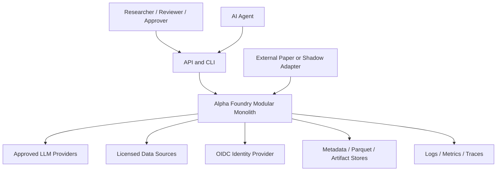

외부 Paper/Shadow adapter는 실행 결과를 가져오는 inbound integration이다. Alpha Foundry에서 외부로 실제 주문을 전송하는 outbound path는 존재하지 않는다.

## 3. 런타임 토폴로지

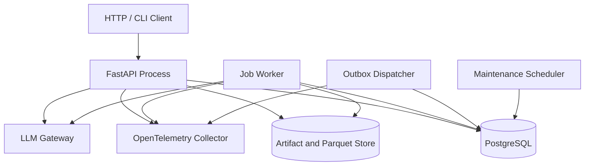

### 3.1 Process 역할

| Process | 책임 | 수평 확장 | 상태 |
|---|---|---:|---|
| API | 인증, request validation, application command, query, job enqueue | 가능 | 무상태 |
| Worker | job claim, LLM task, engine run, validation, report build | 가능 | lease 외 무상태 |
| Outbox Dispatcher | 미발행 event claim·발행·확인 | 가능 | DB checkpoint |
| Scheduler | lease 회수, orphan artifact 청소, retention, health aggregation | active-passive | DB advisory lock |

API, Worker, Dispatcher는 같은 package와 domain model을 사용하지만 별도 entry point와 container command를 가진다.

### 3.2 기술 기준선

| 영역 | 선택 |
|---|---|
| 언어·환경 | Python 3.12, `uv` lockfile |
| HTTP | FastAPI, OpenAPI 3.1, Pydantic v2 strict model |
| CLI | Typer; HTTP를 재호출하지 않고 같은 application service contract 사용 |
| Metadata | PostgreSQL 16, SQLAlchemy 2, Alembic |
| API DB driver | `asyncpg` 기반 async session |
| Worker DB driver | `psycopg` 기반 sync session |
| Table data | Parquet + PyArrow schema, Polars lazy scan |
| Artifact | Azure Blob Storage; local은 Azurite |
| 통계 | NumPy, SciPy, statsmodels; bootstrap은 seed가 고정된 내부 adapter |
| 관측성 | OpenTelemetry, JSON log, Azure Monitor/Application Insights |
| 인증 | OIDC JWT; Production managed identity와 workload identity |
| 배포 | OCI image, Azure Container Apps, Azure Database for PostgreSQL Flexible Server, Azure Blob, Key Vault |

Dependency patch version은 `uv.lock`이 고정하며 minor/major upgrade는 별도 pull request와 전체 contract test를 요구한다.

## 4. 논리 컴포넌트

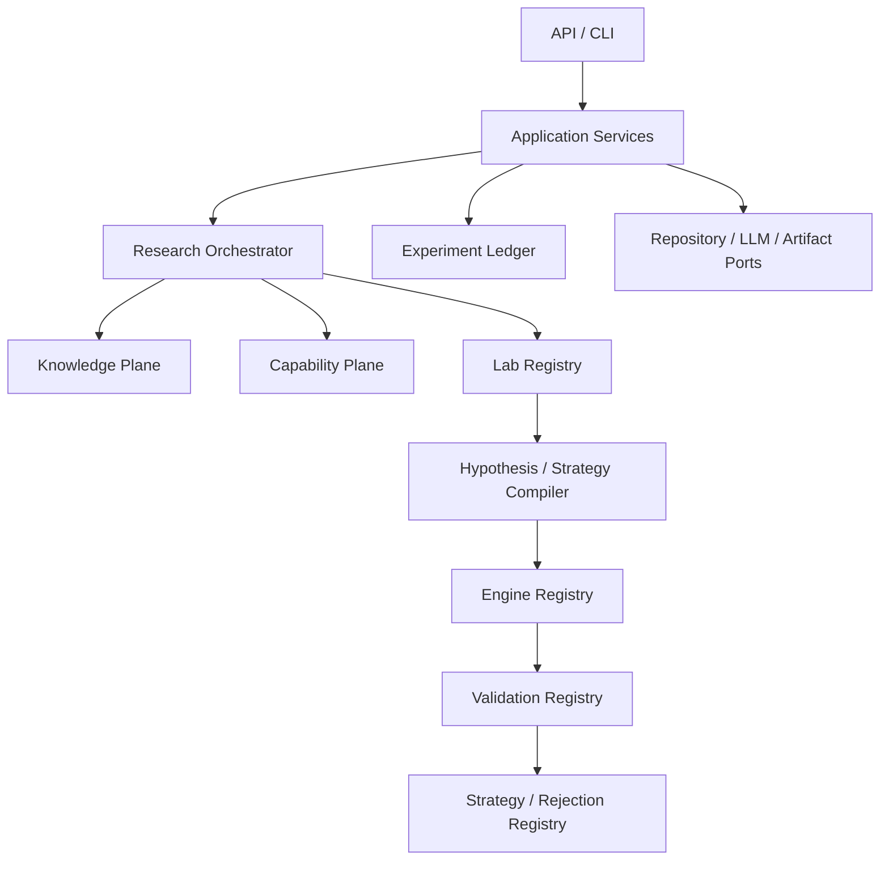

### 4.1 컴포넌트 책임

| 컴포넌트 | 소유 책임 | 출력 |
|---|---|---|
| `MandateCompiler` | 자연어와 명시 입력을 strict mandate로 변환 | `ResearchMandate` revision |
| `DomainRouter` | primary domain과 허용 auxiliary interface 결정 | `DomainRoute` |
| `CapabilityRegistry` | 데이터·engine·config·compute의 immutable snapshot | `CapabilitySnapshot` |
| `KnowledgeCompiler` | source에서 claim/method/failure 후보 추출과 위치 연결 | 검토 가능한 cards |
| `EvidenceAssembler` | 특정 질문 생성에 사용한 근거 집합 고정 | `EvidenceBundle` |
| `QuestionGenerator` | lab policy와 generation allocation에 따른 후보 생성 | domain union questions |
| `QuestionAuditor` | 7개 auditor와 hard gate 실행 | `QuestionAuditReport` |
| `ProgramBuilder` | 감사 통과 질문의 작업 DAG 구성 | `ResearchProgram` |
| `HypothesisCompiler` | falsifiable hypothesis 생성·검증 | `HypothesisSpec` |
| `StrategyCompiler` | executable declarative strategy 구성 | `StrategySpec` |
| `EngineRegistry` | domain/capability에 맞는 단일 engine 선택 | `EngineProfile` |
| `ValidationRegistry` | G0~G10 gate orchestration | `ValidationReport` |
| `ExperimentLedger` | search와 상태 사건 append | lineage graph |
| `SearchMemory` | domain 전용 성공·실패·중복 기억 | memory revisions |
| `StrategyRegistry` | 전략 상태와 사람 승인 | registry entry |
| `ReportBuilder` | JSON과 Markdown 보고서 | content-addressed artifacts |

## 5. 모듈 경계와 의존성

### 5.1 허용 의존 방향

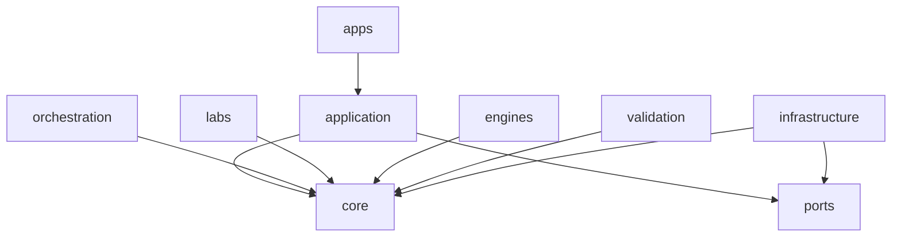

- `core`는 framework, DB, HTTP, LLM SDK를 import하지 않는다.
- `labs/{domain}`은 다른 lab의 내부 module을 import하지 않는다.
- `engines/{engine}`은 lab 구현을 import하지 않고 `StrategySpec` protocol만 받는다.
- `validation/{domain}`은 engine 내부 객체가 아니라 `ExperimentResult`와 artifact reader port만 받는다.
- `application`은 port protocol에 의존하고 `infrastructure` adapter가 이를 구현한다.
- `apps`는 application command/query만 호출한다.
- 의존 역전은 constructor injection으로 구현하고 service locator는 bootstrap module에서만 허용한다.

이 규칙은 import-linter contract와 architecture test로 강제한다.

### 5.2 Lab plugin 계약

모든 built-in lab은 다음 method를 구현한다.

```python
class ResearchLab(Protocol):
    domain: Domain
    schema_version: str

    def compile_mandate(self, mandate, capabilities) -> DomainMandate: ...
    def build_evidence_bundle(self, mandate) -> EvidenceBundle: ...
    def generate_questions(self, mandate, evidence, failure_memory) -> list[ResearchQuestion]: ...
    def audit_question(self, question, capabilities) -> QuestionAuditReport: ...
    def build_research_program(self, questions) -> ResearchProgram: ...
    def compile_hypothesis(self, question) -> HypothesisSpec: ...
    def compile_strategy(self, hypothesis) -> StrategySpec: ...
    def select_engine(self, strategy) -> EngineProfile: ...
    def validate(self, experiment) -> ValidationReport: ...
    def update_memory(self, result) -> list[MemoryUpdate]: ...
```

Method input과 output은 [API schema](04_API.md#5-핵심-리소스-스키마)의 in-process model을 재사용한다. `extra="forbid"`, domain equality, schema compatibility가 registry 등록 시 검사된다.

### 5.3 Engine 계약

```python
class BacktestEngine(Protocol):
    engine_id: str
    engine_version: str
    supported_domains: frozenset[Domain]

    def validate_inputs(self, strategy, dataset, config) -> tuple[ValidationViolation, ...]: ...
    def run(self, strategy, dataset, config, context) -> ExperimentResult: ...
    def explain(self, result, artifacts) -> AttributionReport: ...
```

`EngineRunContext`는 seed, clock, artifact writer, cancellation token, resource budget, correlation id를 제공한다. engine은 DB session, HTTP client, global random generator에 직접 접근하지 않는다.

## 6. 도메인과 엔진 매핑

| Domain | Lab | 기본 Engine | MVP 수준 |
|---|---|---|---|
| `FACTOR_PORTFOLIO` | `factor_portfolio` | `PanelPortfolioEngine` | 완전 수직 |
| `STAT_ARB` | `stat_arb` | `MultiLegSequentialEngine` | 완전 수직 |
| `MARKET_STRUCTURE_MM` | `market_making` | `LOBDiscreteEventEngine` | 계약 + synthetic |
| `MARKET_STRUCTURE_FLOW` | `structural_flow` | `StructuralEventEngine` | 계약 + synthetic |
| `CROSS_VENUE` | `cross_venue` | `MultiVenueGraphEngine` | 계약 + synthetic |
| `DERIVATIVES_RV` | `derivatives_rv` | `DerivativesCashflowEngine` | 계약 + synthetic |
| `EVENT_FUNDAMENTAL` | `event_fundamental` | `PointInTimeEventEngine` | 계약 + synthetic |
| `TIME_SERIES` | `time_series` | `SequentialForecastEngine` | 계약 + synthetic |

Meta Portfolio는 `META_PORTFOLIO` application module이며 질문 생성 lab이 아니다. 입력 전략이 모두 `REGISTERED` 이상인지 확인한 뒤 `MetaAllocationEngine`을 사용한다.

## 7. 데이터 흐름

### 7.1 Mandate에서 Program까지

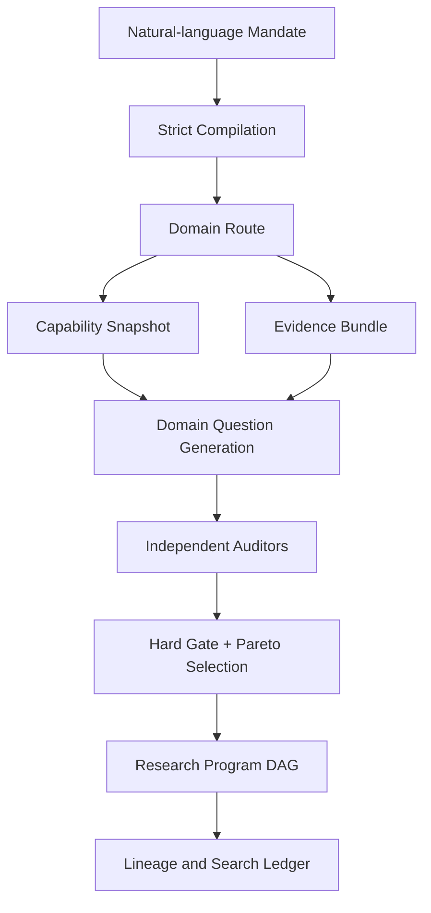

Generator는 `EvidenceBundle`, coarse failure memory, capability만 읽는다. experiment validation과 sealed metrics로 향하는 역방향 data edge는 architecture test에서 금지한다.

### 7.2 Experiment 실행

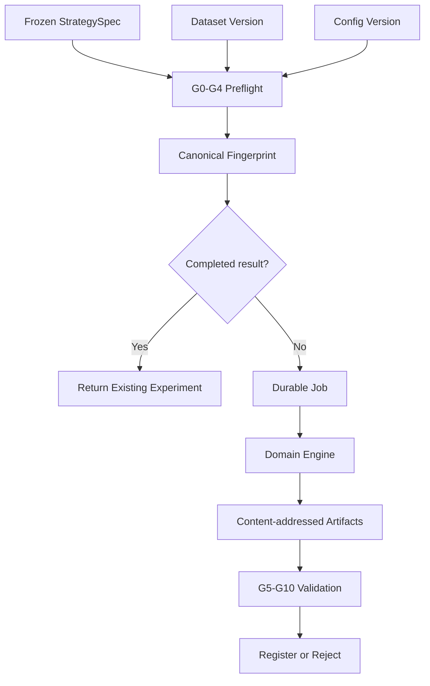

### 7.3 Artifact commit

1. worker가 local temporary file에 artifact를 생성한다.
2. BLAKE3 content hash와 byte size를 계산한다.
3. `blobs/{hash[0:2]}/{hash}` key로 업로드한다. 같은 hash가 있으면 byte size와 checksum을 확인한다.
4. DB transaction이 artifact metadata, owner link, outbox event를 함께 기록한다.
5. DB commit 전에 worker가 죽은 blob은 24시간 후 orphan collector가 삭제한다. DB가 참조하는 blob은 삭제 대상이 아니다.

## 8. Event Flow

모든 integration event는 CloudEvents 1.0 JSON envelope를 사용한다. 상세 schema는 [04_API.md](04_API.md#10-event-schema)가 소유한다.

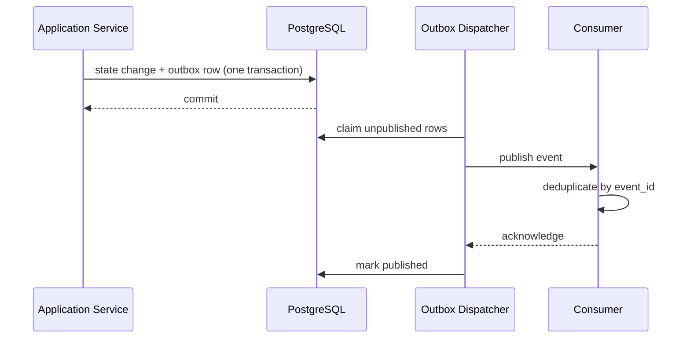

- 전달 보장은 at-least-once다.
- 순서는 `aggregate_id` 안에서 `aggregate_version`으로 확인한다.
- consumer는 `(consumer_name, event_id)` dedup key를 사용한다.
- 10회 발행 실패 event는 dead-letter 상태로 전환하고 운영 경보를 발생시킨다.

## 9. 상태 전이

### 9.1 Mandate aggregate

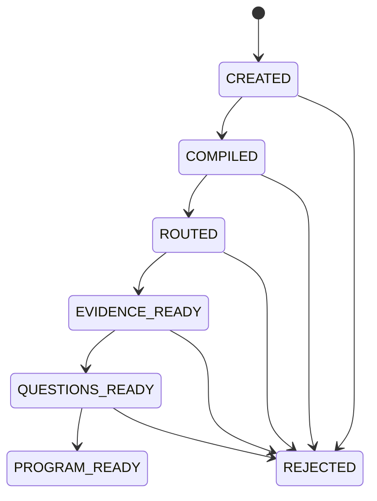

새 입력으로 수정하면 기존 aggregate를 되돌리지 않고 `supersedes_mandate_id`를 가진 새 mandate를 만든다.

### 9.2 Question aggregate

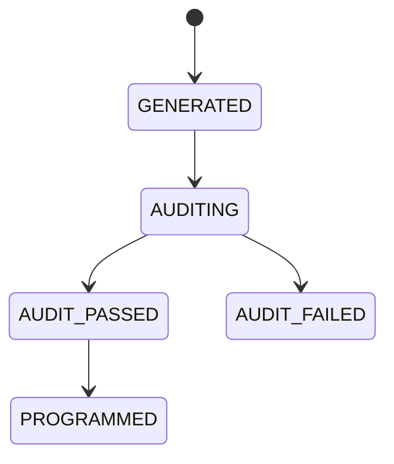

`AUDIT_FAILED` 질문은 immutable이다. 수정은 `parent_question_id`가 있는 새 question이다.

### 9.3 Experiment aggregate

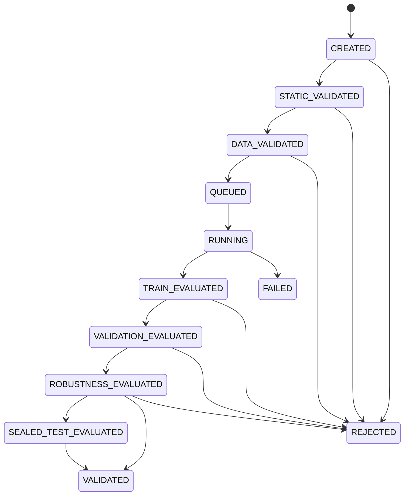

sealed test가 mandate에서 요구되면 `ROBUSTNESS_EVALUATED → VALIDATED` 직접 전이는 금지된다. `FAILED`는 infrastructure 또는 unexpected software failure이고 `REJECTED`는 연구 gate의 정상적인 부정 결과다.

### 9.4 Strategy registry

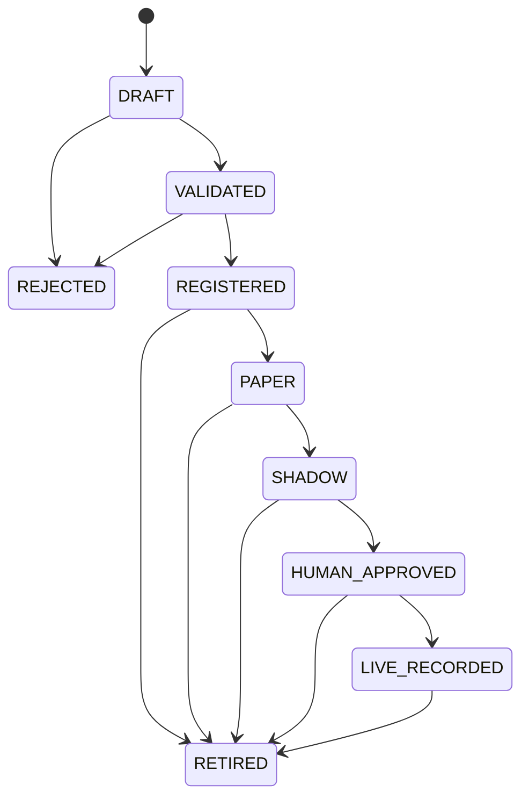

`SHADOW → HUMAN_APPROVED`는 `RISK_APPROVER`, `HUMAN_APPROVED → LIVE_RECORDED`는 서로 다른 `RISK_APPROVER`와 `PLATFORM_ADMIN`의 두 승인 기록을 요구한다. AI/service identity는 guard에서 거부된다.

### 9.5 Job aggregate

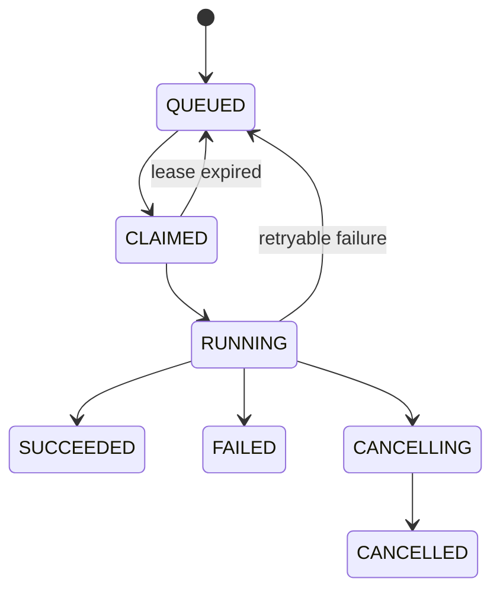

## 10. 동시성, 멱등성, Job lease

### 10.1 Resource 동시성

- mutable aggregate는 증가하는 `row_version`을 가진다.
- command는 읽은 `expected_version`을 전달한다.
- update는 `WHERE id = :id AND row_version = :expected`를 사용한다.
- 영향 행이 0이면 `AF-CONCURRENCY-001`을 반환하며 자동 merge하지 않는다.
- append-only entity는 update하지 않고 새 revision을 만든다.

### 10.2 Request 멱등성

- mutation은 `Idempotency-Key`를 받는다.
- scope는 `(actor_id, HTTP method, normalized route, key)`다.
- server는 canonical request hash를 함께 저장한다.
- 같은 key·같은 hash는 최초 응답을 반환한다.
- 같은 key·다른 hash는 conflict다.
- record TTL은 일반 command 24시간, experiment/holdout/승격 7년이다.

### 10.3 Job claim

Worker는 하나의 transaction에서 다음 순서를 수행한다.

1. `QUEUED`이고 `available_at <= now()`인 행을 priority, created_at 순으로 `FOR UPDATE SKIP LOCKED` 조회한다.
2. status를 `CLAIMED`, `lease_owner`, `lease_expires_at = now()+60s`로 변경한다.
3. 별도 transaction에서 `RUNNING`으로 전환한다.
4. 15초마다 heartbeat와 progress를 갱신한다.
5. 두 heartbeat를 놓치고 lease가 만료되면 scheduler가 retry policy를 검사한다.

Schema·권한·gate 실패는 재시도하지 않는다. network timeout, provider 429/5xx, worker loss, transient DB disconnect만 exponential backoff 5s/30s/120s로 최대 3회 재시도한다. Sealed holdout job은 access row가 이미 원자적으로 소비되므로 worker loss 후 같은 experiment id로만 재개하고 새 접근을 만들지 않는다.

## 11. Cache와 무효화

| Cache | Key | Value | 무효화 |
|---|---|---|---|
| Experiment result | fingerprint | completed experiment id | key 구성요소 변경 시 새 key; 기존 값 불변 |
| Schema registry | schema id + version | compiled validator | process restart 또는 새 version 등록 |
| Capability snapshot | snapshot hash | immutable snapshot | 무효화 없음; 새 snapshot 생성 |
| Knowledge retrieval | namespace version + query hash + policy date | claim ids | namespace revision 변경 시 version key 변경 |
| Report render | report input hash + renderer version | artifact hash | 입력 또는 renderer version 변경 |

공유 mutable cache는 사용하지 않는다. process-local bounded LRU는 immutable value에만 허용하며 source of truth가 아니다.

## 12. Repository Directory Structure

```text
alpha_foundry/
├── pyproject.toml
├── uv.lock
├── alembic.ini
├── docker-compose.yml
├── apps/
│   ├── api/
│   │   ├── main.py
│   │   ├── dependencies.py
│   │   └── routers/
│   ├── cli/
│   │   ├── main.py
│   │   └── commands/
│   ├── worker/main.py
│   ├── dispatcher/main.py
│   └── scheduler/main.py
├── alpha_foundry/
│   ├── core/
│   │   ├── ids.py
│   │   ├── time.py
│   │   ├── money.py
│   │   ├── mandates/
│   │   ├── questions/
│   │   ├── hypotheses/
│   │   ├── strategies/
│   │   ├── programs/
│   │   ├── experiments/
│   │   ├── state_machine/
│   │   └── provenance/
│   ├── application/
│   │   ├── commands/
│   │   ├── queries/
│   │   ├── services/
│   │   └── dto/
│   ├── ports/
│   │   ├── repositories.py
│   │   ├── llm.py
│   │   ├── artifacts.py
│   │   ├── datasets.py
│   │   └── events.py
│   ├── orchestration/
│   │   ├── domain_router/
│   │   ├── question_generation/
│   │   ├── question_audit/
│   │   ├── program_builder/
│   │   ├── search_budget/
│   │   └── feedback_policy/
│   ├── knowledge/
│   │   ├── ingestion/
│   │   ├── claims/
│   │   ├── contradictions/
│   │   ├── failures/
│   │   └── retrieval/
│   ├── capabilities/
│   │   ├── datasets/
│   │   ├── engines/
│   │   ├── configs/
│   │   └── snapshots/
│   ├── labs/
│   │   ├── factor_portfolio/
│   │   ├── stat_arb/
│   │   ├── market_making/
│   │   ├── structural_flow/
│   │   ├── cross_venue/
│   │   ├── derivatives_rv/
│   │   ├── event_fundamental/
│   │   └── time_series/
│   ├── engines/
│   │   ├── panel_portfolio/
│   │   ├── multileg_sequential/
│   │   ├── lob_discrete_event/
│   │   ├── structural_event/
│   │   ├── multivenue_graph/
│   │   ├── derivatives_cashflow/
│   │   ├── point_in_time_event/
│   │   ├── sequential_forecast/
│   │   └── meta_allocation/
│   ├── validation/
│   │   ├── common/
│   │   └── domains/
│   ├── ledger/
│   ├── registry/
│   ├── reports/
│   └── infrastructure/
│       ├── postgres/
│       ├── blob/
│       ├── parquet/
│       ├── llm/
│       ├── identity/
│       └── telemetry/
├── schemas/
│   ├── api/
│   ├── domains/
│   └── events/
├── migrations/versions/
├── configs/
│   ├── local/
│   ├── test/
│   └── examples/
├── knowledge/
│   └── wiki/
│       ├── shared/
│       └── domains/
├── examples/
│   ├── factor_portfolio/
│   ├── stat_arb/
│   ├── market_making/
│   ├── structural_flow/
│   ├── cross_venue/
│   ├── derivatives_rv/
│   ├── event_fundamental/
│   └── time_series/
├── tests/
│   ├── unit/
│   ├── contract/
│   ├── integration/
│   ├── e2e/
│   ├── property/
│   ├── leakage/
│   ├── performance/
│   ├── recovery/
│   ├── red_team/
│   └── fixtures/
└── docs/
```

## 13. Service Dependency

| Consumer | Dependency | 실패 시 동작 | Timeout / Retry |
|---|---|---|---|
| API | PostgreSQL | mutation 거부, health degraded | connect 2s, statement 5s; request 내 자동 retry 없음 |
| Worker | PostgreSQL | lease 만료 후 다른 worker 회수 | connect 5s; transaction 전체 최대 3회 |
| Worker | Blob Storage | artifact commit 전 job retry | connect 5s, operation 60s; 3회 |
| Generator Worker | LLM Gateway | job retry 또는 structured failure | connect 5s, total 120s; 429/5xx 2회 |
| Data Worker | Licensed source | dataset ingestion 실패; 기존 version 영향 없음 | source profile이 소유, 최대 3회 |
| API | OIDC JWKS | cached key 유효 기간 안에는 계속 검증 | fetch 3s; cache 1h, key-id miss 즉시 refresh 1회 |
| All processes | Telemetry backend | business path 계속, bounded local buffer | export 5s; buffer 10,000 spans/logs |

## 14. Deployment Architecture

### 14.1 Local/CI

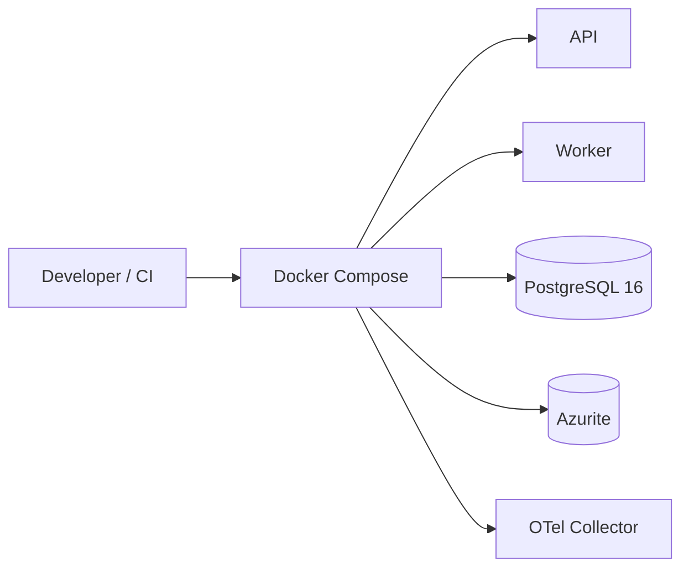

Local identity는 test OIDC issuer가 서명한 짧은 수명 token을 사용한다. Production credential을 local config에 넣지 않는다.

### 14.2 Production

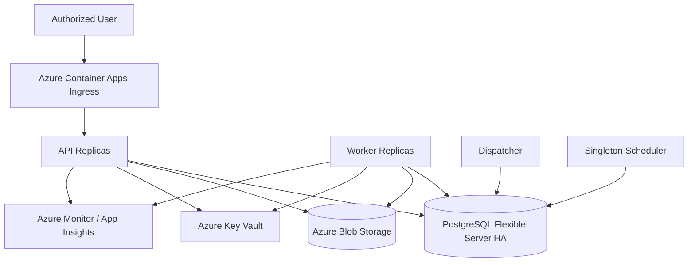

- API는 minimum 2 replica, Worker는 1~8 replica autoscale이다.
- private endpoint로 DB·Blob·Key Vault에 접근한다.
- migration은 배포 전용 one-shot job이 advisory lock을 획득한 뒤 실행한다.
- schema migration 성공 전 새 application revision에 traffic을 보내지 않는다.
- worker는 API보다 먼저 scale-to-zero하지 않으며 queue depth와 oldest job age로 확장한다.

## 15. 주요 Sequence

### 15.1 영역 지시에서 Program 생성

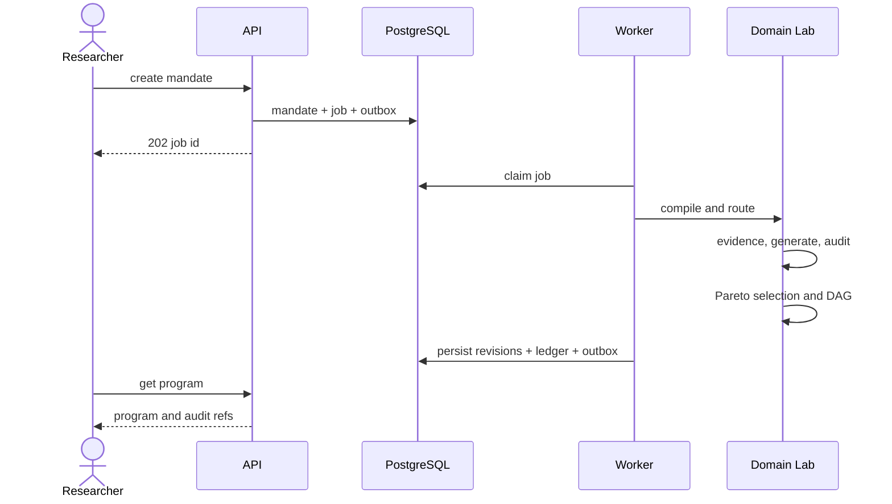

### 15.2 Experiment 실행과 cache

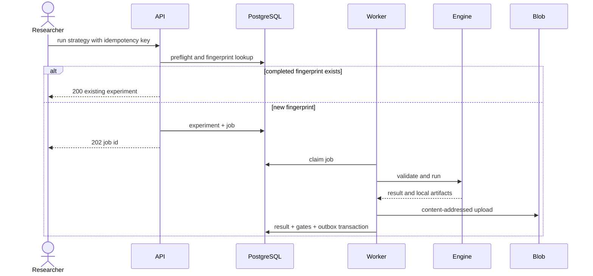

### 15.3 Sealed holdout

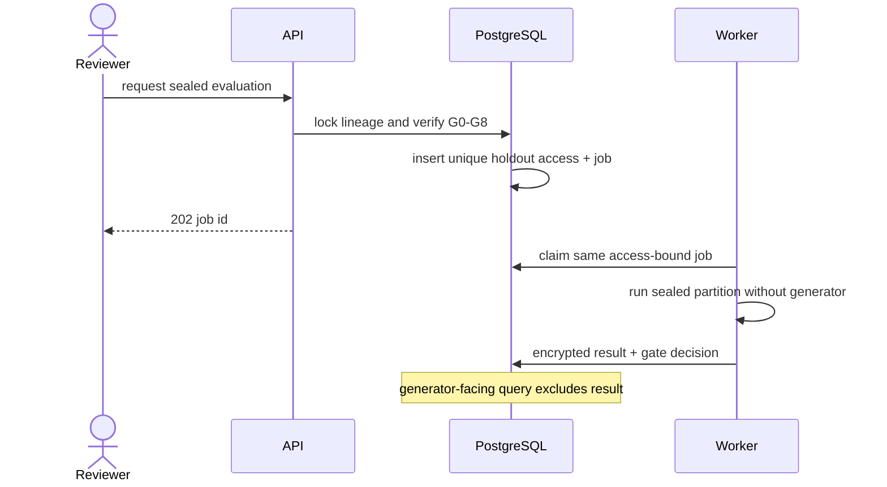

## 16. 보안 구조

- OIDC access token의 `sub`, `actor_type`, `roles`, `tenant`, `exp`, `aud`를 검증한다.
- application service가 RBAC와 transition guard를 적용하고 DB role은 API/worker/dispatcher/migration으로 분리한다.
- 사람이 제출한 원문과 prompt는 secret scanner와 PII redactor를 통과한다. provenance에는 원문 대신 hash와 접근 제한 artifact ref를 남긴다.
- service credential은 managed identity로 취득하고 Key Vault secret을 환경 변수나 log에 직렬화하지 않는다.
- artifact는 private container, short-lived delegated access, server-side encryption을 사용한다.
- Production egress는 승인된 LLM·data endpoint allowlist로 제한한다.
- holdout partition은 일반 dataset reader가 열 수 없고 `SealedDatasetPort`만 승인된 access id로 읽는다.

## 17. 관측성

### 17.1 공통 log 필드

`timestamp`, `level`, `service`, `release`, `trace_id`, `span_id`, `correlation_id`, `actor_id_hash`, `job_id`, `aggregate_type`, `aggregate_id`, `aggregate_version`, `experiment_id`, `fingerprint_prefix`, `event`, `duration_ms`, `error_code`를 사용한다.

시장 데이터 row, prompt 원문, token, secret, full position series는 log에 남기지 않는다.

### 17.2 핵심 metric

- `http_request_duration_seconds`
- `job_queue_depth`, `job_oldest_age_seconds`, `job_duration_seconds`, `job_retry_total`
- `worker_lease_recovery_total`
- `experiment_cache_hit_total`
- `validation_gate_failure_total{gate,domain}`
- `holdout_access_total{outcome}`
- `llm_request_duration_seconds`, `llm_schema_reject_total`, `llm_token_total`
- `artifact_write_bytes`, `artifact_checksum_failure_total`
- `outbox_lag_seconds`, `outbox_dead_letter_total`
- `db_pool_wait_seconds`, `db_transaction_retry_total`

## 18. 장애와 복구

| 장애 | 감지 | 복구 | 불변식 |
|---|---|---|---|
| API process 종료 | health probe | replica 교체 | command는 transaction 또는 무효 |
| Worker 종료 | heartbeat·lease expiry | 같은 job id 회수 | side effect dedup, holdout access 재소비 금지 |
| DB primary 장애 | managed health | HA failover | committed ledger 보존 |
| Blob 일시 장애 | write failure metric | job retry | DB는 없는 blob을 참조하지 않음 |
| LLM invalid JSON | schema reject | repair prompt 1회, 그 뒤 실패 | 자유 형식 저장·실행 금지 |
| LLM outage | timeout/rate metric | retry 후 job 실패 | deterministic job은 독립 실행 |
| Outbox consumer 장애 | lag metric | 재발행 | at-least-once + dedup |
| 손상 artifact | checksum read | replica/backup 복원, experiment quarantine | 손상 결과 재사용 금지 |
| Dataset version 철회 | capability status | 신규 실행 차단 | 과거 experiment lineage는 보존 |

백업·보존의 물리 규칙은 [Database](05_Database.md#14-백업과-복구)가 소유하고 검증 절차는 [TestPlan](07_TestPlan.md#11-장애-복구-테스트)이 소유한다.

## 19. Architecture Decision 연결

| 결정 | 문서 |
|---|---|
| 모듈형 단일 애플리케이션 | [ADR-0001](ADR/ADR-0001-modular-monolith.md) |
| 도메인 판별형 계약 | [ADR-0002](ADR/ADR-0002-domain-discriminated-contracts.md) |
| 도메인별 engine | [ADR-0003](ADR/ADR-0003-domain-specific-backtest-engines.md) |
| LLM·결정론 경계 | [ADR-0004](ADR/ADR-0004-llm-deterministic-boundary.md) |
| 저장소 토폴로지 | [ADR-0005](ADR/ADR-0005-storage-topology.md) |
| lineage와 sealed holdout | [ADR-0006](ADR/ADR-0006-experiment-lineage-and-sealed-holdout.md) |
| 영속 비동기 job | [ADR-0007](ADR/ADR-0007-durable-asynchronous-jobs.md) |
| 도메인 결합 제한 | [ADR-0008](ADR/ADR-0008-cross-domain-composition.md) |
