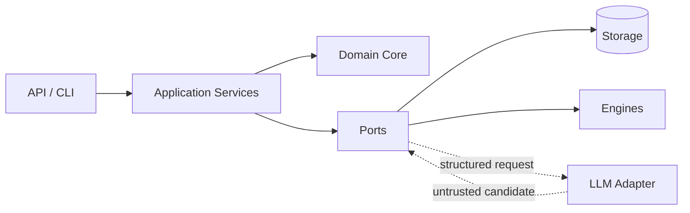
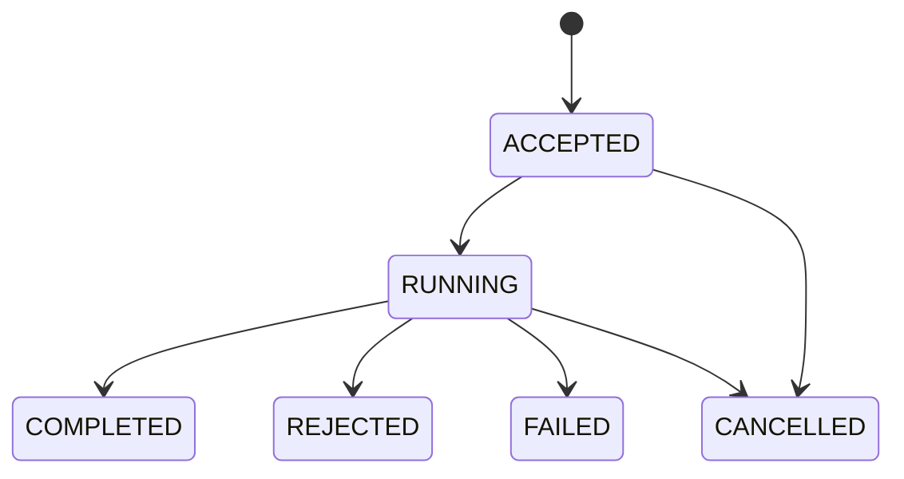
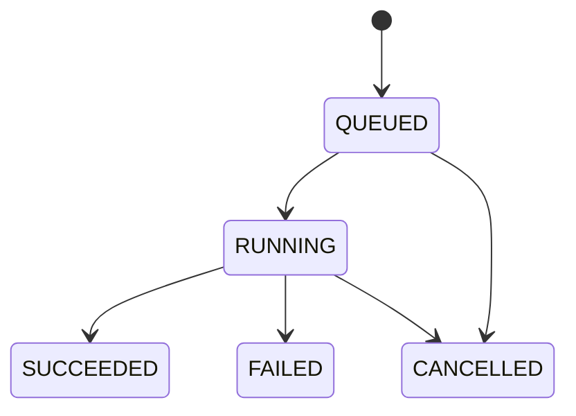
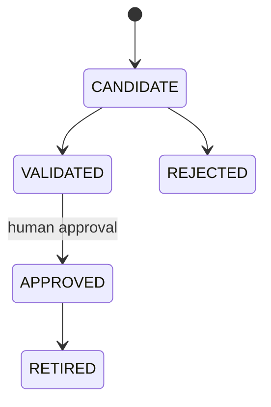
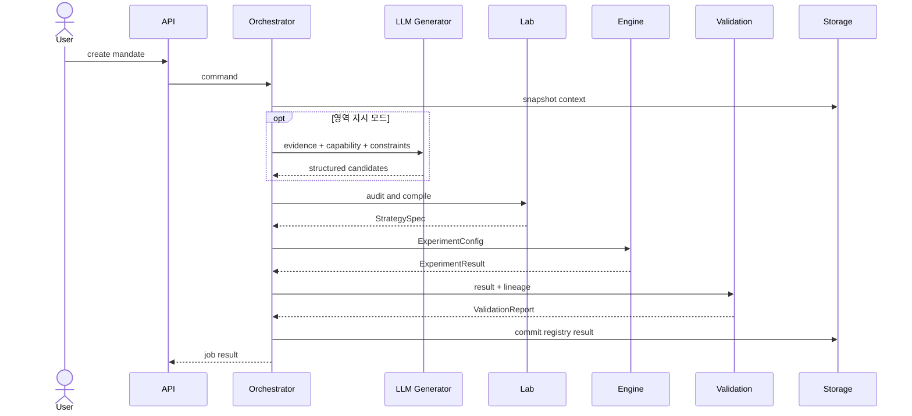
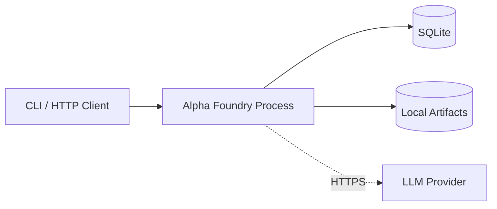

# Alpha Foundry 아키텍처

상태: Approved  
범위: MVP 구조와 확장 경계

## 1. 설계 원칙

1. 하나의 repository와 release를 갖는 모듈형 단일 애플리케이션으로 시작한다.
2. 도메인 모델은 framework, DB, LLM SDK에 의존하지 않는다.
3. LLM은 후보만 생성하며 상태 전이와 판정은 결정론적 코드가 수행한다.
4. 질문·전략·엔진은 도메인별 계약을 사용한다.
5. 모든 실험 입력은 실행 전에 immutable fingerprint로 고정한다.
6. 세부 인프라는 port 뒤에 두어 MVP 구현을 불필요하게 확장하지 않는다.

관련 결정은 [ADR-0001](./ADR/ADR-0001-modular-monolith.md), [ADR-0002](./ADR/ADR-0002-domain-discriminated-contracts.md), [ADR-0004](./ADR/ADR-0004-llm-deterministic-boundary.md)에 기록한다.

## 2. 시스템 구조

전체 개요는 [README 다이어그램](./README.md#프로그램-전체-구조)을 사용한다. 이 문서의 다이어그램은 개별 구현 질문에만 답한다.

### 2.1 실행 경계



- `Domain Core`: 상태, entity, schema, 정책, 불변식의 권위자
- `Application Services`: use case 조정과 transaction 경계
- `Ports`: storage, LLM, engine, clock, ID, artifact의 추상 계약
- `Adapters`: FastAPI, CLI, SQLite, filesystem, provider SDK 구현
- `Engines`: StrategySpec을 받아 ExperimentResult를 반환하는 결정론적 실행기

LLM 응답은 `untrusted candidate`다. schema validation, capability 검사, budget 검사, hard gate를 통과한 뒤에만 entity revision으로 저장한다.

## 3. 컴포넌트 책임

| 컴포넌트 | 책임 | 소유 데이터 | 호출 가능 대상 |
| --- | --- | --- | --- |
| API/CLI Adapter | 입력 parsing, 인증 컨텍스트, 출력 formatting | 없음 | Application Services |
| Research Orchestrator | use case 순서, 예산, 프로그램 DAG, 승인 관문 | Mandate/Program 상태 | 아래 모든 application port |
| Knowledge Plane | source·claim·반대근거·실패기억 조회 | Knowledge record | StoragePort |
| Capability Plane | dataset·engine·config snapshot 생성 | CapabilitySnapshot | StoragePort, registries |
| Domain Router | 주 도메인과 보조 interface 선택 | DomainRoute | Lab Registry |
| Lab Registry | domain key로 Lab plugin 제공 | plugin metadata | Lab plugin |
| Research Generator | 질문·가설·전략 후보 생성 | 권위 데이터 없음 | LLMPort |
| Question Auditor | schema·근거·실행 가능성 검사 | AuditResult | Capability, validation rules |
| Experiment Compiler | 실행 입력 정규화와 fingerprint 생성 | ExperimentConfig | Engine Registry |
| Engine Registry | engine key로 실행기 제공 | engine metadata | Engine |
| Validation Registry | 공통·도메인 gate 실행 | ValidationReport | validation rules |
| Result Registry | Strategy 또는 Rejection 종결 기록 | registry entry | StoragePort |
| Job Runner | 장시간 use case 실행과 복구 | Job | Application Services |

컴포넌트는 다른 컴포넌트의 DB table을 직접 읽지 않는다. Application service 또는 공개 port를 사용한다.

## 4. 핵심 계약

### 4.1 Lab Plugin

```python
class LabPlugin(Protocol):
    domain: Domain
    question_model: type[ResearchQuestionPayload]
    strategy_model: type[StrategyPayload]
    engine_key: str

    def audit_question(self, question, capability) -> AuditResult: ...
    def compile_hypothesis(self, question) -> HypothesisSpec: ...
    def compile_strategy(self, hypothesis) -> StrategySpec: ...
    def validation_rules(self) -> Sequence[ValidationRule]: ...
```

MVP의 8개 plugin은 모두 이 계약을 구현한다. Factor와 StatArb만 실제 engine을 사용하고 나머지는 fixture smoke engine을 사용한다.

### 4.2 Engine

```python
class ExperimentEngine(Protocol):
    engine_key: str

    def validate_config(self, config: ExperimentConfig) -> None: ...
    def run(self, config: ExperimentConfig, data: DataBundle) -> ExperimentResult: ...
```

Engine은 LLM, HTTP, application service를 호출하지 않는다. 입력 config를 수정하지 않으며 결과와 artifact만 반환한다.

### 4.3 LLM Port

```python
class ResearchGeneratorPort(Protocol):
    def generate_questions(self, request: QuestionGenerationRequest) -> list[dict]: ...
    def generate_hypothesis(self, request: HypothesisGenerationRequest) -> dict: ...
    def generate_strategy(self, request: StrategyGenerationRequest) -> dict: ...
```

Adapter는 timeout, provider 오류, token 사용량을 표준 결과로 변환한다. Domain object 생성은 adapter가 아니라 application service가 담당한다.

## 5. 데이터 흐름

### 5.1 연구 생성과 실행

1. API/CLI가 Mandate command를 Application Service에 전달한다.
2. Orchestrator가 Capability snapshot과 Knowledge context를 고정한다.
3. Domain Router가 주 도메인을 선택한다.
4. 질문 지정 모드는 입력 질문을 정규화하고, 영역 지시 모드는 LLM 후보를 생성한다.
5. Question Auditor가 후보를 판정한다.
6. 승인 질문에서 Hypothesis와 Strategy revision을 생성한다.
7. Experiment Compiler가 데이터·정책·seed·버전을 고정하고 fingerprint를 계산한다.
8. Engine Registry가 해당 engine으로 실행한다.
9. Validation Registry가 공통 gate 후 도메인 gate를 실행한다.
10. 통과하면 Strategy Registry, 실패하면 Rejection Registry에 기록한다.

### 5.2 Experiment fingerprint

다음 canonical JSON의 SHA-256을 사용한다.

```text
strategy schema/version + normalized payload
dataset IDs + immutable versions + content hashes
period + split policy
cost/latency/fill/slippage/impact/borrow/funding policies
engine key/version
validation rule-set version
random seed
code release
```

key 정렬, UTF-8, UTC timestamp, 명시적 null, decimal 문자열 표현을 사용한다. 같은 fingerprint의 성공 결과가 있으면 기존 experiment를 반환한다.

## 6. Event Flow

MVP 이벤트는 외부 broker가 아니라 application transaction 이후 in-process dispatcher에 전달한다. 이벤트는 관측과 후속 작업을 위한 것이며 비즈니스 상태의 권위 원본이 아니다.

| Event | 발생 시점 | 소비자 |
| --- | --- | --- |
| `mandate.accepted` | Mandate 저장 완료 | Job Runner |
| `question.approved` | 감사 통과 | Program Builder |
| `question.rejected` | 감사 실패 | Failure Memory Writer |
| `experiment.completed` | 결과와 artifact 저장 완료 | Validation Service |
| `experiment.failed` | 실행 실패 저장 완료 | Failure Memory Writer |
| `validation.completed` | report 저장 완료 | Result Registry |

이벤트 envelope은 [04_API.md](./04_API.md#8-event-schema)가 정의한다. Beta 다중 Worker 전환 시 동일 event name과 payload version을 유지한다.

## 7. State Transition

### 7.1 Mandate



### 7.2 Experiment



### 7.3 Registry



허용되지 않은 전이는 `AF-STATE-001`로 거절한다. terminal state를 되돌리지 않는다. 수정은 새 revision을 만든다.

## 8. Sequence Diagram



LLM 호출 실패는 engine 실행을 시작시키지 않는다. Engine 또는 validation 실패는 성공 Registry entry를 만들지 않는다.

## 9. 의존성 규칙

```text
interfaces/adapters  ──> application ──> domain
infrastructure       ──> application ports
labs                 ──> domain contracts
engines              ──> engine contracts + domain value objects
domain               ──> standard library only
```

금지되는 의존성:

- `domain -> application/infrastructure/interfaces`
- `engine -> LLM/API/DB adapter`
- `lab A -> lab B`의 내부 모듈
- `API route -> repository` 직접 호출
- `LLM adapter -> domain repository` 직접 호출

## 10. Directory Structure

```text
src/alpha_foundry/
├── domain/
│   ├── models.py
│   ├── states.py
│   ├── policies.py
│   └── errors.py
├── application/
│   ├── commands.py
│   ├── queries.py
│   ├── orchestrator.py
│   ├── jobs.py
│   └── ports.py
├── labs/
│   ├── factor/
│   ├── statarb/
│   ├── market_making/
│   ├── structural_flow/
│   ├── cross_venue/
│   ├── derivatives/
│   ├── event_fundamental/
│   └── time_series/
├── engines/
│   ├── panel.py
│   ├── multileg.py
│   └── smoke.py
├── validation/
│   ├── common.py
│   └── registry.py
├── infrastructure/
│   ├── db/
│   ├── artifacts/
│   ├── llm/
│   └── datasets/
├── interfaces/
│   ├── api/
│   └── cli/
└── bootstrap.py
tests/
├── unit/
├── contract/
├── integration/
├── e2e/
└── fixtures/
```

각 package는 `__init__.py`에 공개 interface만 export한다. 테스트를 제외한 외부 package는 내부 파일을 직접 import하지 않는다.

## 11. Service Dependency

| 호출자 | 의존 대상 | 실패 정책 |
| --- | --- | --- |
| API/CLI | Application Services | domain error를 표준 오류로 변환 |
| Orchestrator | SQLite repository | transaction rollback, job 실패 기록 |
| Orchestrator | LLM adapter | timeout 1회 재시도 후 생성 실패 |
| Orchestrator | Dataset adapter | 누락·hash 불일치 시 실행 차단 |
| Orchestrator | Engine | 예외를 `ENGINE_FAILED`로 격리 |
| Validation | Artifact reader | 누락 artifact면 hard fail |

MVP는 단일 process 안에서 호출하므로 네트워크 retry를 일반화하지 않는다.

## 12. Deployment Architecture

### 12.1 MVP



- API와 단일 Worker는 같은 release를 사용한다.
- SQLite는 WAL mode와 process 단일 writer 규칙을 사용한다.
- artifact는 content hash 기반 경로에 atomic rename으로 저장한다.

### 12.2 Beta

PostgreSQL, object storage, API process와 Worker process 분리를 적용한다. 다중 Worker는 lease와 idempotent side effect가 검증된 후 활성화한다.

### 12.3 Production

관리형 DB·object storage, 비밀 관리, 중앙 log/metric, 백업·복구, 네트워크 접근 제어를 적용한다. Production은 구조 변경이 아니라 MVP port의 adapter 교체다.

## 13. 장애와 복구

| 장애 | MVP 동작 | 불변식 |
| --- | --- | --- |
| LLM timeout | 1회 재시도 후 job 실패 | 후보 revision 미생성 |
| Engine 예외 | experiment `FAILED` | 성공 result·registry 미생성 |
| process 종료 | 시작 시 `RUNNING` job을 `QUEUED`로 복구 | 완료 artifact 유지 |
| artifact 쓰기 중단 | 임시 파일 제거 | metadata는 완성 hash만 참조 |
| DB commit 실패 | transaction rollback | 부분 상태 전이 없음 |
| sealed 실행 중단 | access는 소비된 것으로 유지 | 두 번째 노출 금지 |

## 14. 관측성

모든 구조화 log는 다음 필드를 포함한다.

```text
timestamp, level, event, correlation_id, job_id,
mandate_id, experiment_id, stage, duration_ms, error_code
```

LLM prompt 전문, dataset row, secret, sealed selector는 log에 기록하지 않는다. token 수, provider model, prompt hash는 기록한다.

## 15. ADR 연결

| 주제 | ADR |
| --- | --- |
| 배포 단위 | [ADR-0001](./ADR/ADR-0001-modular-monolith.md) |
| 도메인 schema | [ADR-0002](./ADR/ADR-0002-domain-discriminated-contracts.md) |
| 엔진 분리 | [ADR-0003](./ADR/ADR-0003-domain-specific-backtest-engines.md) |
| LLM 경계 | [ADR-0004](./ADR/ADR-0004-llm-deterministic-boundary.md) |
| 저장소 | [ADR-0005](./ADR/ADR-0005-storage-topology.md) |
| 계보와 holdout | [ADR-0006](./ADR/ADR-0006-experiment-lineage-and-sealed-holdout.md) |
| Job 실행 | [ADR-0007](./ADR/ADR-0007-durable-asynchronous-jobs.md) |
| 도메인 결합 | [ADR-0008](./ADR/ADR-0008-cross-domain-composition.md) |
