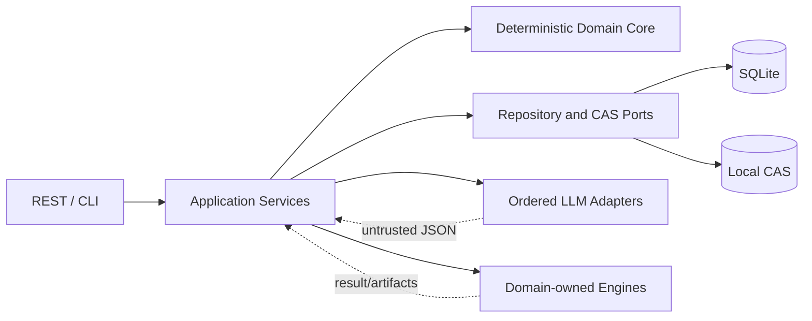
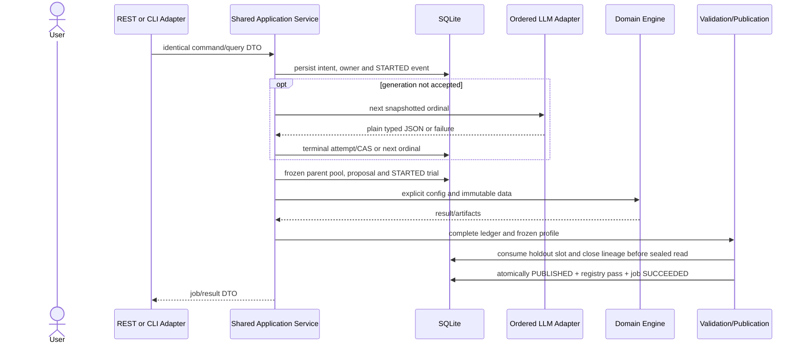

# Alpha Foundry 아키텍처

상태: Approved  
범위: 구현 전 권위 경계와 불변 계약

이 문서는 권위 상태·실행 순서·소유권의 아키텍처 계약이다. HTTP/CLI wire는 [04_API.md](./04_API.md), 영속 제약은 [05_Database.md](./05_Database.md), 구현 규칙은 [06_CodingGuidelines.md](./06_CodingGuidelines.md)를 따른다.

## 1. 설계 원칙

1. Python 모듈형 단일 애플리케이션, SQLite WAL, local CAS artifact와 지속 단일 worker를 사용한다.
2. 결정론적 코드만 schema 검증, compiler, 예산, hash, 검색, 수치 실행, 검증, holdout, registry, publication과 상태 전이를 소유한다. LLM은 typed JSON 후보만 반환한다.
3. 8개 Lab은 Factor, StatArb, Market Making, Structural Flow, Cross Venue, Derivatives, Event Fundamental, Time Series의 별도 typed DSL/compiler와 실제 연구급 수치 엔진을 제공한다. 공통화는 동일성이 입증된 primitive에 한정한다.
4. 모든 의미 있는 resource는 immutable version과 AF-CANON digest로 고정한다. 수정은 새 resource/revision이며 이전 hash를 바꾸지 않는다.
5. provider·engine·publication 같은 외부/복합 작업은 intent와 독점 소유권을 먼저 영속하고, terminal event와 authority 전이를 CAS로 기록한다.
6. 후보 생성·검색·LLM 입력은 sealed selector, holdout metric, 상세 결과를 볼 수 없다. 사용자에게는 완전한 `PUBLISHED` aggregate만 보인다.
7. API와 CLI는 같은 application service command/query를 호출한다. adapter가 business rule, hash 또는 상태 전이를 구현하지 않는다.
8. cross-domain composition과 Meta Portfolio는 deferred다. 하나의 strategy는 하나의 primary domain만 가지며 Lab 내부를 서로 import하지 않는다.

## 2. 실행 경계

- **Adapter**: REST 또는 `argparse` 입력을 동일 command/query와 response DTO로 변환한다.
- **Application service**: transaction 경계, write-ahead intent, CAS와 작업 순서를 조정한다.
- **Domain core**: AF-CANON, state machine, compiler, finite iterator, ranking, validation 및 disclosure 정책을 결정론적으로 시행한다.
- **Repository/CAS**: SQLite 제약과 atomic artifact rename을 제공할 뿐 business decision을 만들지 않는다.
- **LLM adapter**: snapshot에 등록된 provider/model을 순서대로 호출하고 plain JSON 결과/오류만 반환한다. provider SDK object와 credential는 경계를 넘지 않는다.
- **Engine**: 입력을 수정하지 않고, 명시된 data/policy로만 실행한다. 누락된 data·cost·latency·fill·slippage·impact·borrow·funding·accounting policy는 reason code와 함께 preflight에서 거절한다.

## 3. 권위 계약

### 3.1 AF-CANON identity registry

모든 normative digest는 SHA-256(`domain_utf8 || 0x00 || field_count_u32be || encoded_fields`)이다. field는 `name_len_u16be || name_ascii || type_tag_u8 || value_len_u64be || value`로 encode하며 이름은 UTF-8 byte 순으로 정렬한다. type tag는 null=0, false=1, true=2, UTF-8 string=3, signed integer=4, Decimal=5, bytes=6, list=7, object=8이다.

- integer는 최소 base-10 ASCII, Decimal은 지수 표기와 negative zero가 없는 normalized ASCII, string은 NFC UTF-8, timestamp는 UTC RFC3339 microsecond, hash는 raw 32 bytes다. NaN/Infinity는 금지한다.
- list는 선언된 semantic order의 length-prefixed item, object는 재귀적으로 정렬된 named field를 encode한다. identity에 영향을 주는 unnamed/implementation-defined 값과 unknown identity field는 거절한다.
- `docs/05_Database.md#32-af-canon-resource-storage`의 hash text는 이 raw digest의 display form일 뿐 canonical input이 아니다.

| Identity | Domain separator | exhaustive named fields |
| --- | --- | --- |
| Candidate | `AF:CANDIDATE:1` | `domain:string`, `operator_set_hash:bytes32`, `strategy_ast:object` |
| Universe | `AF:UNIVERSE:1` | `candidate_hashes:list[bytes32]` raw-byte ascending, `domain:string`, `operator_set_hash:bytes32`, `version:string` |
| SearchSpec | `AF:SEARCH_SPEC:1` | `code_hash:bytes32`, `dataset_hashes:list[bytes32]` ascending, `domain:string`, `initial_population_size:int`, `offspring_count:int`, `operator_schedule:list[string]` declared order, `operator_set_hash:bytes32`, `parent_pool_size:int`, `patience:int`, `policy_hashes:list[bytes32]` ascending, `profile_hash:bytes32`, `schema_hashes:list[bytes32]` ascending, `seed:int`, `universe_hash:bytes32` |
| Traversal | `AF:TRAVERSAL:1` | `candidate_hash:bytes32`, `seed:int` |
| Parent alternative | `AF:PARENT:1` | `generation_index:int`, `operator_id:string`, `parent_hashes:list[bytes32]` tuple order, `schedule_offset:int`, `seed:int`, `slot_index:int` |
| Parameter alternative | `AF:PARAMETER:1` | `generation_index:int`, `operator_id:string`, `parameter_indices:list[int]`, `schedule_offset:int`, `seed:int`, `slot_index:int` |
| Parent-pool snapshot | `AF:PARENT_POOL:1` | `generation_index:int`, `parent_candidate_hashes:list[bytes32]` exact ranked order, `profile_hash:bytes32`, `search_spec_hash:bytes32` |
| GenerationRequest | `AF:GENERATION_REQUEST:1` | `capability_snapshot_hash:bytes32`, `claim_pins:list[object{id:string,version:string,hash:bytes32}]` ID/version/hash order, `constraints:object`, `domain:string`, `knowledge_pack_hash:bytes32`, `provider_chain:list[object{ordinal:int,provider:string,model:string,config_hash:bytes32}]` ordinal order, `request_schema_hash:bytes32`, `sampling:object`, `user_request:object` |

`max_generations`는 SearchSpec, resource, API, DB와 implementation에 존재하지 않는다. 정상 종료는 `PLATEAU` 또는 `UNIVERSE_EXHAUSTED`뿐이며 cancellation/interruption은 typed failure다.

`operator_set_hash`는 ID/version, 모든 operator ID/version·arity·commutativity·implementation/compiler semantic version·입출력 AST type·typed parameter name/type·finite grid·grid ordering/dedup·mutation/crossover semantics·validity predicate·referenced schema hash 전체를 포함한다. `profile_hash`는 score metric definition/version·direction·Decimal quantization/rounding·lexicographic order·hard gate ID/order/threshold·parent/PBO eligibility·tie-break·patience·purged/embargoed exact fold ID·CSCV/PBO parameter/minimum·holdout policy·HoldoutDisclosurePolicy allowlist/version·validation implementation/schema hash 전체를 포함한다.

`universe_hash`는 domain, operator-set hash, version, raw-byte sorted complete candidate list를 포함한다. `dataset_hashes`는 immutable DataBundle manifest/PIT availability/type/unit/row-content hash/version, `policy_hashes`는 모든 비용·지연·fill·slippage·impact·borrow·funding·accounting value와 semantic version, `schema_hashes`는 question/strategy/execution/result/report schema, `code_hash`는 release/compiler/engine/validation/canonicalization identity를 포함한다. semantic component의 변화는 해당 resource hash와 SearchSpec hash를 반드시 바꾼다. comment/display label은 semantic input이 아니다. parameter name은 ASCII 순, grid는 AF-CANON encoded value byte 순으로 deduplicate하며 마지막 parameter가 가장 빨리 변한다.

### 3.2 GenerationRequest, ordered fallback, replay

CapabilitySnapshot은 immutable ordered provider/model chain을 가진다. GenerationRequest는 위 digest로 unique하며 state는 `AVAILABLE | RUNNING | ACCEPTED | FAILED`다. request row는 owner token/job, lease epoch/expiry, next ordinal, accepted artifact, row version을 가진다. owner event는 `ACQUIRED`, `RELEASED_INTERRUPTED`, `TRANSFERRED`, `COMPLETED`뿐이다.

1. unique insert는 `AVAILABLE`, epoch 0, owner null을 만든다. owner-null/state/version CAS만 `AVAILABLE` epoch 0을 `RUNNING + ACQUIRED`로 바꾼다.
2. release된 epoch>0은 prior release/owner/epoch를 연결한 owner-null/state/version CAS로만 `RUNNING + TRANSFERRED`가 된다. `RUNNING`은 matching token/epoch/version으로만 ordinal·lease를 전진하거나 final transition한다.
3. live `RUNNING` 요청은 expiry 뒤에도 기존 owner/job을 반환하며 provider를 호출하지 않는다. 시간 경과는 warning일 뿐 authority transfer 근거가 아니다.
4. provider 호출 전에 unique `(request_id, ordinal)` `STARTED` attempt를 insert한다. invalid/failure terminal과 ordinal advance는 하나의 guarded transaction이다.
5. valid JSON은 typed schema 검증 후 hash 검증·atomic rename으로 accepted artifact를 만든다. 그 뒤 한 transaction에서 `SUCCEEDED_VALID`, matching token/epoch/version/ordinal CAS `RUNNING→ACCEPTED`, artifact link, owner clear, `COMPLETED`를 append한다. final chain failure도 같은 CAS로 `FAILED + COMPLETED`다.
6. owner job이 terminal이면 matching CAS가 dangling attempt를 `INTERRUPTED`로 terminalize하고 uncertain ordinal을 skip하여 `AVAILABLE + RELEASED_INTERRUPTED`로 만든다. terminal 전에 crash하면 이렇게 처리하고, terminal 뒤 crash면 다음 ordinal을 계속한다. artifact rename 뒤 acceptance 전 CAS file은 orphan일 수 있으나 authority가 아니다.
7. `ACCEPTED`/`FAILED` duplicate 또는 resubmit은 바꾸지 않고 zero call이다. accepted artifact replay는 LLM을 다시 호출하지 않는다.

### 3.3 Frozen parent pool과 finite first-admissible search

Universe는 duplicate-free candidate hash raw-byte order이고 traversal은 `(TraversalDigest, candidate_hash)` 순이다. generation 0은 traversal 순으로 `min(initial_population_size, N)` trial을 시작한다. generation `g >= 1`의 slot 0 전에 transaction으로 다음 immutable parent-pool row를 만든다.

1. generation-start commit 전에 terminal `EVALUATED`, 모든 frozen hard gate 통과, complete/finite/quantized score vector인 CandidateTrial만 읽는다.
2. profile의 exact lexicographic field/direction/quantized value와 raw candidate hash ascending으로 정렬하고 `K=min(parent_pool_size, eligible_count)`를 retain한다.
3. exact ordered hashes, profile hash와 `AF:PARENT_POOL:1` digest를 `(search_run_id, generation_index)` unique row로 저장한다. 이후 slot은 live ranking query가 아니라 이 row만 읽는다. 늦게 terminalize한 trial은 다음 generation에서만 고려한다.

offspring generation의 slot은 `0..offspring_count-1`이다. 각 slot은 schedule offset ascending, `schedule[(g*O+s+offset) mod length]`, parent digest/hash 순 legal tuple, Parameter digest/vector 순 finite iterator를 사용한다. mutation parent는 중복되지 않고 crossover는 ordered distinct pair(commutative면 canonical `(min,max)` 1개)다. parent 부족 또는 `K=0`이면 parent iterator는 비어 있다.

slot은 순차적으로 실행하고 evaluation order는 ledger position이다. 소비한 alternative마다 schema-invalid이면 `INVALID`, universe 밖이면 `OUTSIDE_UNIVERSE`, 이미 run-scoped proposed/visited면 `DUPLICATE` event를 append한다. 첫 schema-valid/in-universe/unseen candidate만 승자다: accepted proposal, proposed set, 정확히 하나의 `STARTED` CandidateTrial, visited set을 한 transaction으로 기록하고 slot을 멈춘다. 소비하지 않은 alternative은 event가 없다. alternative이 모두 끝나면 traversal universe를 한 번 스캔하여 first unseen candidate를 선택하고 `DIRECT_FALLBACK`, accepted proposal, proposed/visited set, 정확히 하나의 `STARTED` trial을 한 transaction으로 기록한다. 없으면 `SLOT_EXHAUSTED`다. proposed/visited는 run 전체 수명이며 reset되지 않는다. slot당 trial은 0 또는 1개, generation당 최대 O개다.

partial generation은 유효하다. zero-trial generation은 plateau를 바꾸지 않으며 visited=universe면 `UNIVERSE_EXHAUSTED`, 아니면 `FAILED_INVARIANT`다. plateau는 `best=None,counter=0`에서 시작한다. 첫 eligible best는 counter 0, best가 없고 eligible vector가 없으면 increment, strict improvement는 reset, 동점/악화 또는 best 뒤 no eligible vector는 한 번 increment한다. patience(최소 1)는 initialization 및 매 completed generation 뒤 검사한다. precedence는 interruption/invariant failure, universe exhaustion, plateau 순이며 동시면 exhaustion이 이긴다.

### 3.4 CandidateTrial과 exact PBO

preflight/engine 이전의 짧은 transaction은 contiguous ledger position, immutable candidate/operator relation, CandidateTrial `STARTED`, `TRIAL_STARTED`를 함께 기록한다. 각 start에는 정확히 하나의 terminal이 필요하다: `EVALUATED`, `REJECTED_PREFLIGHT`, `REJECTED_HARD_GATE`, `ENGINE_FAILED`, `INTERRUPTED`. startup은 dangling start를 terminalize하고 SearchRun을 failed로 한다. 재제출은 새 lineage다.

PBO certificate는 started/terminal/profile-eligible/matrix trial ID set, count와 expected/observed fold ID를 기록한다. holdout/publication 전에는 다음이 모두 성립해야 한다: `started = terminal` set/count, `eligible = matrix`, 각 eligible fold set = profile fold set, duplicate/missing/NaN/Infinity 없음, normal stop, minimum eligible count 충족. 처음에는 complete finite `EVALUATED`만 eligible이고, profile이 명시한 hard-gate reject는 identical complete folds가 있을 때만 eligible이다. 다른 terminal에 score를 발명하지 않는다. 위반은 `AF-PBO-INCOMPLETE`이며 holdout과 publication을 막는다.

### 3.5 Automatic holdout과 disclosure boundary

pre-validation과 complete PBO가 통과하면 application service가 자동으로 holdout을 시작한다. manual reviewer 승인과 sealed-evaluation endpoint는 없다. sealed read 전에 `BEGIN IMMEDIATE`에서 profile/certificate/open lineage/unused slot을 확인하고 slot을 consume하며 lineage를 close한 뒤 commit한다. 성공·실패·crash와 관계없이 retry/reopen하지 않는다.

frozen HoldoutDisclosurePolicy는 final report의 named aggregate decision/metric/threshold field만 허용한다. selector, row, revealing range, observation return, fold, detail trace와 reconstruction 가능한 값은 공개하지 않는다. report/disclosure module은 knowledge, generation, failure memory, search, ranking, PBO 또는 lineage-mutating service에서 import할 수 없고, 이들 입력도 될 수 없다.

### 3.6 Publication, visibility, restart

preflight-invalid publication request는 `VALIDATION_NOT_PASS`, `LINEAGE_NOT_CLOSED`, `DISCLOSURE_INVALID`, `INPUT_HASH_MISMATCH` 중 non-retryable reason의 idempotent `publication_rejections`만 append하고 Publication은 만들지 않는다.

eligible Publication state는 `AVAILABLE | PREPARING | PUBLISHED | FAILED_RETRYABLE`다. retryable kind는 `ARTIFACT_IO`, `REPORT_RENDER`, `STORAGE_COMMIT`, `OWNER_INTERRUPTED`만 허용한다. Publication은 validation ID unique이며 owner token/job/epoch/expiry/row version과 `ACQUIRED`, `RELEASED_STALE`, `FAILED_ATTEMPT`, `PUBLISHED` event를 가진다. `AVAILABLE` 또는 `FAILED_RETRYABLE`만 fresh token/job/epoch/attempt와 CAS로 `PREPARING`이 된다. live owner의 `PREPARING` duplicate는 expiry 뒤에도 owner job만 반환하고 staging하지 않는다.

정상 path는 matching `PREPARING/token/epoch/version`을 조건으로 한 SQLite transaction 하나다. 이 transaction은 JSON/HTML artifact metadata, validation/strategy/lineage link, 정확히 하나의 pass registry entry, `PUBLISHED`, `PUBLISHED` event와 exact owner job의 `RUNNING→SUCCEEDED` immutable result link를 함께 commit하거나 모두 rollback한다. user-facing strategy/report query는 `PUBLISHED` aggregate만 반환한다.

startup은 예외 없이 persisted `RUNNING` 모든 job을 `FAILED`와 `AF-JOB-INTERRUPTED`로 바꾼다. PUBLISHED는 immutable로 남는다. 그 failed job이 소유한 `PREPARING` publication은 ownership을 clear하고 old job/epoch/orphan hash를 기록하여 `FAILED_RETRYABLE/OWNER_INTERRUPTED`, `RELEASED_STALE`, `FAILED_ATTEMPT`가 된다. live lease expiry만으로 recovery하지 않는다. legacy `PUBLISHED + RUNNING`은 `PUBLISHED + FAILED`이며 success로 복구하지 않는다.

## 4. Application services와 dependency rules

| Service | 소유 책임 | 허용 협력자 |
| --- | --- | --- |
| GenerationService | request identity, ownership, attempt chain, replay | Capability/knowledge repository, LLMPort, CAS |
| SearchService | SearchSpec/run, parent snapshot, iterator, trials | immutable resource repository, Lab compiler, Engine service |
| ValidationService | frozen profile, folds, PBO certificate, automatic holdout trigger | engine results, holdout port, report input DTO |
| PublicationService | disclosure validation, report staging, Publication/job atomic commit | CAS, publication/job repositories |
| RegistryQueryService | `PUBLISHED` result query | publication read model only |
| InternalRejectionQueryService | rejection/failure lineage query | internal read model only |

`interfaces → application → domain`이고 infrastructure는 application ports를 구현한다. Lab/engine은 domain value object와 명시된 contract만 의존한다. 금지 의존성은 `domain → application/infrastructure/interfaces`, `engine → LLM/API/DB`, `Lab A → Lab B internal`, `route/CLI → repository`, `reporting/disclosure → research feedback service`다.

## 5. Durable sequence

## 6. Storage, recovery, observability

CAS write order는 temporary same-filesystem write, byte/hash verification, atomic rename, DB metadata/owner reference transaction이다. orphan CAS file은 proven-unreferenced이고 live generation/publication epoch로 보호되지 않을 때만 정리할 수 있다.

구조화 log에는 `correlation_id`, `job_id`, `request_hash`, `attempt_ordinal`, `search_run_id`, `generation_index`, `slot_index`, `trial_id`, `publication_id`, `stage`, `duration_ms`, `error_code`를 기록한다. secret, prompt/response 전문, raw dataset, sealed selector/detail은 기록하지 않는다.

관련 결정은 [ADR-0001](./ADR/ADR-0001-modular-monolith.md)~[ADR-0008](./ADR/ADR-0008-cross-domain-composition.md), finite search/trial ledger와 validation/holdout/publication ADR에 기록한다.
