# Alpha Foundry 개발 계획

상태: Approved  
계획 원칙: 검증 가능한 권위 계약과 실제 수직 흐름을 먼저 완성한다. 공통화는 두 번째 실제 사용 사례가 증명한 primitive에만 적용하며, 일정 단축을 위해 엔진·검증 범위를 축소하지 않는다.

## 1. 릴리스 정의

| 단계 | 목표 | 종료 조건 |
| --- | --- | --- |
| MVP | 8개 도메인의 연구급 실행, finite search, 검증·공개 경계 완성 | [01_Requirements.md](./01_Requirements.md)의 AC-001~AC-021 및 MVP release gate 통과 |
| 후속 운영 확장 | MVP 외 운영 기능의 별도 승인 | 인증·권한, 다중 worker, 분산 저장소, 실거래는 별도 ADR과 acceptance 필요 |

MVP는 Factor/StatArb만의 초기 수직 흐름이나 다른 6개 domain의 smoke 구현으로 완료될 수 없다. cross-domain composition과 Meta Portfolio는 MVP와 이 계획의 작업 package가 아니다.

## 2. 구현 순서와 의존성

1. **Phase 0** — 권위 문서, manifest/lock/checker, canonical resource와 fixture를 고정한다. 제품 source는 만들지 않는다.
2. **Phase 1** — kernel, migration, canonical encoding, CAS, durable job/restart를 만든다.
3. **Phase 2** — immutable knowledge와 ordered LLM fallback/replay를 만든다.
4. **Phase 3** — Factor DSL/compiler·engine과 finite search, parent-pool, trial ledger를 수직으로 만든다.
5. **Phase 4~10** — 나머지 7개 domain을 각각 독립 연구급 vertical로 완성한다.
6. **Phase 11** — exact PBO, automatic holdout/disclosure, `PUBLISHED` publication·report를 완성한다.
7. **Phase 12** — CLI/REST, observability, recovery, backup, cross-OS와 release approval을 완료한다.

```mermaid
flowchart LR
    P0[Phase 0 Authority and Tooling] --> P1[Phase 1 Kernel and Recovery]
    P1 --> P2[Phase 2 Knowledge and Generation]
    P2 --> P3[Phase 3 Factor Search Vertical]
    P3 --> P4[Phase 4 StatArb]
    P4 --> P5[Phase 5 Market Making]
    P5 --> P6[Phase 6 Structural Flow]
    P6 --> P7[Phase 7 Cross Venue]
    P7 --> P8[Phase 8 Derivatives]
    P8 --> P9[Phase 9 Event Fundamental]
    P9 --> P10[Phase 10 Time Series]
    P10 --> P11[Phase 11 Validation and Publication]
    P11 --> P12[Phase 12 Interfaces and Release]
```

백테스트 엔진만 먼저 만들지 않는다. typed StrategySpec과 compiler, frozen resource, engine policy, validation profile, fixture를 해당 domain vertical에서 함께 완료한다.

## 3. 공통 작업 package 규칙

각 작업 package는 다음을 포함해야 완료된다.

- 관련 FR·AC·ADR·Test ID
- public schema, resource 또는 artifact 영향
- 구현 및 focused unit/contract/integration/numeric/E2E test
- 기존 문서와 traceability 영향
- 재현 가능한 locked 실행 명령

한 PR은 하나의 package 또는 강하게 결합된 두 package만 포함한다. `PUBLISHED` authority, holdout consumption, lineage/trial ledger, generation attempt, parent-pool snapshot, completed fingerprint를 수정·삭제·재작성하는 package는 허용하지 않는다.

## 4. Phase 0 — Authority and Tooling Foundations

**목표:** 코드보다 먼저 모든 semantic input, acceptance, 도구 재현성과 no-composition 경계를 고정한다. 이 Phase에는 제품 source를 추가하지 않는다.

| ID | 작업 | 산출물 | 추적 |
| --- | --- | --- | --- |
| P0-01 | 권위 문서·ADR·diagram 동기화 | scope, eight-engine, search, holdout, publication, restart, report 계약 | AC-001~021 |
| P0-02 | Python/Node manifest와 lock | Python 3.12, locked dev toolchain, Mermaid CLI lock | NFR-DET-001~003 |
| P0-03 | 문서·traceability·architecture·OpenAPI·Mermaid checker | 변경 없이 검증하는 checker와 CI entrypoint | NFR-MNT-001, NFR-TST-001 |
| P0-04 | AF-CANON schema/vector 및 semantic mutation fixture | canonical digest vector, immutable SearchSpec/operator/profile resource | FR-DSL-006, FR-SRCH-002, FR-PROFILE-001~003 |
| P0-05 | 8 domain golden·policy·validation fixture와 disclosure fixture | synthetic data manifest, golden oracle, resource hash | FR-ENG-001~008, FR-POL-001~003 |
| P0-06 | finite search/parent-pool/PBO/holdout/publication traceability | acceptance-to-test matrix | AC-007~021 |

**Exit:** 문서 checker와 traceability가 AC-001~021을 빠짐없이 매핑하고, locked toolchain과 Phase 0 fixture가 재현 가능하다. 코드 구현은 review gate를 통과한 뒤 Phase 1에서 시작한다.

## 5. Phase 1 — Kernel, storage, job recovery

**목표:** 결정론적 identity, local authority storage, artifact 처리, restart fail-closed를 제공한다.

| ID | 작업 | 산출물 | 추적 |
| --- | --- | --- | --- |
| P1-01 | domain IDs/state/error와 AF-CANON | canonical serializer와 golden vectors | NFR-DET-001~003, AC-021 |
| P1-02 | SQLite WAL migration, local CAS, immutable artifact metadata | transaction/repository boundary | FR-LEDGER-001~006 |
| P1-03 | durable job/owner event와 startup recovery | persisted `RUNNING`→`FAILED`, resubmit path | FR-JOB-001~004, AC-020 |
| P1-04 | capability/policy preflight base | versioned data·policy hash와 fail-closed error | FR-POL-001~003, AC-011 |

**Exit:** restart는 모든 persisted `RUNNING` job을 failed로 기록하고, completed fingerprint·consumed holdout·published authority를 변경하지 않는다.

## 6. Phase 2 — Immutable knowledge and ordered generation

**목표:** claim pinning, ordered provider fallback, durable attempt와 zero-call replay를 완성한다.

| ID | 작업 | 산출물 | 추적 |
| --- | --- | --- | --- |
| P2-01 | KnowledgePack/claim repository와 deterministic search | immutable version/hash, citation, counterevidence, failure memory | FR-KNOW-001~006, AC-001 |
| P2-02 | CapabilitySnapshot와 GenerationRequest identity | pinned claims, provider/model chain, request hash | FR-GEN-001~004, AC-002~003 |
| P2-03 | write-ahead attempt 및 fake adapter | ordinal provenance, typed JSON validation, interruption handling | FR-GEN-002~004 |
| P2-04 | accepted artifact replay | no provider call for accepted request | FR-GEN-005, AC-004 |

**Exit:** ordered fallback의 모든 attempt가 저장되고 수락 artifact 재생은 외부 LLM을 호출하지 않는다.

## 7. Phase 3 — Factor, compiler, finite search, trial ledger

**목표:** 첫 번째 실제 domain vertical에서 compiler와 finite deterministic evolutionary search를 구현한다.

| ID | 작업 | 산출물 | 추적 |
| --- | --- | --- | --- |
| P3-01 | Factor typed JSON StrategySpec/allowlist compiler | code-owned execution plan, arbitrary code rejection | FR-DSL-001~006, AC-005~006 |
| P3-02 | SearchSpec, finite universe, deterministic iterator | seed traversal, mutation/crossover allowlist, no-repeat | FR-SRCH-001~004 |
| P3-03 | frozen parent-pool과 lexicographic ranking | immutable generation snapshot, tie-break | FR-SRCH-005~006, AC-007 |
| P3-04 | plateau/exhaustion runner와 write-ahead CandidateTrial | complete trial ledger, generation cap 없는 finite normal stop | FR-SRCH-007~009, FR-LEDGER-001~003, AC-008~009 |
| P3-05 | Factor Panel Portfolio Engine | policy-aware golden accounting, leakage fixture, CLI/REST E2E | FR-ENG-001, FR-POL-001~003 |

**Exit:** same seed와 frozen resources가 same Factor lineage/rank/stop reason을 만들고 Factor 후보가 실제 엔진에서 평가된다. Optimizer 우월성은 exit 조건이 아니다.

## 8. Phase 4~10 — Remaining domain verticals

각 Phase는 schema-only plugin이나 smoke engine을 만들지 않는다. 각 vertical은 typed DSL/compiler, domain data/policy contract, research-grade numerical engine, validation profile, golden accounting/fill fixture, 비용·지연 sensitivity, leakage test, CLI/REST E2E를 포함한다.

| Phase | Domain | FR | Exit evidence |
| --- | --- | --- | --- |
| Phase 4 | StatArb | FR-ENG-002 | Multi-Leg Sequential Engine과 domain oracle/E2E |
| Phase 5 | Market Making | FR-ENG-003 | inventory/fill/adverse-selection accounting oracle/E2E |
| Phase 6 | Structural Flow | FR-ENG-004 | event-impact/execution policy oracle/E2E |
| Phase 7 | Cross Venue | FR-ENG-005 | multi-venue clock/latency/route oracle/E2E |
| Phase 8 | Derivatives | FR-ENG-006 | cash-flow/funding/borrow/margin oracle/E2E |
| Phase 9 | Event Fundamental | FR-ENG-007 | point-in-time event availability oracle/E2E |
| Phase 10 | Time Series | FR-ENG-008 | walk-forward-compatible engine and leakage oracle/E2E |

**Exit:** AC-010과 AC-011의 eight-domain matrix를 완주한다. 공통 utility는 실제로 동일한 실행 primitive가 검증된 경우에만 추출한다.

## 9. Phase 11 — Validation, one-shot holdout, publication

**목표:** search 결과를 공개 결과로 바꾸는 검증과 single visibility boundary를 완성한다.

| ID | 작업 | 산출물 | 추적 |
| --- | --- | --- | --- |
| P11-01 | frozen ValidationProfile, purged/embargoed walk-forward | profile pinning, hard gate, fold fixture | FR-VAL-001~004, FR-PROFILE-001~003, AC-012~014 |
| P11-02 | complete-ledger PBO certificate | exact set/fold equality, hand oracle, incomplete rejection | FR-PBO-001~005, FR-LEDGER-004~005, AC-013 |
| P11-03 | automatic sealed holdout/disclosure boundary | pre-access atomic slot consume, closed lineage, no-feedback scan | FR-HOLD-001~005, AC-015 |
| P11-04 | Rejection Registry and atomic publication | internal failure lineage, `PUBLISHED` registry only | FR-PUB-001~004, FR-REJ-001~003, AC-016~017 |
| P11-05 | ResearchReport renderer | canonical JSON, deterministic escaped HTML, artifact linkage | FR-RPT-001~006, AC-019 |

**Exit:** no user result surface exposes a non-`PUBLISHED` strategy; a consumed holdout slot is never opened again; incomplete PBO prevents holdout and publication.

## 10. Phase 12 — Interfaces, observability, recovery and release

**목표:** shared command surfaces와 operational evidence로 local single-worker MVP를 release-ready 상태로 만든다.

| ID | 작업 | 산출물 | 추적 |
| --- | --- | --- | --- |
| P12-01 | REST/CLI shared commands | same fingerprint/result, no composition surface | FR-IFACE-001~003, AC-018 |
| P12-02 | observability and safe export | correlation/job/search/trial/publication fields, no secret/sealed detail | NFR-SEC-001 |
| P12-03 | fault, recovery, backup, artifact verification | provider/engine/publication cut matrix and resubmit evidence | FR-JOB-001~005, AC-020 |
| P12-04 | cross-OS, performance and release review | Windows/Linux canonical/numeric evidence, gate report | AC-021, NFR-TST-001 |

**Exit:** AC-001~AC-021, focused release suites, cross-OS evidence, and P0/P1 defect 0건을 만족한다.

## 11. AI 협업과 파일 소유권

병렬 작업 시 한 파일의 writer는 한 명 또는 한 AI로 제한한다.

| Lane | 소유 경로 | 합의가 필요한 공개 계약 |
| --- | --- | --- |
| Core | `domain/`, `application/`, canonical resources | IDs, state, hash, transaction |
| Generation | `knowledge/`, `generation/`, adapter tests | request/attempt/artifact schema |
| Search | `search/`, trial tests | SearchSpec, parent pool, ledger, stop reason |
| Domain vertical | 해당 `labs/<domain>/`, engine, numeric tests | StrategySpec, policy, result |
| Validation/Publication | `validation/`, `publication/`, report tests | profile, PBO, holdout, `PUBLISHED` |
| Interface/Quality | `interfaces/`, `tests/`, checker scripts | OpenAPI, Test ID, traceability |

공개 schema나 frozen resource 변경은 소비자 contract test, traceability, hash/vector fixture를 같은 PR에서 변경한다. 다른 AI가 같은 public model을 독립적으로 재정의하지 않는다.

## 12. 리스크와 대응

| 리스크 | 조기 신호 | 대응 |
| --- | --- | --- |
| finite search가 비결정적 또는 무한 | seed 간 ledger/stop 차이, generation cap 제안 | frozen universe, iterator, parent-pool, plateau/exhaustion fixture로 중단 |
| LLM fallback이 재현성을 훼손 | attempt 누락 또는 replay 재호출 | ordered snapshot, write-ahead ordinal, accepted artifact replay |
| 8개 engine이 smoke로 축소 | domain별 numeric oracle/E2E 부재 | Phase exit를 engine·policy·fixture matrix로 제한 |
| holdout 누수 또는 재시도 | access 전 transaction 부재, report feedback import | pre-access consume/close와 no-feedback test |
| 비공개 결과 노출 | non-`PUBLISHED` API/report surface | atomic publication 및 public-query marker test |
| restart가 권위 상태를 복구 | persisted `RUNNING` 유지 또는 stage resume | unconditional `RUNNING`→`FAILED`, resubmit-only recovery |
| composition 범위 침범 | Lab cross-import, composition API/schema | architecture checker와 no-composition contract |

## 13. Milestone evidence

| Milestone | 증거 |
| --- | --- |
| MS-00 Authority | Phase 0 checker, lock, canonical resource, traceability |
| MS-01 Kernel | deterministic storage와 restart failure evidence |
| MS-02 Generation | ordered fallback와 zero-call replay |
| MS-03 Search vertical | Factor compiler, finite search, parent pool, trial ledger |
| MS-04~10 Domains | 8개 research-grade engine matrix 완료 |
| MS-11 Publication | PBO, automatic holdout, `PUBLISHED`, HTML/JSON report |
| MS-12 MVP release | AC-001~AC-021, cross-OS, recovery, release approval |
