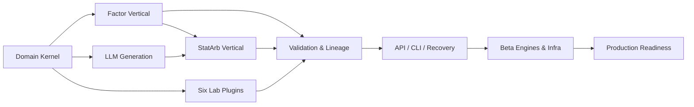

# Alpha Foundry 개발 계획

상태: Approved  
계획 원칙: 실행 가능한 수직 흐름을 먼저 완성하고, 공통화는 두 번째 실제 사용 사례가 생긴 뒤 수행한다.

## 1. 릴리스 정의

| 단계 | 목표 | 종료 조건 |
| --- | --- | --- |
| MVP | 계약과 두 개 수직 연구 흐름 검증 | AC-001~AC-010 통과 |
| Beta | 도메인 엔진 확대와 다중 사용자 운영 기반 | 8개 실제 engine, PostgreSQL/object storage, 다중 Worker 검증 |
| Production | 보안·복구·운영 승인 완료 | 모든 NFR, 보안·성능·복구 gate 통과 |

범위의 권위는 [01_Requirements.md](./01_Requirements.md)이며 이 문서는 작업 순서만 결정한다.

## 2. 구현 우선순위

1. Domain schema와 불변식
2. 질문 지정 Factor 수직 흐름
3. 영역 지시와 LLM 경계
4. StatArb 수직 흐름
5. 6개 도메인 plugin 계약
6. 검증·계보·sealed holdout
7. API/CLI와 장애 복구
8. 운영 확장

백테스트 엔진만 먼저 만들지 않는다. 질문과 StrategySpec 계약이 engine 입력을 결정한다.

## 3. 전체 작업 의존성

## 4. 작업 패키지 규칙

각 작업 패키지는 다음을 포함해야 완료된다.

- 관련 FR·AC·ADR ID
- public interface 또는 schema 변경
- 구현 코드
- unit/contract/integration test
- 문서 영향 확인
- 재현 가능한 실행 명령

한 PR은 하나의 package 또는 강하게 결합된 두 package만 포함한다.

## 5. MVP — Day 1: Kernel과 첫 수직 흐름

### 목표

질문 지정 Factor 연구가 fixture에서 end-to-end로 실행되는 최소 골격을 만든다.

| ID | 작업 | 산출물 | 선행 |
| --- | --- | --- | --- |
| M1-01 | 프로젝트 scaffold와 검사 설정 | package, lint, type, test config | 없음 |
| M1-02 | 공통 ID·state·error·provenance | domain value objects | M1-01 |
| M1-03 | Mandate·Question 공통 외피 | Pydantic schema와 불변식 | M1-02 |
| M1-04 | Factor payload·StrategySpec | factor contract | M1-03 |
| M1-05 | SQLite migration과 repository | MVP schema v1 | M1-02 |
| M1-06 | Capability snapshot | dataset/engine/config snapshot | M1-03, M1-05 |
| M1-07 | Experiment compiler와 fingerprint | canonical serializer | M1-04 |
| M1-08 | Panel Portfolio Engine | signal→portfolio→cost→result | M1-04, M1-07 |
| M1-09 | 공통 validation과 registry | pass/reject 결과 | M1-08 |

### 병렬화

- Lane A: M1-02~M1-04
- Lane B: M1-05 repository
- Lane C: synthetic Factor fixture와 numeric oracle

M1-07은 schema와 repository interface가 고정된 뒤 시작한다.

### Day 1 Exit

- 질문 지정 Factor fixture가 application service를 통해 완료된다.
- 같은 입력의 fingerprint와 result hash가 반복 실행에서 일치한다.
- 비용 config가 숫자 oracle과 일치한다.

## 6. MVP — Day 2: 영역 지시와 LLM 경계

### 목표

Knowledge·Capability를 제한된 prompt로 조립하고, LLM 후보를 신뢰하지 않는 생성 흐름을 완성한다.

| ID | 작업 | 산출물 | 선행 |
| --- | --- | --- | --- |
| M2-01 | Source·Claim·Failure Memory repository | knowledge query port | M1-05 |
| M2-02 | Domain Router | deterministic route와 reason | M1-03, M1-06 |
| M2-03 | generation request schema | evidence/capability/budget context | M2-01, M2-02 |
| M2-04 | LLM adapter와 fake adapter | timeout, usage, structured output | M2-03 |
| M2-05 | Question Generator | candidate 생성 orchestration | M2-04 |
| M2-06 | Question Auditor | hard gate와 reason code | M1-04, M1-06 |
| M2-07 | 영역 지시 Factor E2E | UC-002 실행 | M2-05, M2-06, M1-09 |

### Day 2 Exit

- 유효 후보는 Factor 수직 흐름으로 연결된다.
- malformed JSON, 미등록 field, 데이터 누락, 예산 초과 후보가 저장 전에 차단된다.
- prompt와 log에 원문 dataset·secret·sealed 정보가 포함되지 않는다.

## 7. MVP — Day 3: StatArb와 Lab Registry

### 목표

두 번째 실제 엔진으로 공통 계약의 타당성을 검증하고 8개 Lab 경계를 완성한다.

| ID | 작업 | 산출물 | 선행 |
| --- | --- | --- | --- |
| M3-01 | StatArb payload·StrategySpec | statarb contract | M1-03 |
| M3-02 | Multi-Leg Sequential Engine | hedge state·position·cost 결과 | M3-01, M1-07 |
| M3-03 | StatArb validation | 관계·turnover·stability gate | M3-02 |
| M3-04 | Lab Registry와 plugin protocol | domain plugin lookup | M1-04, M3-01 |
| M3-05 | 나머지 6개 질문 payload | schema + invalid fixtures | M3-04 |
| M3-06 | Smoke Engine | 고정 fixture contract 실행 | M3-04 |
| M3-07 | 8개 Lab contract suite | 동일 protocol 검증 | M3-05, M3-06 |

### 병렬화

- Lane A: M3-01~M3-03
- Lane B: M3-04~M3-06
- Lane C: 8개 도메인 유효·무효 fixture

### Day 3 Exit

- Factor와 StatArb가 서로 다른 payload와 engine을 사용한다.
- 8개 Lab이 protocol, routing, schema contract test를 통과한다.
- Lab 내부 import 없이 Registry를 통해 선택된다.

## 8. MVP — Day 4: 계보, Interface, 공격 테스트

### 목표

시스템 경계와 실패 경로를 완성해 인수 가능한 실행 묶음을 만든다.

| ID | 작업 | 산출물 | 선행 |
| --- | --- | --- | --- |
| M4-01 | Program DAG와 탐색 원장 | lineage/search event | M2, M3 |
| M4-02 | sealed holdout guard | 계보당 1회 transaction | M4-01 |
| M4-03 | Job Runner와 복구 | persistent single-worker queue | M1-05 |
| M4-04 | HTTP API | OpenAPI 일치 endpoints | M2, M3, M4-03 |
| M4-05 | CLI | API와 같은 services | M4-04 |
| M4-06 | 공격·복구 테스트 | leakage, duplicate, kill tests | M4-01~M4-05 |
| M4-07 | 예제와 운영 문서 | Factor/StatArb commands | M4-06 |

### MVP Definition of Done

- [01_Requirements.md](./01_Requirements.md)의 AC-001~AC-010 통과
- [07_TestPlan.md](./07_TestPlan.md)의 MVP release gate 통과
- OpenAPI와 구현 route 일치
- 빈 DB에서 migration과 두 예제 실행 성공
- `README`, `.mmd`, `.svg` 링크 유효
- P0/P1 defect 0건

## 9. Beta Phase

### B1 — Core Hardening, Week 2~3

- PostgreSQL·object storage adapter
- 다중 Worker queue, lease, idempotent side effect
- real dataset scanner와 chunk execution
- 인증 기본 역할, audit export
- Factor·StatArb 대용량 성능 및 수치 검증

Exit: MVP API 호환, migration 검증, 2 Worker 강제 종료 복구 통과.

### B2 — Market Structure, Week 4~5

- LOB discrete-event engine
- inventory·queue·adverse selection accounting
- Structural Flow event-impact engine
- simulator calibration fixture와 domain validation

Exit: Market Making·Structural Flow 실제 engine E2E 통과.

### B3 — Cross Venue와 Derivatives, Week 6~7

- multi-venue clock·latency·route engine
- cash-flow·funding·borrow·margin engine
- partial fill, venue failure, liquidation stress test

Exit: 두 domain의 실제 engine과 회계 invariant 통과.

### B4 — Event, Time Series, Meta, Week 8~10

- point-in-time event engine
- walk-forward time-series engine
- 검증 완료 전략만 받는 Meta Portfolio allocator
- 8개 domain performance baseline

Exit: Smoke Engine이 실제 engine으로 전부 대체된다.

## 10. Production Phase

### P1 — 운영 준비, Week 11

- OIDC 인증, 역할 권한, secret 관리
- 중앙 log·metric·alert
- backup/restore와 retention job
- dependency·container 보안 검사
- API rate limit과 resource quota

### P2 — Shadow와 Release, Week 12

- 운영과 동일한 shadow dataset 실행
- 장애 주입, 복구 시간, 성능 목표 검증
- migration rollback rehearsal
- 운영 runbook과 승인자 교육
- signed release artifact 생성

Production exit: 모든 NFR, acceptance, security, recovery gate 통과와 사람 승인.

## 11. 모듈별 작업 단위

| 모듈 | 최초 package | 후속 package |
| --- | --- | --- |
| `domain` | IDs, state, common envelope | 새 불변식만 추가 |
| `application` | orchestrator, commands | use case별 service 추가 |
| `labs` | Factor, StatArb, 6 schema plugins | domain별 compiler·validation 강화 |
| `engines` | Panel, MultiLeg, Smoke | domain별 실제 engine |
| `validation` | common gates, registry | domain gate version 추가 |
| `infrastructure` | SQLite, local artifact, LLM | PostgreSQL, object storage, provider 추가 |
| `interfaces` | MVP HTTP/CLI | auth, pagination, admin query |

## 12. AI 협업과 파일 소유권

병렬 작업 시 한 파일의 writer는 한 명 또는 한 AI로 제한한다.

| Lane | 소유 경로 | 합의가 필요한 공개 계약 |
| --- | --- | --- |
| Domain | `domain/`, schema tests | IDs, states, base models |
| Factor | `labs/factor/`, `engines/panel.py` | StrategySpec, Result |
| StatArb | `labs/statarb/`, `engines/multileg.py` | StrategySpec, Result |
| Platform | `application/`, `infrastructure/` | ports, transaction |
| Interface | `interfaces/` | request/response models |
| Quality | `validation/`, `tests/` | Test IDs, gate version |

공개 schema 변경은 소비자 contract test와 문서를 같은 PR에서 변경한다. 서로 다른 AI가 같은 공개 모델을 독립적으로 재정의하지 않는다.

## 13. 리스크와 대응

| 리스크 | 조기 신호 | 대응 |
| --- | --- | --- |
| 범위 과다 | Day 1에 E2E가 없음 | Smoke domain을 늘리지 말고 Factor vertical 우선 |
| 범용 schema 팽창 | domain별 optional field 증가 | discriminated payload로 이동 |
| LLM 결합 | provider object가 domain에 등장 | port와 candidate validation 복구 |
| 수치 오류 | fixture oracle 불일치 | 기능 추가 중단 후 accounting invariant 수정 |
| 누수 | 미래 timestamp 접근 | 실행 hard fail과 공격 fixture 추가 |
| 병렬 충돌 | 같은 schema 파일 동시 수정 | 단일 owner와 contract PR 선행 |

## 14. 마일스톤

| Milestone | 시점 | 증거 |
| --- | --- | --- |
| MS-01 Factor Vertical | Day 1 | 질문 지정 E2E |
| MS-02 LLM Boundary | Day 2 | 영역 지시 E2E와 malformed 차단 |
| MS-03 Domain Contracts | Day 3 | 8 Lab contract suite |
| MS-04 MVP | Day 4 | AC-001~AC-010 |
| MS-05 Beta Core | Week 3 | multi-worker recovery |
| MS-06 All Engines | Week 10 | 8 real engine E2E |
| MS-07 Production | Week 12 | NFR와 운영 승인 |
