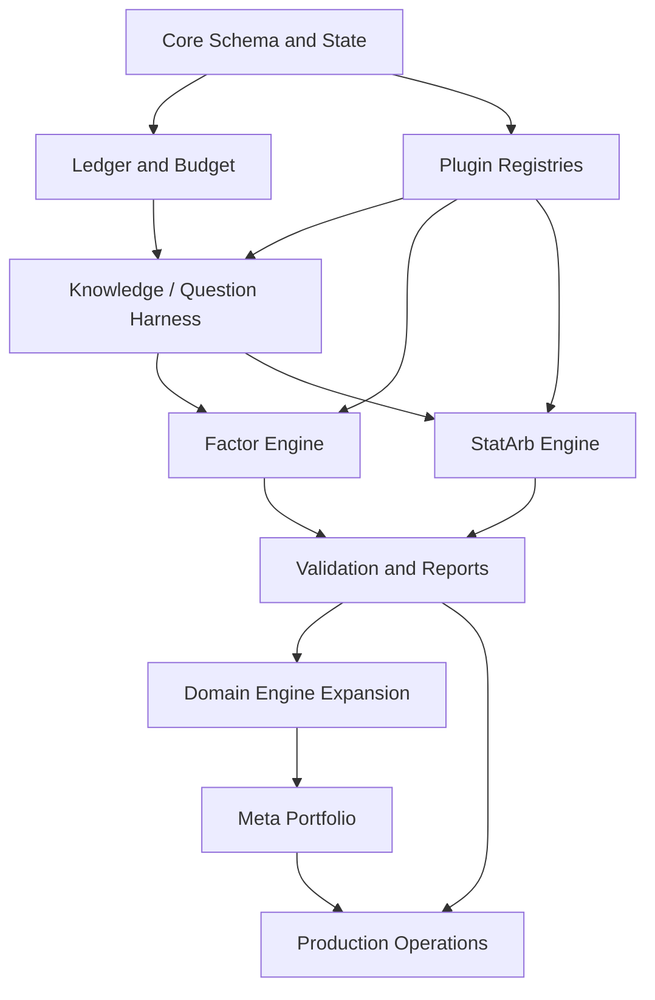

# Alpha Foundry 개발 계획

| 항목 | 값 |
|---|---|
| 문서 버전 | 1.0.0 |
| 기준일 | 2026-07-11 |
| 일정 기준 | 4일 MVP + 12주 Production baseline |
| 요구사항 | [01_Requirements.md](01_Requirements.md) |
| 아키텍처 | [02_Architecture.md](02_Architecture.md) |

## 1. 계획 기준과 현실성

4일 안에 8개 연구소의 실데이터 백테스터, 통계 검증, 운영 배포를 모두 생산급으로 만드는 것은 불가능하다. 4일의 산출물은 공통 커널, 모든 도메인의 실행 계약, Factor/Portfolio와 StatArb의 완전 수직 경로를 증명하는 기술 기반 MVP다.

12주 기준선은 다음 인력이 같은 기간 투입된다는 전제를 가진다.

| 역할 | 투입 | 소유권 |
|---|---:|---|
| Principal Architect / Tech Lead | 1.0 FTE | core contract, ADR, architecture, merge 승인 |
| Quant Engineer A | 1.0 FTE | Factor, Event, Time Series, 통계 검증 |
| Quant Engineer B | 1.0 FTE | StatArb, Derivatives, Meta Portfolio |
| Market Microstructure Engineer | 1.0 FTE | MM, Structural Flow, Cross Venue, execution simulation |
| Platform / Data / QA Engineer | 1.0 FTE | API, DB, job, artifact, CI/CD, 성능·복구 |
| Human Quant Reviewer | 0.5 FTE | golden fixture, 회계·누수·통계·risk 승인 |

2명의 개발팀이면 같은 범위의 달력 기간은 최소 20주로 재산정한다. AI 에이전트는 코드·fixture·문서 초안과 정적 검토를 병렬화하지만 FTE 또는 승인자로 계산하지 않는다.

## 2. 릴리스 수준

| 수준 | 기간 | 사용자 가치 | 완료 경계 |
|---|---|---|---|
| MVP / Technical Foundation | Day 1~4 | 자연어 mandate에서 program과 두 수직 연구 결과까지 재현 | 8개 schema, 공통 kernel, Factor/StatArb 실동작, 6개 synthetic path |
| Beta | Week 2~10 | 8개 도메인 실데이터 연구와 전체 validation suite | domain engine hardening, data versioning, reports, meta allocation |
| Production | Week 11~12 | 권한·복구·관측·배포·Paper/Shadow 운영 | Azure HA, SLO, fault injection, security audit, operational acceptance |

기능의 목표 릴리스는 기능의 존재 여부를 바꾸지 않는다. 모든 계약은 MVP에서 확정하고 계산 깊이와 실데이터 calibration을 단계적으로 완성한다.

## 3. 전체 의존성

Critical path는 `core contract → ledger/budget → question harness → two vertical engines → common validation → production operations`다. UI는 critical path가 아니며 API와 CLI가 먼저 완료된다.

## 4. 작업 패키지 규칙

각 `WP-*`는 다음 항목을 포함한 issue로만 시작한다.

- 연결된 `FR-*`, `NFR-*`, `AC-*`
- 읽어야 할 ADR과 contract file
- 수정 가능한 file ownership 범위
- 입력·출력 schema와 상태 전이
- 실패 테스트와 정상 테스트
- 완료 명령과 기대 결과
- 데이터·seed·resource budget

한 작업 패키지의 완료는 코드 작성 완료가 아니라 해당 package의 contract, unit, integration, documentation drift 검사가 모두 통과한 상태다.

## 5. MVP: Day 1 — Domain Kernel과 영속 기반

### 목표

도메인과 상태를 코드 수준에서 고정하고 이후 병렬 개발이 같은 계약 위에서 진행되도록 한다.

| WP | 작업 | 산출물 | 선행 | 완료 시험 |
|---|---|---|---|---|
| WP-M1-01 | repository·Python·CI bootstrap | `pyproject.toml`, `uv.lock`, package, lint/type/test workflow | 없음 | clean checkout에서 CI green |
| WP-M1-02 | core identifiers·time·money·provenance | UUID, UTC aware time, Decimal money, actor provenance | M1-01 | unit/property tests |
| WP-M1-03 | Domain과 8개 question union | 공통 외피, 8 payload, strict discriminator | M1-01 | valid/invalid contract fixture 16개 이상 |
| WP-M1-04 | mandate·hypothesis·strategy·program schema | immutable core models, DAG node/edge | M1-02~03 | schema snapshot, cycle rejection |
| WP-M1-05 | state machines | mandate, question, experiment, job, registry transition table | M1-04 | 모든 legal/illegal transition exhaustive test |
| WP-M1-06 | config policy | cost, latency, fill, slippage, impact, borrow, funding unions | M1-03 | static fee preservation, extra field rejection |
| WP-M1-07 | fingerprint canonicalizer | canonical JSON, hash, seed/version inclusion | M1-02, M1-06 | order invariance와 component mutation tests |
| WP-M1-08 | PostgreSQL schema foundation | core tables, migrations, repository ports/adapters | M1-02~05 | empty→head→downgrade-safe migration test |
| WP-M1-09 | job·idempotency·outbox kernel | claim, lease, heartbeat, request dedup, event rows | M1-05, M1-08 | concurrent claim·same-key test |
| WP-M1-10 | lab/engine/validation registry | version compatibility와 duplicate registration guard | M1-03~06 | plugin contract tests |

### 병렬화

- Track A: M1-02, M1-03
- Track B: M1-08의 DB bootstrap
- Track C: CI, lint, type, schema snapshot
- 병합 순서: M1-01 → M1-02/03 → M1-04/06 → M1-05/07/08 → M1-09/10

### Day 1 Exit

1. 8개 domain valid fixture와 domain/payload mismatch fixture가 기대대로 판정된다.
2. static fee 값이 parse→serialize→fingerprint에서 bit-equivalent decimal text로 보존된다.
3. illegal state transition, illegal composition, duplicate job claim이 실패한다.
4. PostgreSQL migration head와 model metadata가 일치한다.

## 6. MVP: Day 2 — Knowledge와 질문 생성 Harness

### 목표

자연어 영역 지시가 근거와 실행 가능성을 갖춘 질문 후보 및 Research Program으로 변환되는 E2E 경로를 만든다.

| WP | 작업 | 산출물 | 선행 | 완료 시험 |
|---|---|---|---|---|
| WP-M2-01 | source/claim/method/failure model | exact locator, contradiction graph, namespace | M1-08 | lineage·location integrity test |
| WP-M2-02 | capability snapshot | dataset/engine/config/compute immutable snapshot | M1-10 | missing capability fixture |
| WP-M2-03 | mandate compiler | structured output, clarification-free validation error | M1-04, M2-02 | two autonomy mode fixtures |
| WP-M2-04 | domain router | primary domain, auxiliary interface, excluded-domain guard | M1-03, M2-02 | golden routing set |
| WP-M2-05 | evidence assembler | support/contradict/failure bundle freeze | M2-01, M2-04 | source-to-question trace test |
| WP-M2-06 | question generator adapter | strict LLM JSON, generation allocation, repair once | M2-03~05 | invalid JSON and budget tests |
| WP-M2-07 | seven independent auditors | domain/economic/stat/data/execution/duplicate/opposition reports | M2-02, M2-05 | hard gate truth table |
| WP-M2-08 | Pareto selector | non-dominated set, deterministic tie break | M2-07 | no weighted-score regression test |
| WP-M2-09 | budget·search ledger | atomic budget charge, changed-fields event | M1-09, M2-06 | concurrent exhaustion test |
| WP-M2-10 | ProgramBuilder | DAG, capability binding, node budget | M1-04, M2-08~09 | cycle/capability rejection |
| WP-M2-11 | API/CLI thin path | mandate create, generate, job status, program get | M1-09, M2-10 | API/CLI parity test |

### 생성 fixture

각 built-in lab은 synthetic mandate 한 개에서 schema-valid 질문 5개를 생성한다. 40개 질문 모두 근거, 반대 근거, 가정, falsifier, negative control, data/engine requirements, 양방향 decision, 예산을 가져야 한다.

### Day 2 Exit

`natural language → compile → route → evidence → 5 questions → audit → top 3 → DAG`가 API와 CLI에서 같은 결과 hash를 만든다. LLM이 없는 deterministic fake adapter에서도 E2E test가 재현된다.

## 7. MVP: Day 3 — Factor와 StatArb 수직 구현

### 7.1 Factor/Portfolio Track

| WP | 작업 | 산출물 | 선행 | 완료 시험 |
|---|---|---|---|---|
| WP-M3-F01 | point-in-time panel reader | manifest validation, eligibility, as-of join, delisting | M1-10 | future revision attack fixture |
| WP-M3-F02 | typed factor AST | rank, lag, delta, rolling, robust zscore, residualize, neutralize | M1-03 | type/depth/property tests |
| WP-M3-F03 | signal pipeline | lag, winsorize, missing policy, cross-sectional transform | F01~02 | no future read, invariant tests |
| WP-M3-F04 | portfolio constructor | quantile/linear mapping, long-only/L/S, exposure constraints | F03 | weights/exposure reconciliation |
| WP-M3-F05 | cost·turnover·capacity | policy application과 gross/net attribution | M1-06, F04 | higher-cost monotonicity |
| WP-M3-F06 | factor validation | Pearson/Rank IC, ICIR, monotonicity, Fama–MacBeth, bootstrap, risk | F05 | reference notebook oracle |
| WP-M3-F07 | Factor E2E | mandate에서 final report까지 | M2-10, F01~06 | AC-006 |

### 7.2 StatArb Track

| WP | 작업 | 산출물 | 선행 | 완료 시험 |
|---|---|---|---|---|
| WP-M3-S01 | synchronized multi-asset reader | causal alignment, stale/missing policy | M1-10 | timestamp shuffle attack |
| WP-M3-S02 | formation selector | pair/basket candidate와 formation-only selection | S01 | full-period selection attack |
| WP-M3-S03 | hedge/spread models | static/rolling OLS, robust zscore baseline | S02 | no look-ahead coefficient test |
| WP-M3-S04 | sequential trade state | entry/exit/stop/max hold, position state | S03 | deterministic state sequence |
| WP-M3-S05 | multi-leg execution | simultaneous/sequential, partial fill, imbalance, borrow | M1-06, S04 | fills/positions/cash reconciliation |
| WP-M3-S06 | relation validation | ADF+KPSS, residual diagnostics, break, half-life, placebo, walk-forward | S03~05 | statistical oracle fixtures |
| WP-M3-S07 | StatArb E2E | mandate에서 final report까지 | M2-10, S01~06 | AC-007 |

### 7.3 Six Domain Contract Track

| WP | 작업 | 산출물 |
|---|---|---|
| WP-M3-C01 | six StrategySpec payloads | domain별 declarative fixture와 invalid fixture |
| WP-M3-C02 | six engine skeletons | `validate_inputs/run/explain`, synthetic deterministic result |
| WP-M3-C03 | six validation profiles | 필수 gate 이름·입력·의도된 pass/fail |
| WP-M3-C04 | six smoke programs | question → strategy → engine → report |

### Day 3 Exit

- Factor와 StatArb가 실제 계산 artifact, validation, report를 생성한다.
- 6개 domain은 다른 engine을 선택하면 실패하고 자신의 synthetic E2E는 통과한다.
- 모든 P&L component 합과 position/fill 회계가 맞는다.

## 8. MVP: Day 4 — 통합, 공격 테스트, 인계

| WP | 작업 | 산출물 | 완료 시험 |
|---|---|---|---|
| WP-M4-01 | G0~G10 orchestrator | fatal/nonfatal gate와 상태 전이 | gate sequence exhaustive test |
| WP-M4-02 | feedback firewall | train full, validation coarse, sealed hidden view | forbidden data-flow test |
| WP-M4-03 | holdout access guard | lineage unique access와 사람 승인 | concurrent double-access test |
| WP-M4-04 | Rejection/Success report | JSON + Markdown + artifact refs | golden report snapshot |
| WP-M4-05 | API/CLI completion | MVP endpoint와 commands | OpenAPI/CLI parity |
| WP-M4-06 | red-team suite | leakage, domain, config, schema, duplicate attacks | AC-011~016 |
| WP-M4-07 | worker recovery | lease reclaim, retry, cancel, idempotent effects | process-kill recovery test |
| WP-M4-08 | documentation/code drift | links, IDs, schema, migration, OpenAPI | intentional drift failure |
| WP-M4-09 | demo package | 8 examples, sample configs, synthetic datasets | clean-room execution |

### MVP Definition of Done

- `AC-001`~`AC-019` 중 Production 성능·HA 전용 항목을 제외한 모든 acceptance test 통과
- core critical branch coverage 100%, core 전체 branch coverage 85% 이상
- type, lint, dependency, secret, migration, OpenAPI, schema, docs 검사 통과
- 신규 환경에서 단일 bootstrap 명령 후 Factor·StatArb demo 완료
- known defect 중 correctness, leakage, accounting, holdout, security 심각도 P0/P1이 0건

## 9. Beta Phase B1 — Core 및 두 엔진 Hardening (Week 2~3)

| WP | 기능 단위 | 상세 산출물 | 의존 |
|---|---|---|---|
| WP-B1-01 | Dataset versioning | immutable manifest, schema evolution, quality report, as-of audit | MVP |
| WP-B1-02 | Factor production | corporate action, universe reconstruction, industry/beta/size neutralization, capacity curve | B1-01 |
| WP-B1-03 | StatArb production | Johansen/Kalman plugin, reselection, pair conflict, short availability, event mode | B1-01 |
| WP-B1-04 | Multiple testing | DSR, PBO, SPA/WRC adapters, similarity clustering | MVP ledger |
| WP-B1-05 | Reporting | interactive artifact index가 아닌 정적 JSON/Markdown bundle, provenance appendix | B1-02~04 |
| WP-B1-06 | Query performance | indexes, pagination, artifact streaming, benchmark | production-size fixture |
| WP-B1-07 | Beta acceptance | walk-forward, recovery, concurrency, reviewer UAT | B1-01~06 |
| WP-B1-08 | Open Discovery | data profile·capability·evidence·failure memory에서 budget-bound research mandate와 질문을 생성하는 실행 경로 | B1-01, MVP harness |

Exit: 두 엔진은 licensed-like anonymized dataset에서 전체 gate와 performance baseline을 통과하고 수치 oracle 차이가 허용 범위 안이다. `OPEN_DISCOVERY`는 데이터 profile에서 program을 생성하되 candidate·token·trial·wall-clock 한도를 넘지 않는다.

## 10. Beta Phase B2 — Market Making과 Structural Flow (Week 4~5)

### Market Making

- `WP-B2-01`: L2 event normalization, sequence gap, snapshot recovery
- `WP-B2-02`: price-time queue, queue-ahead, partial fill, cancel race
- `WP-B2-03`: market/order/cancel latency policy와 replay clock
- `WP-B2-04`: inventory accounting, skew policy, hard limit, flatten
- `WP-B2-05`: markout/adverse selection/spread capture attribution
- `WP-B2-06`: replay calibration과 paper fill comparison

### Structural Flow

- `WP-B2-07`: event declaration/availability/execution clock
- `WP-B2-08`: mechanical flow equation과 uncertainty distribution
- `WP-B2-09`: event cluster, auction, impact/reversal windows
- `WP-B2-10`: placebo, pre-trend, CAR, clustered error, Bayesian sparse-event path

병렬 경계는 normalized market data와 공통 event clock까지다. MM queue simulator와 Flow event estimator는 파일·모델을 공유하지 않는다.

Exit: 각각 calibrated fixture와 intentionally wrong simulator/flow model을 구분하고 P&L attribution이 cash ledger와 일치한다.

## 11. Beta Phase B3 — Cross Venue (Week 6~7)

| WP | 작업 | 완료 기준 |
|---|---|---|
| WP-B3-01 | canonical instrument mapping | multiplier, quote, collateral mismatch fixture 차단 |
| WP-B3-02 | venue/asset graph | deterministic route/cycle enumeration, quantity-aware edge |
| WP-B3-03 | causal multi-venue join | independent clocks, stale threshold, no future quote |
| WP-B3-04 | route executor | leg order, partial completion, rollback policy, max unhedged |
| WP-B3-05 | inventory·margin state | venue별 balance, preposition, capital opportunity cost |
| WP-B3-06 | venue failure | disconnect, 429, halt, transfer delay, settlement/default scenario |
| WP-B3-07 | attribution·validation | realized route P&L, depth capacity, venue risk report |

Exit: profitable idealized route가 realistic failure model에서 탈락할 수 있고 그 원인이 fee, stale quote, depth, failed leg, capital, settlement로 분해된다.

## 12. Beta Phase B4 — Derivatives, Event, Time Series, Meta (Week 8~10)

### Week 8: Derivatives와 Event 기반

- `WP-B4-01`: contract multiplier, funding/borrow/roll cashflow calendar
- `WP-B4-02`: initial/maintenance margin, collateral haircut, liquidation path
- `WP-B4-03`: expiry/exercise, Greeks, delta/vega/gamma hedge reconciliation
- `WP-B4-04`: filing/fiscal/available time, correction lineage, market-session mapping
- `WP-B4-05`: surprise, matched control, overlap cohort, CAR and extraction evidence

### Week 9: Time Series와 domain hardening

- `WP-B4-06`: rolling/expanding pipeline, purged/embargo split
- `WP-B4-07`: probabilistic model protocol, calibration, regime state
- `WP-B4-08`: position mapping, volatility target, kill-switch, sequential costs
- `WP-B4-09`: 6개 domain common validation 및 report 일치 검토

### Week 10: Meta Portfolio

- `WP-B4-10`: strategy input adapter와 return/exposure alignment
- `WP-B4-11`: robust covariance, Bayesian shrinkage, correlation uncertainty
- `WP-B4-12`: ERC, volatility scaling, constrained mean-variance, CVaR optimizer
- `WP-B4-13`: capacity, liquidity, venue/asset/domain concentration, turnover cost
- `WP-B4-14`: allocation attribution와 rebalance simulation

Exit: 8개 연구소가 실데이터형 fixture에서 자신의 engine·validation으로 완료되고 Meta Portfolio가 등록되지 않은 전략을 거부한다.

## 13. Production Phase P1 — 운영 준비 (Week 11)

| WP | 작업 | 산출물 |
|---|---|---|
| WP-P1-01 | Azure IaC | private network, Container Apps, PostgreSQL HA, Blob, Key Vault, Monitor |
| WP-P1-02 | OIDC/RBAC | human/service/AI 분리, dual approval, access audit |
| WP-P1-03 | Observability | dashboard, SLO, queue/holdout/artifact/DB/LLM alerts |
| WP-P1-04 | Backup/restore | PITR, blob versioning, cross-region copy, restore script |
| WP-P1-05 | Resource isolation | job CPU/memory/time/output limits와 cancellation |
| WP-P1-06 | Security hardening | secret scan, dependency scan, image signing, egress allowlist |
| WP-P1-07 | Migration deployment | expand/contract automation과 rollback gate |

Exit: staging과 production-like 환경의 configuration contract가 같고 secret·network·role boundary test가 통과한다.

## 14. Production Phase P2 — Shadow와 최종 감사 (Week 12)

| WP | 작업 | 완료 기준 |
|---|---|---|
| WP-P2-01 | Paper/Shadow inbound adapter | 외부 실행 결과 import와 source signature 검증 |
| WP-P2-02 | Fault injection | worker/API/DB failover, blob/LLM outage, event duplicate |
| WP-P2-03 | Load test | NFR-004~007 성능·scale threshold 충족 |
| WP-P2-04 | Recovery drill | NFR-017 RPO/RTO 실측 |
| WP-P2-05 | Statistical audit | golden strategy와 의도된 bad strategy 전체 재검증 |
| WP-P2-06 | Red-team audit | leakage, holdout, approval, secret, schema bypass 0건 |
| WP-P2-07 | Human UAT | researcher/reviewer/admin/auditor role별 AC 수행 |
| WP-P2-08 | Release candidate | signed image, migration, SBOM, test/report bundle |

Production release는 P0/P1 defect 0건, 모든 AC와 NFR threshold 통과, Tech Lead·Quant Reviewer·Risk Approver의 서명 후에만 허용한다.

## 15. 모듈별 구현 단위

| 모듈 | 최소 파일 단위 | 독립 테스트 대상 |
|---|---|---|
| `core` | model, enum, invariant, transition table, canonicalizer | pure unit/property |
| `orchestration` | router, budget, generator, auditor, selector, DAG | fake ports integration |
| `knowledge` | card model, locator, relation, assembler | source/claim lineage |
| `labs/{domain}` | payload, compiler, audit rules, memory, registration | lab contract suite |
| `engines/{engine}` | input adapter, clock/state, accounting, policy ports, attribution | numerical oracle + replay |
| `validation` | gate, statistic adapter, decision rule | pass/fail golden fixture |
| `ledger` | search diff, append service, feedback view | immutability/concurrency |
| `registry` | state guard, human approval, retirement | actor/transition matrix |
| `infrastructure/postgres` | models, repositories, UoW, migrations | Testcontainers integration |
| `apps` | DTO mapper, auth dependency, router/command | API/CLI contract |

## 16. 병렬 개발과 파일 소유권

| Track | 소유 경로 | 공유 변경 승인자 |
|---|---|---|
| Core Contract | `core/`, `schemas/` | Tech Lead 단독 merge |
| Factor/Event/TS | 해당 `labs/`, `engines/`, `validation/domains/` | Quant Engineer A |
| StatArb/Derivatives/Meta | 해당 domain 경로 | Quant Engineer B |
| MM/Flow/CrossVenue | 해당 domain 경로 | Microstructure Engineer |
| Platform | `apps/`, `infrastructure/`, `migrations/` | Platform Engineer |
| Common QA | `tests/contract`, `tests/e2e`, `tests/red_team` | Quant Reviewer + Tech Lead |

공유 schema와 migration은 동시 편집하지 않는다. 작업 중 계약 변경이 발견되면 구현을 확장하기 전에 ADR 또는 계약 변경 PR을 먼저 병합한다.

## 17. AI 협업 실행 규칙

1. 사람 담당자가 작업 패키지와 수정 가능한 파일을 고정한다.
2. 구현 AI에는 관련 요구사항, ADR, input/output schema, 기존 test, 금지 동작만 전달하고 전체 raw log를 누적하지 않는다.
3. 별도 AI가 contract mismatch, 미래 데이터 접근, 비용 부호, fill/position/cash conservation을 검토한다.
4. AI가 만든 통계 코드의 oracle은 독립 reference implementation 또는 손계산 fixture로 확인한다.
5. AI는 migration, holdout guard, 승인 guard, risk threshold를 단독 승인할 수 없다.
6. 실패한 agent attempt는 요약, 변경 파일, 실패 test, 가설을 structured work log에 남기고 무제한 재시도하지 않는다.
7. 같은 task의 agent revision은 2회로 제한한다. 이후 사람 담당자가 문제를 재분해한다.

## 18. 마일스톤

| Milestone | 시점 | Exit Evidence |
|---|---|---|
| MS-01 Contract Freeze | Day 1 | 8 domain schema, state, config, fingerprint, registry tests |
| MS-02 Research Harness | Day 2 | 40 valid questions, 7 auditor reports, 8 DAG examples |
| MS-03 Vertical Proof | Day 3 | Factor/StatArb reports, six synthetic domain reports |
| MS-04 MVP Acceptance | Day 4 | attack/recovery/docs/API/CLI test bundle |
| MS-05 Core Beta | Week 3 | production-size Factor/StatArb and multiple-testing suite |
| MS-06 Microstructure Beta | Week 5 | calibrated MM/Flow engines |
| MS-07 Cross-Venue Beta | Week 7 | failure-aware venue graph engine |
| MS-08 Full Domain Beta | Week 10 | 8 real-data-capable engines + Meta Portfolio |
| MS-09 Operational RC | Week 11 | secured Azure staging and recovery evidence |
| MS-10 Production | Week 12 | all AC/NFR, human sign-off, signed release bundle |

## 19. 리스크와 대응

| 리스크 | 확률/영향 | 조기 지표 | 대응 | Owner |
|---|---|---|---|---|
| 데이터 시점 의미 불명 | 높음/치명 | `available_at` 누락 | dataset 등록 차단, owner 확인 전 연구 금지 | Data/QA |
| engine 회계 오류 | 중간/치명 | cash/position 불일치 | conservation property, independent oracle | Domain owner |
| LLM schema 불안정 | 높음/중간 | reject rate >5% | constrained JSON, repair 1회, deterministic fallback fixture | Tech Lead |
| 4일 범위 팽창 | 높음/높음 | Day 2에 engine 추가 요구 | MVP exit 고정, Beta backlog 이동 | Product/Tech Lead |
| 성능 메모리 초과 | 중간/높음 | fixture RSS >70% budget | lazy scan, partition pruning, profile gate | Platform |
| 통계 검정 남용 | 중간/높음 | 모든 변수에 ADF 적용 | applicability rule과 reviewer checklist | Quant Reviewer |
| holdout 우회 | 낮음/치명 | alias lineage, duplicate access | lineage hash, unique DB constraint, red team | Tech Lead |
| domain leakage | 중간/높음 | cross-lab import | import-linter, plugin contract, ADR-0008 | Tech Lead |
| 외부 LLM/data 장애 | 중간/중간 | timeout/429 증가 | bounded retry, compiled deterministic jobs 지속 | Platform |
| 일정 대비 calibration 부족 | 중간/높음 | paper/replay divergence | production 승격 차단, phase exit 연장 | Domain owner |

## 20. Definition of Done

모든 작업 패키지는 다음을 모두 만족해야 완료다.

- 연결된 FR/NFR/AC와 예상 상태 전이가 PR 설명에 있다.
- strict type과 schema validation이 있고 알 수 없는 필드를 거부한다.
- 정상, 경계, 실패, concurrency 또는 leakage 관련 테스트가 존재한다.
- 결정론적 실행은 seed와 fingerprint를 기록한다.
- 비용·노출·위험·P&L 관련 변경은 reconciliation test를 통과한다.
- 새 영속 상태는 migration, index, retention, rollback 영향을 문서화한다.
- 새 interface는 OpenAPI/JSON Schema/event snapshot과 일치한다.
- log에 secret·원문 prompt·시장 row가 없음을 확인한다.
- 관련 문서와 ADR 영향이 같은 PR에 반영된다.
- lint, format, type, unit, contract, integration, property, leakage 검사가 통과한다.
- 사람 reviewer가 quant correctness 또는 platform correctness를 승인한다.

## 21. 최종 납품물

- 전체 source와 reproducible `uv.lock`
- OCI image build와 Azure IaC
- PostgreSQL migration 전체 이력
- OpenAPI 3.1, domain JSON Schema, event schema
- API, CLI, worker, dispatcher, scheduler
- 8개 lab, 8개 engine, Meta Portfolio engine
- unit/contract/integration/E2E/property/leakage/performance/recovery/red-team tests
- 8개 자연어 mandate example, synthetic fixture, sample config
- JSON/Markdown success·rejection report example
- CI/CD, SBOM, signed release metadata
- 이 `docs/` 세트와 최신 ADR
- 성능·복구·보안·통계·red-team acceptance evidence
