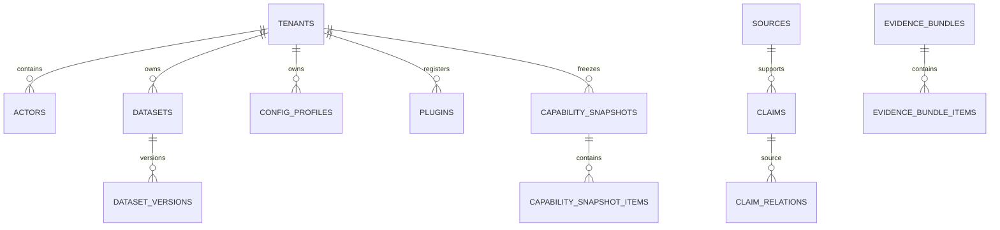
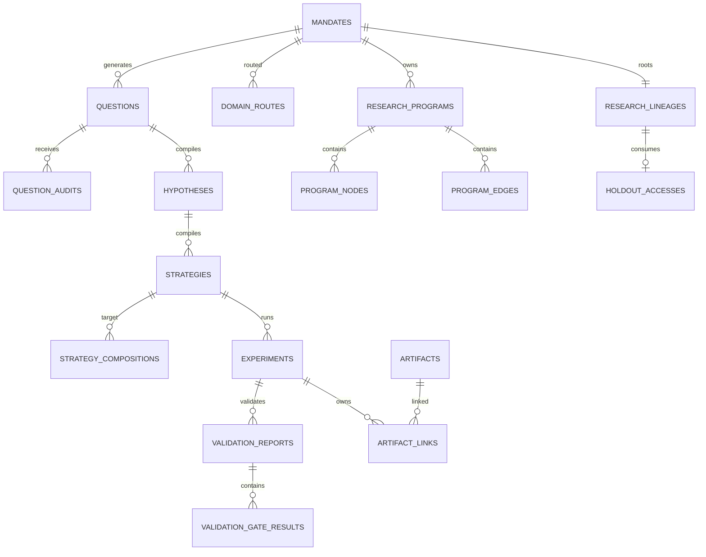
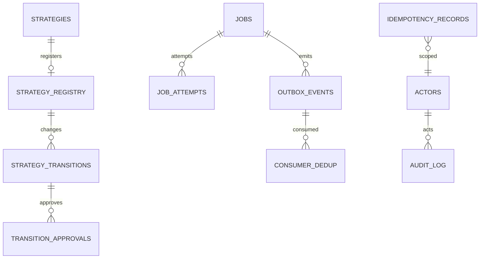

# Alpha Foundry 데이터베이스 및 저장소 설계

| 항목 | 값 |
|---|---|
| 문서 버전 | 1.0.0 |
| Metadata DB | PostgreSQL 16 |
| 시계열·패널 | Parquet |
| 대형 artifact | Azure Blob Storage |
| Migration | Alembic expand/contract |

이 문서는 영속 모델과 물리 데이터 정책을 소유한다. HTTP request/response는 포함하지 않으며 [API 계약](04_API.md)을 참조한다.

## 1. 저장 원칙

1. PostgreSQL은 metadata, 상태, 계보, 예산, 승인, job, audit의 권위 저장소다.
2. 시장 row·P&L series·position·order·fill은 PostgreSQL JSONB에 넣지 않고 versioned Parquet 또는 content-addressed artifact로 저장한다.
3. immutable resource는 update하지 않고 parent를 가진 새 revision을 만든다.
4. mutable aggregate는 `row_version`과 허용 상태 전이로 보호한다.
5. 모든 tenant 소유 row는 `tenant_id`를 가지며 Row Level Security를 적용한다.
6. timestamp는 `timestamptz(6)`로 저장하고 session timezone은 UTC로 고정한다.
7. 금융값은 `numeric(38,18)` 또는 원래 계약 precision을 보존하는 Parquet decimal을 사용한다. PostgreSQL `real/double precision`은 metric cache 외에 사용하지 않는다.
8. JSONB는 schema-less escape hatch가 아니다. 모든 JSONB payload는 `schema_id`, `schema_version`, `content_hash`와 함께 저장되고 application validator를 통과한다.
9. soft delete flag로 계보를 숨기지 않는다. lifecycle은 `status`, `retired_at`, retention tombstone으로 표현하며 audit·holdout row는 삭제할 수 없다.
10. MVP부터 PostgreSQL을 사용한다. SQLite 호환 layer는 제공하지 않는다. 근거는 [ADR-0005](ADR/ADR-0005-storage-topology.md)에 있다.

## 2. Naming, Type, 공통 컬럼

### 2.1 Naming

- table과 column은 lowercase `snake_case` 복수 table명이다.
- PK는 `{entity}_id`, FK는 참조 PK와 같은 이름이다.
- constraint는 `pk_`, `fk_`, `uq_`, `ck_`, `ix_` 접두사를 사용한다.
- enum은 PostgreSQL native enum 대신 `text` + named `CHECK`를 사용한다. rolling upgrade에서 enum DDL lock을 피하기 위해서다.

### 2.2 공통 domain

| 논리 타입 | PostgreSQL | 규칙 |
|---|---|---|
| `UUID` | `uuid` | application 생성 UUIDv4 |
| `UTC timestamp` | `timestamptz(6)` | offset-aware input, DB session UTC |
| `Decimal` | `numeric(38,18)` | NaN/Infinity 없음 |
| `Hash` | `text` | `{algorithm}:{lowercase hex}` |
| `Schema version` | `varchar(32)` | semantic 또는 `major.minor` |
| `Domain` | `varchar(40)` | 8개 domain CHECK |
| `State` | `varchar(40)` | aggregate별 CHECK |
| `Payload` | `jsonb` | object만 허용, `jsonb_typeof='object'` |

### 2.3 공통 컬럼 집합

`created_at timestamptz(6) NOT NULL DEFAULT clock_timestamp()`와 `created_by_actor_id uuid NOT NULL`는 모든 사용자·service 생성 entity에 적용한다. Mutable aggregate는 `row_version bigint NOT NULL DEFAULT 1 CHECK (row_version>0)`를 추가한다. Immutable payload entity는 다음을 함께 가진다.

```text
schema_id text NOT NULL
schema_version varchar(32) NOT NULL
payload jsonb NOT NULL
content_hash text NOT NULL
parent_resource_id uuid NULL
```

`updated_at`은 mutable aggregate에만 있고 trigger가 아니라 repository command가 `row_version`과 함께 갱신한다. DB trigger는 audit/outbox 보조 검증 외 business state를 만들지 않는다.

## 3. ERD

### 3.1 Capability와 Knowledge



### 3.2 Research와 Experiment



### 3.3 Operations와 Registry



## 4. Tenant, Identity, Schema, Capability Table

### 4.1 `tenants`

| Column | Type | Null | 제약·의미 |
|---|---|:---:|---|
| `tenant_id` | uuid | N | PK |
| `slug` | varchar(63) | N | lowercase regex `^[a-z0-9][a-z0-9-]{1,61}[a-z0-9]$`, unique |
| `name` | varchar(200) | N | 표시명 |
| `status` | varchar(20) | N | `ACTIVE|SUSPENDED|CLOSED` CHECK |
| `retention_policy_version` | varchar(32) | N | 적용 정책 |
| `created_at` | timestamptz(6) | N | 생성 시각 |

Index: `uq_tenants_slug(slug)`.

### 4.2 `actors`

| Column | Type | Null | 제약·의미 |
|---|---|:---:|---|
| `actor_id` | uuid | N | PK |
| `tenant_id` | uuid | N | FK tenants |
| `external_subject_hash` | text | N | IdP `iss|sub` HMAC hash |
| `actor_type` | varchar(20) | N | `HUMAN|AI_AGENT|SERVICE` |
| `display_name` | varchar(200) | Y | 사람만 허용, 감사 export에서 redaction 가능 |
| `roles` | text[] | N | 허용 role subset, 중복 금지 |
| `is_active` | boolean | N | default true |
| `created_at` | timestamptz(6) | N | 최초 확인 |
| `last_seen_at` | timestamptz(6) | N | 최근 인증 |

Constraints: `UNIQUE(tenant_id, external_subject_hash)`. Index: `(tenant_id,is_active)`, GIN `roles`.

### 4.3 `schema_registry`

| Column | Type | Null | 제약·의미 |
|---|---|:---:|---|
| `schema_id` | text | N | composite PK |
| `schema_version` | varchar(32) | N | composite PK |
| `kind` | varchar(30) | N | `API|QUESTION|HYPOTHESIS|STRATEGY|PLUGIN_PARAMETER|EVENT|ARTIFACT` |
| `domain` | varchar(40) | Y | domain 전용 schema |
| `json_schema` | jsonb | N | Draft 2020-12 object |
| `content_hash` | text | N | unique |
| `compatibility` | varchar(20) | N | `BACKWARD|BREAKING` |
| `created_at` | timestamptz(6) | N | 등록 시각 |
| `created_by_actor_id` | uuid | N | FK actors |

PK `(schema_id,schema_version)`, unique `content_hash`. 등록 후 update/delete 금지.

### 4.4 `plugins`

| Column | Type | Null | 제약·의미 |
|---|---|:---:|---|
| `plugin_registration_id` | uuid | N | PK |
| `tenant_id` | uuid | N | FK tenants |
| `plugin_id` | varchar(255) | N | 논리 ID |
| `plugin_type` | varchar(40) | N | lab/engine/validator/policy/data adapter |
| `plugin_version` | varchar(32) | N | semver |
| `supported_domains` | text[] | N | 1개 이상 |
| `input_schema_id/version` | text/varchar(32) | N | composite FK schema_registry |
| `output_schema_id/version` | text/varchar(32) | N | composite FK schema_registry |
| `parameter_schema_id/version` | text/varchar(32) | Y | parameter 없는 plugin만 null |
| `code_revision` | text | N | git digest |
| `artifact_hash` | text | N | signed package/image hash |
| `capabilities` | text[] | N | unique sorted values |
| `status` | varchar(20) | N | `ACTIVE|DEPRECATED|REVOKED` |
| `created_at`, `created_by_actor_id` | common | N | provenance |

Unique `(tenant_id,plugin_id,plugin_version)`. Index `(tenant_id,plugin_type,status)`, GIN `supported_domains`, GIN `capabilities`.

### 4.5 `datasets`

| Column | Type | Null | 제약·의미 |
|---|---|:---:|---|
| `dataset_id` | uuid | N | PK |
| `tenant_id` | uuid | N | FK tenants |
| `logical_name` | varchar(255) | N | tenant unique |
| `description` | text | N | 1~10,000자 |
| `owner` | varchar(255) | N | license/data owner |
| `classification` | varchar(20) | N | `PUBLIC|INTERNAL|CONFIDENTIAL|SEALED` |
| `status` | varchar(20) | N | `ACTIVE|SUSPENDED|RETIRED` |
| `created_at`, `created_by_actor_id` | common | N | provenance |

Unique `(tenant_id,logical_name)`. Index `(tenant_id,status,classification)`.

### 4.6 `dataset_versions`

| Column | Type | Null | 제약·의미 |
|---|---|:---:|---|
| `dataset_version_id` | uuid | N | PK |
| `tenant_id` | uuid | N | tenant denormalization/RLS |
| `dataset_id` | uuid | N | FK datasets |
| `version_label` | varchar(64) | N | dataset 안 unique |
| `schema_id/version` | text/varchar(32) | N | FK schema_registry |
| `content_hash` | text | N | manifest+parts hash |
| `storage_manifest_artifact_id` | uuid | N | FK artifacts, deferred constraint |
| `event_time_field` | varchar(255) | N | canonical role mapping |
| `available_at_field` | varchar(255) | N | 반드시 event와 별도 선언 |
| `source_timezone` | varchar(64) | N | IANA name 또는 UTC |
| `revision_policy` | varchar(30) | N | `APPEND_ONLY|POINT_IN_TIME|LATEST_ONLY`; 연구용은 앞의 두 개 |
| `coverage_start/end_exclusive` | timestamptz(6) | N | start < end |
| `row_count` | bigint | N | 0 이상 |
| `instrument_count` | bigint | N | 0 이상 |
| `quality_summary` | jsonb | N | versioned quality schema |
| `license_policy` | jsonb | N | permitted use, redistribution, owner |
| `retention_until` | date | N | license 만료 포함 |
| `status` | varchar(20) | N | `ACTIVE|QUARANTINED|REVOKED|EXPIRED` |
| `created_at`, `created_by_actor_id` | common | N | provenance |

Unique `(dataset_id,version_label)`, `(tenant_id,content_hash)`. Check coverage order, nonnegative counts. Index `(tenant_id,status,coverage_start,coverage_end_exclusive)`, `(dataset_id,created_at DESC)`.

### 4.7 `config_profiles`

| Column | Type | Null | 제약·의미 |
|---|---|:---:|---|
| `config_profile_id` | uuid | N | PK |
| `tenant_id` | uuid | N | FK tenants |
| `name` | varchar(255) | N | 논리명 |
| `schema_id/version` | text/varchar(32) | N | FK schema_registry |
| `payload` | jsonb | N | 7개 policy와 risk profile |
| `content_hash` | text | N | canonical config hash |
| `status` | varchar(20) | N | `ACTIVE|DEPRECATED|REVOKED` |
| `created_at`, `created_by_actor_id` | common | N | provenance |

Unique `(tenant_id,name,content_hash)`, `(tenant_id,content_hash)`. Immutable.

### 4.8 `capability_snapshots`

| Column | Type | Null | 제약·의미 |
|---|---|:---:|---|
| `capability_snapshot_id` | uuid | N | PK |
| `tenant_id` | uuid | N | FK tenants |
| `snapshot_hash` | text | N | unique per tenant |
| `compute_limits` | jsonb | N | memory/workers/trials strict schema |
| `created_at`, `created_by_actor_id` | common | N | provenance |

`capability_snapshot_items`: `snapshot_item_id` PK, `capability_snapshot_id` FK, `item_type DATASET|CONFIG|PLUGIN|KNOWLEDGE_NAMESPACE`, `resource_id text`, `resource_version text`, `content_hash text`, `capabilities text[]`. Unique `(capability_snapshot_id,item_type,resource_id,resource_version)`; index by snapshot and item type. Snapshot과 item은 immutable이다.

## 5. Knowledge Table

### 5.1 `sources`

| Column | Type | Null | 제약·의미 |
|---|---|:---:|---|
| `source_id` | uuid | N | PK |
| `tenant_id` | uuid | N | FK tenants |
| `source_type` | varchar(30) | N | `PAPER|BOOK|FILING|DATA_DOC|WEB|INTERNAL_NOTE|DATASET` |
| `title` | text | N | 원문 제목 |
| `canonical_locator` | text | N | URL/DOI/object ref; tenant unique hash |
| `publication_at` | timestamptz(6) | Y | source 발행 시각 |
| `knowledge_available_at` | timestamptz(6) | N | 연구 이용 가능 시각 |
| `raw_artifact_id` | uuid | Y | FK artifacts; external-only source는 null 허용 |
| `content_hash` | text | N | source bytes 또는 canonical citation hash |
| `status` | varchar(20) | N | `ACTIVE|RETRACTED|UNAVAILABLE` |
| `created_at`, `created_by_actor_id` | common | N | provenance |

Unique `(tenant_id,content_hash)`. Index `(tenant_id,knowledge_available_at)`, full-text GIN on generated `search_vector(title)`.

### 5.2 `claims`

| Column | Type | Null | 제약·의미 |
|---|---|:---:|---|
| `claim_id` | uuid | N | PK |
| `tenant_id` | uuid | N | RLS |
| `source_id` | uuid | N | FK sources |
| `domain` | varchar(40) | N | domain CHECK |
| `statement` | text | N | 주장 |
| `locator_kind` | varchar(20) | N | page/section/paragraph/timestamp/row/url fragment |
| `locator_value` | varchar(500) | N | exact location |
| `scope` | jsonb | N | asset/market/frequency/sample schema |
| `assumptions` | jsonb | N | string array |
| `limitations` | jsonb | N | string array |
| `evidence_quality` | varchar(20) | N | `LOW|MEDIUM|HIGH` |
| `reproduction_status` | varchar(20) | N | `NOT_ATTEMPTED|FAILED|PARTIAL|REPRODUCED` |
| `review_status` | varchar(20) | N | `UNREVIEWED|APPROVED|REJECTED` |
| `knowledge_available_at` | timestamptz(6) | N | source 이하가 될 수 없음 |
| `content_hash` | text | N | normalized claim hash |
| `created_at`, `created_by_actor_id` | common | N | provenance |

Unique `(tenant_id,content_hash,source_id,locator_value)`. Index `(tenant_id,domain,review_status)`, `(source_id)`, GIN full-text `statement`.

### 5.3 `claim_relations`

`claim_relation_id uuid PK`, `tenant_id`, `source_claim_id` FK claims, `target_claim_id` FK claims, `relation_type SUPPORTS|CONTRADICTS|LIMITS|REPLICATES|SUPERSEDES`, `strength numeric(5,4)` 0~1, `rationale text`, provenance. Source와 target은 달라야 한다. Unique `(source_claim_id,target_claim_id,relation_type)`; 양 방향 relation은 별도 row다.

### 5.4 `evidence_bundles`와 items

`evidence_bundles`: `evidence_bundle_id uuid PK`, `tenant_id`, `domain`, `knowledge_policy jsonb`, `namespace_versions jsonb`, `content_hash`, provenance. Immutable.

`evidence_bundle_items`: `evidence_bundle_item_id uuid PK`, `evidence_bundle_id` FK, `item_type SUPPORTING_CLAIM|CONTRADICTING_CLAIM|EMPIRICAL_OBSERVATION|FAILURE_MEMORY`, `claim_id` nullable FK, `failure_memory_id` nullable FK, `observation_artifact_id` nullable FK, `ordinal int`, `selection_reason text`. 정확히 하나의 target FK만 non-null이어야 한다. Unique `(evidence_bundle_id,item_type,ordinal)`와 target 중복 금지 partial unique index를 둔다.

### 5.5 `wiki_pages`

`wiki_page_id uuid PK`, `tenant_id`, `namespace`, `path`, `title`, `content_artifact_id` FK, `source_bundle_hash`, `version int>0`, `status ACTIVE|SUPERSEDED`, provenance. Unique `(tenant_id,namespace,path,version)`. Wiki row는 claim FK의 대체물이 아니다.

### 5.6 `failure_memories`

| Column | Type | Null | 제약·의미 |
|---|---|:---:|---|
| `failure_memory_id` | uuid | N | PK |
| `tenant_id` | uuid | N | RLS |
| `domain` | varchar(40) | N | domain CHECK |
| `memory_type` | varchar(60) | N | domain memory type |
| `lineage_id` | uuid | N | FK research_lineages |
| `strategy_id` | uuid | Y | FK strategies |
| `experiment_id` | uuid | Y | FK experiments |
| `context_schema_id/version` | text/varchar(32) | N | schema ref |
| `context` | jsonb | N | domain-specific context |
| `failure_reason_code` | varchar(100) | N | controlled code |
| `outcome` | jsonb | N | domain outcome schema |
| `confidence` | numeric(5,4) | N | 0~1 |
| `sample_count` | bigint | N | 1 이상 |
| `content_hash` | text | N | normalized memory hash |
| `created_at`, `created_by_actor_id` | common | N | provenance |

Index `(tenant_id,domain,failure_reason_code)`, `(lineage_id)`, unique `(tenant_id,content_hash)`. 다른 domain reader role은 row를 조회할 수 없다.

## 6. Research Table

### 6.1 `research_lineages`

| Column | Type | Null | 제약·의미 |
|---|---|:---:|---|
| `lineage_id` | uuid | N | PK |
| `tenant_id` | uuid | N | RLS |
| `root_mandate_id` | uuid | N | unique FK mandates, deferred |
| `lineage_hash` | text | N | root + normalized ancestry |
| `sealed_state` | varchar(20) | N | `UNUSED|RESERVED|CONSUMED|LOCKED_AFTER_RESULT` |
| `row_version` | bigint | N | optimistic lock |
| `created_at`, `created_by_actor_id` | common | N | provenance |

Unique `(tenant_id,lineage_hash)`. `sealed_state` 역전 금지 trigger가 이전/신규 순서를 검사한다.

### 6.2 `mandates`

| Column | Type | Null | 제약·의미 |
|---|---|:---:|---|
| `mandate_id` | uuid | N | PK |
| `tenant_id` | uuid | N | RLS |
| `lineage_id` | uuid | N | FK research_lineages, deferred on root creation |
| `supersedes_mandate_id` | uuid | Y | self FK |
| `schema_id/version` | text/varchar(32) | N | schema ref |
| `natural_language_goal` | text | N | encrypted-at-rest column storage |
| `goal_hash` | text | N | normalized hash |
| `autonomy_mode` | varchar(30) | N | 3개 mode CHECK |
| `payload` | jsonb | N | strict mandate |
| `content_hash` | text | N | canonical resource hash |
| `status` | varchar(30) | N | lifecycle CHECK |
| `row_version` | bigint | N | status change guard |
| `created_at`, `created_by_actor_id`, `updated_at` | common | N | provenance |

Unique `(tenant_id,content_hash,supersedes_mandate_id)` with null-safe unique index. Index `(tenant_id,status,created_at DESC)`, `(lineage_id)`.

### 6.3 `domain_routes`

`domain_route_id uuid PK`, `tenant_id`, `mandate_id` FK, `capability_snapshot_id` FK, `primary_domain`, `auxiliary_interfaces text[]`, `candidate_scores jsonb`, `router_id/version`, `prompt_hash nullable`, `content_hash`, provenance. Unique `(mandate_id,content_hash)`. `auxiliary_interfaces`는 6개 허용 interface CHECK function으로 검사한다.

### 6.4 `questions`

| Column | Type | Null | 제약·의미 |
|---|---|:---:|---|
| `question_id` | uuid | N | PK |
| `tenant_id` | uuid | N | RLS |
| `mandate_id` | uuid | N | FK mandates |
| `lineage_id` | uuid | N | FK lineages |
| `parent_question_id` | uuid | Y | self FK revision |
| `domain` | varchar(40) | N | discriminator |
| `schema_id/version` | text/varchar(32) | N | domain question schema |
| `title` | varchar(300) | N | 표시 제목 |
| `question_text` | text | N | 연구질문 |
| `payload` | jsonb | N | common+domain payload |
| `normalized_hash` | text | N | lexical duplicate key |
| `semantic_fingerprint` | text | N | versioned embedding/semantic cluster artifact hash |
| `evidence_bundle_id` | uuid | N | FK evidence_bundles |
| `search_event_id` | uuid | N | FK search_events, deferred |
| `status` | varchar(30) | N | generated/auditing/pass/fail/programmed |
| `row_version` | bigint | N | state guard |
| `created_at`, `created_by_actor_id`, `updated_at` | common | N | provenance |

Index `(mandate_id,status)`, `(tenant_id,domain,normalized_hash)`, `(lineage_id)`, `(semantic_fingerprint)`. Unique `(mandate_id,normalized_hash,parent_question_id)` null-safe.

### 6.5 `question_audits`

`question_audit_id uuid PK`, `tenant_id`, `question_id` FK, `capability_snapshot_id` FK, `auditor_set_version`, `auditor_results jsonb`, `hard_gate_decision PASS|FAIL`, `fatal_reason_codes text[]`, `quality_vector jsonb`, `pareto_rank int nullable`, `content_hash`, provenance. Unique `(question_id,auditor_set_version,content_hash)`. Index `(question_id,created_at DESC)`, GIN `fatal_reason_codes`.

### 6.6 `research_programs`, `program_nodes`, `program_edges`

`research_programs`: `program_id uuid PK`, `tenant_id`, `mandate_id` FK, `lineage_id` FK, `capability_snapshot_id` FK, `schema_id/version`, `program_hash`, `status`, `budget_allocation jsonb`, `row_version`, provenance. Unique `(tenant_id,program_hash)`.

`program_nodes`: `program_node_id uuid PK`, `program_id` FK cascade, `node_key varchar(120)`, `node_kind`, `resource_type`, `resource_id uuid nullable`, `node_spec jsonb`, `budget jsonb`, `status`, `row_version`, `ordinal int`. Unique `(program_id,node_key)`, `(program_id,ordinal)`; index `(program_id,status)`.

`program_edges`: `program_edge_id uuid PK`, `program_id` FK cascade, `from_node_id` FK nodes, `to_node_id` FK nodes, `edge_kind DEPENDS_ON|CONSUMES|GATES`. `from != to`; both nodes must share program, enforced by composite FK `(program_id,node_id)`. Unique `(program_id,from_node_id,to_node_id,edge_kind)`. DAG acyclicity는 insert batch transaction의 recursive CTE validation으로 검사한다.

### 6.7 `hypotheses`

`hypothesis_id uuid PK`, `tenant_id`, `question_id` FK, `lineage_id` FK, `parent_hypothesis_id` self FK, `domain`, `schema_id/version`, `payload jsonb`, `content_hash`, `status DRAFT|COMPILED|REJECTED|SUPERSEDED`, provenance. Unique `(tenant_id,content_hash,parent_hypothesis_id)` null-safe. Index `(question_id,status)`, `(lineage_id)`.

### 6.8 `strategies`

| Column | Type | Null | 제약·의미 |
|---|---|:---:|---|
| `strategy_id` | uuid | N | PK |
| `tenant_id` | uuid | N | RLS |
| `hypothesis_id` | uuid | N | FK hypotheses |
| `lineage_id` | uuid | N | FK lineages |
| `parent_strategy_id` | uuid | Y | self FK revision |
| `domain` | varchar(40) | N | hypothesis와 동일 |
| `schema_id/version` | text/varchar(32) | N | strategy schema |
| `name` | varchar(200) | N | 표시명 |
| `payload` | jsonb | N | declarative strategy |
| `content_hash` | text | N | canonical hash |
| `engine_plugin_registration_id` | uuid | N | FK plugins |
| `risk_config_profile_id` | uuid | N | FK config_profiles |
| `frozen_at` | timestamptz(6) | Y | non-null 이후 수정 금지 |
| `status` | varchar(20) | N | `DRAFT|FROZEN|SUPERSEDED` |
| `row_version` | bigint | N | freeze guard |
| `created_at`, `created_by_actor_id`, `updated_at` | common | N | provenance |

Unique `(tenant_id,content_hash)`. Index `(lineage_id)`, `(tenant_id,domain,status)`, `(hypothesis_id)`.

`strategy_compositions`: `composition_id uuid PK`, `tenant_id`, `source_strategy_id` FK, `target_strategy_id` FK, `interface`, `mechanism text`, `ablation_experiment_id` FK, `parameters_frozen_at`, `search_event_id` FK, provenance. Source와 target은 달라야 하며 unique `(source_strategy_id,target_strategy_id,interface)`.

## 7. Experiment, Validation, Artifact Table

### 7.1 `experiments`

| Column | Type | Null | 제약·의미 |
|---|---|:---:|---|
| `experiment_id` | uuid | N | PK |
| `tenant_id` | uuid | N | RLS |
| `strategy_id` | uuid | N | FK strategies |
| `lineage_id` | uuid | N | FK research_lineages |
| `fingerprint` | text | N | tenant 안 unique |
| `config_profile_id` | uuid | N | FK config_profiles |
| `engine_plugin_registration_id` | uuid | N | FK plugins |
| `engine_version` | varchar(32) | N | fingerprint 구성요소 |
| `code_revision` | text | N | immutable VCS digest |
| `random_seed` | bigint | N | 0 이상 |
| `period_spec` | jsonb | N | train/validation/robustness, sealed ref는 승인 전 null |
| `status` | varchar(40) | N | Architecture experiment 상태 CHECK |
| `result_schema_id/version` | text/varchar(32) | Y | 결과 생성 후 schema ref |
| `result_summary` | jsonb | Y | 공통 MetricValue와 runtime summary |
| `result_hash` | text | Y | canonical result hash |
| `cache_source_experiment_id` | uuid | Y | self FK; cache hit logical alias일 때 사용 |
| `started_at`, `finished_at` | timestamptz(6) | Y | 실행 시각 |
| `row_version` | bigint | N | 상태 guard |
| `created_at`, `created_by_actor_id`, `updated_at` | common | N | provenance |

Constraints:

- unique `(tenant_id,fingerprint)`; cache hit는 새 row를 만들지 않고 기존 ID를 반환하는 것이 기본이다.
- `finished_at >= started_at`.
- terminal 상태면 `finished_at` 필수다.
- `VALIDATED|REJECTED`이면 `result_summary`, `result_hash` 필수다.
- engine plugin의 supported domain과 strategy domain 일치는 deferred constraint function이 commit 전에 검증한다.

Indexes: `(strategy_id,created_at DESC)`, `(lineage_id,status)`, partial `(tenant_id,status,created_at) WHERE status IN ('QUEUED','RUNNING')`.

### 7.2 `experiment_datasets`

`experiment_dataset_id uuid PK`, `tenant_id`, `experiment_id` FK cascade, `dataset_version_id` FK, `role` (`PRIMARY|FEATURE|TARGET|COST|LATENCY|FILL|BORROW|FUNDING|BENCHMARK|CONTROL`), `ordinal smallint`, `content_hash_at_run`. Unique `(experiment_id,role,ordinal)`과 `(experiment_id,dataset_version_id,role)`. Index `(dataset_version_id)`은 version 철회 영향 분석에 사용한다.

### 7.3 `search_events`

| Column | Type | Null | 제약·의미 |
|---|---|:---:|---|
| `search_event_id` | uuid | N | PK |
| `tenant_id` | uuid | N | RLS |
| `lineage_id` | uuid | N | FK lineages |
| `parent_search_event_id` | uuid | Y | self FK |
| `event_kind` | varchar(40) | N | `QUESTION|HYPOTHESIS|PROMPT|MODEL|FEATURE|WINDOW|THRESHOLD|UNIVERSE|COST|PERIOD|PORTFOLIO|ENGINE|FILL|COMPOSITION` |
| `changed_fields` | text[] | N | JSON pointer, 1개 이상 |
| `before_hash`, `after_hash` | text | Y/N | 첫 event before만 null |
| `prompt_hash`, `model_id` | text | Y | LLM 변경이면 필수 |
| `config_hash` | text | Y | config 관련이면 필수 |
| `metrics_exposure` | varchar(20) | N | `NONE|TRAIN_FULL|VALIDATION_COARSE` |
| `budget_charge` | jsonb | N | candidate/trial/revision/token/compute |
| `created_at`, `created_by_actor_id` | common | N | append-only |

Index `(lineage_id,created_at)`, `(tenant_id,event_kind,created_at DESC)`, GIN `changed_fields`. Delete/update 권한은 모든 application role에서 제거한다.

### 7.4 `trial_metrics`

고빈도 metric을 long form으로 저장하는 월별 range-partition table이다.

| Column | Type | Null | 제약·의미 |
|---|---|:---:|---|
| `created_at` | timestamptz(6) | N | partition key, composite PK |
| `trial_metric_id` | uuid | N | composite PK |
| `tenant_id` | uuid | N | RLS |
| `experiment_id` | uuid | N | logical FK; partition 제약으로 물리 FK를 두지 않고 ingest validation 적용 |
| `trial_key` | varchar(120) | N | experiment 내 trial ID |
| `split` | varchar(20) | N | `TRAIN|VALIDATION|ROBUSTNESS|SEALED` |
| `metric_name` | varchar(120) | N | controlled registry name |
| `metric_value` | numeric(38,18) | Y | non-value status면 null |
| `metric_status` | varchar(20) | N | MetricStatus |
| `unit` | varchar(20) | N | unit enum |
| `sample_count` | bigint | N | 0 이상 |
| `metric_artifact_id` | uuid | Y | 상세 series/artifact |

PK `(created_at,trial_metric_id)`. Unique local index `(created_at,experiment_id,trial_key,split,metric_name)`. 각 partition에 `(experiment_id,split,metric_name)` B-tree와 `created_at` BRIN을 둔다. `SEALED` row는 별도 DB role만 읽는다.

### 7.5 `validation_reports`와 `validation_gate_results`

`validation_reports`: `validation_report_id uuid PK`, `tenant_id`, `experiment_id` FK, `rule_set_version`, `maximum_gate`, `overall_decision PASS|FAIL`, `generator_feedback jsonb`, `reviewer_findings jsonb`, `content_hash`, provenance. Unique `(experiment_id,rule_set_version,maximum_gate,content_hash)`; index `(experiment_id,created_at DESC)`.

`validation_gate_results`: `gate_result_id uuid PK`, `validation_report_id` FK cascade, `gate_code` (`G0`~`G10`), `decision`, `fatal boolean`, `rule_results jsonb`, `evidence_artifact_ids uuid[]`, `started_at`, `finished_at`, `content_hash`. Unique `(validation_report_id,gate_code)`. Check `finished_at>=started_at`. G9의 `rule_results`와 artifact refs는 restricted role에만 노출한다.

### 7.6 `sealed_partitions`

| Column | Type | Null | 제약·의미 |
|---|---|:---:|---|
| `sealed_partition_id` | uuid | N | PK |
| `tenant_id` | uuid | N | RLS + restricted role |
| `dataset_version_id` | uuid | N | FK dataset_versions |
| `partition_selector_ciphertext` | bytea | N | 일반 application role read 금지 |
| `selector_hash` | text | N | 중복 검사; 날짜·범위 노출 금지 |
| `key_reference` | text | N | Key Vault key URI의 비밀 없는 ref |
| `status` | varchar(20) | N | `ACTIVE|REVOKED|EXPIRED` |
| `created_at`, `created_by_actor_id` | common | N | provenance |

Unique `(tenant_id,dataset_version_id,selector_hash)`. Dataset 일반 query role에는 table privilege가 없다.

### 7.7 `holdout_accesses`

| Column | Type | Null | 제약·의미 |
|---|---|:---:|---|
| `holdout_access_id` | uuid | N | PK |
| `tenant_id` | uuid | N | RLS |
| `lineage_id` | uuid | N | FK lineages, tenant unique |
| `experiment_id` | uuid | N | FK experiments |
| `sealed_partition_id` | uuid | N | FK sealed_partitions |
| `validation_report_id` | uuid | N | G0~G8 pass report |
| `requested_by_actor_id` | uuid | N | FK actors, HUMAN reviewer |
| `request_reason` | text | N | 10~4,000자 |
| `status` | varchar(20) | N | `RESERVED|RUNNING|COMPLETED|FAILED|CANCELLED` |
| `job_id` | uuid | N | unique FK jobs, deferred |
| `result_artifact_id` | uuid | Y | restricted artifact |
| `reserved_at`, `completed_at` | timestamptz(6) | N/Y | 소비 시각 |
| `row_version` | bigint | N | state guard |

Critical constraints: unique `(tenant_id,lineage_id)`, unique `experiment_id`, unique `job_id`. Insert transaction은 `research_lineages` row를 `FOR UPDATE`하고 `UNUSED → RESERVED`로 바꾼다. 어떤 terminal status도 row 삭제나 lineage `UNUSED` 복귀를 허용하지 않는다.

### 7.8 `artifacts`와 `artifact_links`

`artifacts`:

| Column | Type | Null | 제약·의미 |
|---|---|:---:|---|
| `artifact_id` | uuid | N | PK |
| `tenant_id` | uuid | N | RLS |
| `content_hash` | text | N | tenant dedup key |
| `byte_size` | bigint | N | 0 이상 |
| `media_type` | varchar(255) | N | MIME |
| `schema_id/version` | text/varchar(32) | Y | 구조화 artifact면 필수 |
| `storage_key` | text | N | content-addressed internal key |
| `encryption_scope` | varchar(20) | N | `TENANT|SEALED` |
| `retention_class` | varchar(30) | N | 정책 enum |
| `retention_until` | date | N | 자동 삭제 earliest date |
| `legal_hold` | boolean | N | default false |
| `verification_status` | varchar(20) | N | `PENDING|VERIFIED|CORRUPT|MISSING` |
| `created_at`, `created_by_actor_id` | common | N | provenance |

Unique `(tenant_id,content_hash)`, `(tenant_id,storage_key)`. Index `(tenant_id,retention_class,retention_until) WHERE legal_hold=false`, `(verification_status)`.

`artifact_links`: `artifact_link_id uuid PK`, `tenant_id`, `artifact_id` FK, `owner_type`, `owner_id uuid`, `role` (`PNL|POSITIONS|ORDERS|FILLS|DIAGNOSTICS|MODEL|REPORT_JSON|REPORT_MARKDOWN|SOURCE|MANIFEST|OTHER`), `ordinal smallint`, provenance. Generic owner FK는 trigger가 owner_type별 table existence와 tenant 일치를 검증한다. Unique `(owner_type,owner_id,role,ordinal)`; index `(artifact_id)`.

## 8. Strategy Registry Table

### 8.1 `strategy_registry`

`registry_entry_id uuid PK`, `tenant_id`, `strategy_id` unique FK, `current_state`, `latest_validation_report_id` FK, `registered_at`, `retired_at nullable`, `retirement_reason nullable`, `row_version`, provenance. Check state/retired field consistency. Index `(tenant_id,current_state,registered_at DESC)`.

### 8.2 `strategy_transitions`

| Column | Type | Null | 제약·의미 |
|---|---|:---:|---|
| `transition_id` | uuid | N | PK |
| `tenant_id` | uuid | N | RLS |
| `registry_entry_id` | uuid | N | FK registry |
| `from_state`, `to_state` | varchar(30) | N | transition table에 존재 |
| `status` | varchar(20) | N | `PENDING_APPROVAL|APPLIED|REJECTED` |
| `reason` | text | N | 10~4,000자 |
| `evidence_artifact_ids` | uuid[] | N | 0개 이상 |
| `requested_by_actor_id` | uuid | N | HUMAN only guard |
| `applied_at` | timestamptz(6) | Y | applied 상태에서 필수 |
| `created_at` | timestamptz(6) | N | 요청 시각 |

Unique partial `(registry_entry_id) WHERE status='PENDING_APPROVAL'`. Index `(registry_entry_id,created_at)`.

`transition_approvals`: `transition_approval_id uuid PK`, `transition_id` FK, `actor_id` FK, `role`, `decision APPROVE|REJECT`, `reason`, `created_at`. Unique `(transition_id,actor_id,role)`. Trigger는 actor type HUMAN, required role, requester와의 separation, LIVE_RECORDED의 서로 다른 두 actor를 검증한다.

### 8.3 `state_transition_rules`

정적 migration seed table이다. `aggregate_type`, `from_state`, `to_state` composite PK, `required_actor_type`, `required_roles text[]`, `required_approval_count`, `guard_code`, `is_active`. Application과 DB guard가 같은 table을 읽는다. 변경은 migration과 ADR을 요구한다.

## 9. Job, Idempotency, Event, Audit Table

### 9.1 `jobs`

| Column | Type | Null | 제약·의미 |
|---|---|:---:|---|
| `job_id` | uuid | N | PK |
| `tenant_id` | uuid | N | RLS |
| `job_type` | varchar(50) | N | API catalog CHECK |
| `aggregate_type`, `aggregate_id` | varchar(40)/uuid | N | 작업 대상 |
| `status` | varchar(20) | N | job state CHECK |
| `priority` | smallint | N | 0~100, 큰 값 우선 |
| `payload_schema_id/version` | text/varchar(32) | N | strict command schema |
| `payload` | jsonb | N | secret-free command |
| `payload_hash` | text | N | idempotency·audit |
| `progress` | smallint | N | 0~100 |
| `attempt_count`, `maximum_attempts` | smallint | N | 0~3, max 1~3 |
| `available_at` | timestamptz(6) | N | claim 가능 시각 |
| `lease_owner` | varchar(255) | Y | claimed/running only |
| `lease_expires_at`, `heartbeat_at` | timestamptz(6) | Y | claimed/running only |
| `cancellation_requested_at` | timestamptz(6) | Y | cancel command |
| `result_resource_type`, `result_resource_id` | varchar(40)/uuid | Y | success 결과 |
| `error_code`, `safe_error_details` | varchar(100)/jsonb | Y | failure 결과 |
| `started_at`, `finished_at` | timestamptz(6) | Y | lifecycle |
| `row_version` | bigint | N | transition guard |
| `created_at`, `created_by_actor_id`, `updated_at` | common | N | provenance |

Partial claim index:

```sql
CREATE INDEX ix_jobs_claim
ON jobs (priority DESC, available_at, created_at)
WHERE status = 'QUEUED';
```

추가 index: `(tenant_id,aggregate_type,aggregate_id,created_at DESC)`, partial `(lease_expires_at) WHERE status IN ('CLAIMED','RUNNING')`, `(tenant_id,status,created_at DESC)`.

### 9.2 `job_attempts`

`job_attempt_id uuid PK`, `job_id` FK, `attempt_number smallint`, `worker_id`, `claimed_at`, `started_at`, `heartbeat_last_at`, `finished_at`, `outcome SUCCEEDED|FAILED|LEASE_LOST|CANCELLED`, `error_code`, `runtime_summary jsonb`, `log_artifact_id` FK nullable. Unique `(job_id,attempt_number)`; index `(worker_id,started_at DESC)`.

### 9.3 `idempotency_records`

| Column | Type | Null | 제약·의미 |
|---|---|:---:|---|
| `idempotency_record_id` | uuid | N | PK |
| `tenant_id`, `actor_id` | uuid | N | scope FKs |
| `method` | varchar(10) | N | mutation verb |
| `normalized_route` | varchar(500) | N | path template, ID 값 제외 |
| `idempotency_key` | varchar(128) | N | client key |
| `request_hash` | text | N | canonical request hash |
| `status` | varchar(20) | N | `PROCESSING|COMPLETED|FAILED` |
| `response_status` | smallint | Y | terminal 상태 |
| `response_body` | jsonb | Y | 1 MiB 이하; 큰 응답은 resource ref |
| `resource_type`, `resource_id` | varchar(40)/uuid | Y | 결과 |
| `expires_at` | timestamptz(6) | N | policy 기반 |
| `created_at`, `completed_at` | timestamptz(6) | N/Y | lifecycle |

Unique `(tenant_id,actor_id,method,normalized_route,idempotency_key)`. Index `(expires_at)` for cleanup. Holdout·승격 scope는 expires_at을 생성일+7년으로 고정한다.

### 9.4 `outbox_events`

월별 `occurred_at` range partition이다.

| Column | Type | Null | 제약·의미 |
|---|---|:---:|---|
| `occurred_at` | timestamptz(6) | N | partition/PK |
| `event_id` | uuid | N | partition/PK |
| `tenant_id` | uuid | N | RLS |
| `aggregate_type`, `aggregate_id` | varchar(40)/uuid | N | ordering key |
| `aggregate_version` | bigint | N | 1 이상 |
| `event_type` | varchar(160) | N | versioned type |
| `event_schema_id/version` | text/varchar(32) | N | schema ref |
| `payload` | jsonb | N | CloudEvent data |
| `correlation_id`, `causation_id` | uuid | N | trace chain |
| `status` | varchar(20) | N | `PENDING|CLAIMED|PUBLISHED|DEAD_LETTER` |
| `attempt_count` | smallint | N | 0~10 |
| `available_at`, `published_at` | timestamptz(6) | N/Y | dispatch |
| `lease_owner`, `lease_expires_at` | varchar(255)/timestamptz(6) | Y | claim |
| `last_error_code` | varchar(100) | Y | safe code |

PK `(occurred_at,event_id)`. Partition local unique `(occurred_at,aggregate_id,aggregate_version,event_type)`. Partial dispatch index `(available_at,occurred_at) WHERE status='PENDING'`; BRIN `occurred_at`.

### 9.5 `consumer_dedup`

`consumer_name varchar(120)`, `event_id uuid`, `event_occurred_at timestamptz(6)`, `processed_at`, `result_hash`, composite PK `(consumer_name,event_id)`. Index `(processed_at)` for retention cleanup. Event partition FK는 두 key를 요구하고 lifecycle coupling을 피하기 위해 선언하지 않는다.

### 9.6 `audit_log`

월별 `occurred_at` range partition, append-only다.

| Column | Type | Null | 제약·의미 |
|---|---|:---:|---|
| `occurred_at` | timestamptz(6) | N | partition/PK |
| `audit_id` | uuid | N | partition/PK |
| `tenant_id`, `actor_id` | uuid | N | 주체 |
| `action` | varchar(120) | N | controlled action |
| `resource_type`, `resource_id` | varchar(40)/uuid | N | 대상 |
| `before_hash`, `after_hash` | text | Y | content hash |
| `reason` | text | Y | 승인·운영 변경은 필수 |
| `correlation_id` | uuid | N | trace |
| `ip_hash`, `user_agent_hash` | text | Y | raw PII 미저장 |
| `metadata` | jsonb | N | secret-free strict schema |

PK `(occurred_at,audit_id)`. Partition index `(tenant_id,resource_type,resource_id,occurred_at DESC)`, `(actor_id,occurred_at DESC)`, BRIN `occurred_at`. UPDATE/DELETE privilege는 없다.

## 10. 무결성 규칙

### 10.1 DB가 직접 강제하는 불변식

- tenant FK와 RLS tenant 일치
- UUID PK, FK, unique content/fingerprint/idempotency key
- holdout lineage당 1 row
- 상태 enum과 기본 필드 일관성
- nonnegative 수량·비용·count, 시간 범위 순서
- 동일 program의 node만 edge로 연결
- source/target self relation 금지
- strategy composition self link 금지
- terminal job/experiment의 finished fields
- JSONB object type와 schema ref 존재
- artifact hash·storage key uniqueness
- transition approval actor/role separation

### 10.2 Application transaction이 강제하는 불변식

- JSON Schema 전체 validation
- domain이 question→hypothesis→strategy→engine→validator에서 일치
- Research Program DAG acyclic
- Capability Snapshot이 모든 ref를 포함
- trial/search budget 원자 차감
- point-in-time 데이터 의미와 partition selector
- experiment fingerprint canonicalization
- P&L/cash/position/fill reconciliation
- Pareto selection과 feedback redaction

Application 검사는 DB constraint를 대체하지 않는다. DB가 표현 가능한 critical invariant는 양쪽에 둔다.

## 11. Index와 Partition 정책

### 11.1 High-traffic query index

| Query | Index |
|---|---|
| queued job claim | `ix_jobs_claim(priority DESC,available_at,created_at) WHERE status='QUEUED'` |
| expired lease | `jobs(lease_expires_at) WHERE status IN ('CLAIMED','RUNNING')` |
| fingerprint cache | unique `experiments(tenant_id,fingerprint)` |
| lineage search history | `search_events(lineage_id,created_at)` |
| strategy experiments | `experiments(strategy_id,created_at DESC)` |
| gate report | `validation_reports(experiment_id,created_at DESC)` |
| dataset impact | `experiment_datasets(dataset_version_id)` |
| question list | `questions(mandate_id,status,created_at DESC)` |
| knowledge retrieval | claims domain/status B-tree + statement GIN |
| outbox dispatch | partial pending index |
| retention sweep | artifact partial retention index |

### 11.2 Partition 대상

| Table | Key | 주기 | 사전 생성 | 보존 후 처리 |
|---|---|---|---|---|
| `trial_metrics` | `created_at` | monthly | 2개월 앞 | cold export 후 drop |
| `outbox_events` | `occurred_at` | monthly | 2개월 앞 | published 30일 경과 후 partition drop |
| `audit_log` | `occurred_at` | monthly | 3개월 앞 | 7년 archive 후 legal-hold 확인 뒤 drop |

Default partition은 허용하지 않는다. Scheduler가 다음 partition을 만들지 못하면 readiness를 degraded로 하고 새 대량 ingest를 차단한다.

## 12. Parquet와 Blob Layout

### 12.1 Dataset layout

```text
datasets/{dataset_id}/versions/{dataset_version_id}/
├── manifest-{content_hash}.json
└── parts/
    └── {partition_key_1=value}/
        └── {partition_key_2=value}/part-{part_hash_12}.parquet
```

Manifest는 schema id/version, 모든 part의 path/hash/bytes/rows, min/max `event_time`, min/max `available_at`, partition values, 전체 row count와 Merkle root를 가진다. Directory listing은 완전성 근거가 아니며 manifest만 읽는다.

### 12.2 Partition 기준

| 데이터 | 1차 partition | 2차 partition | sort order |
|---|---|---|---|
| tick/L2/L3 | `event_date_utc` | `venue` + `instrument_bucket=hash%64` | available_at, event_time, source_sequence |
| bar/가격 | `event_year_month` | `market` | available_at, instrument_id, event_time |
| fundamental/event | `available_year_month` | `market` | available_at, instrument_id, event_time |
| cross-sectional panel | `available_year_month` | `universe` | available_at, event_time, instrument_id |
| experiment time series | experiment artifact 단위 | `series_kind` | event_time, instrument_id, leg_id |

Target file은 compressed 128~512 MiB, row group은 uncompressed 128 MiB다. Compression은 Zstandard level 3, dictionary encoding은 low-cardinality string에 적용한다. Timestamp는 UTC microsecond, 금융 decimal은 Parquet `DECIMAL(38,18)` 또는 계약별 더 작은 exact scale을 사용한다.

### 12.3 Canonical field role

모든 Dataset Manifest는 물리 column을 다음 논리 role에 매핑한다.

- `instrument_id`
- `event_time`
- `available_at`
- `source_sequence` 또는 `NOT_APPLICABLE`
- `revision_id` 또는 `NOT_APPLICABLE`
- `venue` 또는 `NOT_APPLICABLE`
- `currency` 또는 `NOT_APPLICABLE`

`available_at < event_time` row는 일반적으로 invalid다. 공개 예약 정보처럼 합법적인 예외는 dataset schema의 `availability_exception_code`와 data card 근거를 요구한다.

### 12.4 Artifact layout

```text
blobs/{first_2_hex}/{full_content_hash}
```

Blob key는 tenant 정보나 filename을 포함하지 않는다. logical filename과 role은 `artifact_links`에만 저장한다. 업로드 후 server-side checksum과 local BLAKE3 hash를 확인한 뒤 `VERIFIED`로 바꾼다.

## 13. 데이터 보존과 삭제

| 데이터 | 기본 보존 | 삭제 조건 |
|---|---|---|
| mandate/question/hypothesis/strategy metadata | 7년 | tenant closure + 법적·감사 hold 없음 |
| search events, holdout, strategy transitions, approvals | 7년; holdout은 최소 7년 | 정책 만료 후 감사 승인 |
| audit log | 7년 | archive 검증 + legal hold 없음 |
| registered/Paper/Shadow strategy artifact | 7년 | strategy retired 후 보존 기간 종료 |
| rejected experiment heavy artifact | 1년 | metadata·hash·report는 7년 유지 |
| completed job payload/result cache | 30일 | 관련 resource ref 보존 |
| job attempts/log artifact | 90일 | 보안 사건 hold 없음 |
| published outbox event | 30일 | 모든 mandatory consumer watermark 통과 |
| consumer dedup | 90일 | source outbox 보존 기간보다 길게 유지 |
| raw LLM prompt/response artifact | 90일 | prompt hash·model·template·decision은 7년 유지 |
| dataset bytes | `retention_until`까지 | license 종료, active experiment 없음, registered strategy 재현 bundle 확보 |
| wiki compiled page | superseded 후 1년 | source·claim은 유지 |

`legal_hold=true`, active investigation, sealed evaluation, registered strategy의 reproducibility dependency는 자동 삭제를 차단한다. Dataset license 만료로 byte를 제거해도 manifest, schema, content hash, 사용한 experiment lineage는 유지하고 version 상태를 `EXPIRED`로 바꾼다.

삭제는 `retention_candidates` view로 후보를 만들고 Platform Admin 승인 후 content-addressed blob 참조 count가 0인 것만 제거한다. 제거 사건은 audit log와 tombstone artifact에 기록한다.

## 14. 백업과 복구

| 대상 | 방식 | RPO | 보존 |
|---|---|---:|---:|
| PostgreSQL | continuous WAL + point-in-time recovery | 5분 이하 | 35일 |
| PostgreSQL 장기 | daily encrypted logical/physical backup 검증 | 24시간 | 90일 |
| Blob | versioning + soft delete + geo-redundant copy | 15분 이하 | version 35일 |
| Schema/Static wiki | Git remote mirror | commit 단위 | 전체 history |

분기별 복구 시험은 격리 환경에 특정 timestamp의 DB를 복원하고 blob manifest checksum, FK count, experiment fingerprint, holdout unique row, 최신 migration head를 검증한다. Production 원본에 restore를 덮어쓰지 않는다.

## 15. Migration 전략

1. 모든 schema 변경은 Alembic revision 하나 이상의 순서 있는 migration으로 배포한다.
2. migration ID는 `YYYYMMDDHHMM_{slug}` 형식이며 branch head는 하나만 허용한다.
3. constraint와 index 이름은 naming convention으로 고정한다.
4. 배포 전 migration job이 PostgreSQL advisory lock을 획득한다.
5. **Expand**: nullable column/new table/new index를 추가하고 old code와 호환한다. 대형 index는 `CREATE INDEX CONCURRENTLY`를 별도 transaction 단계로 실행한다.
6. **Migrate**: bounded batch로 backfill하고 row count, null count, hash를 검증한다. batch key는 PK이고 checkpoint를 저장한다.
7. **Switch**: application이 새 field를 dual-read/dual-write 검증 후 new-read로 전환한다.
8. **Contract**: 최소 한 release 이후 old column/constraint를 제거한다. 같은 release에서 add+drop하지 않는다.
9. destructive migration 전 PITR restore point와 영향 row count를 기록한다.
10. migration 실패 시 application traffic 전환을 중단한다. 이미 commit된 expand migration은 downgrade보다 forward fix를 우선하며 data loss 가능 downgrade는 금지한다.

Migration test는 empty DB upgrade, 직전 release upgrade, representative production-size copy upgrade, schema drift, downgrade 가능 revision의 round trip을 포함한다.

## 16. 접근 통제와 RLS

| DB role | 권한 |
|---|---|
| `af_api` | tenant-scoped CRUD, sealed table read 금지, job claim 금지 |
| `af_worker` | tenant-scoped research 실행, own leased job update, 일반 artifact metadata |
| `af_sealed_worker` | 승인된 `holdout_access_id` context에서 sealed partition/result read-write |
| `af_dispatcher` | outbox claim/update, business table read 없음 |
| `af_scheduler` | lease 회수, retention candidate, partition maintenance |
| `af_migrator` | DDL; application traffic identity와 분리 |
| `af_auditor` | tenant-scoped read-only, sealed metric은 별도 승인 session |

Connection 시작 시 signed identity에서 검증된 `app.tenant_id`, `app.actor_id`, `app.job_id`, `app.holdout_access_id`를 `SET LOCAL`로 지정한다. RLS policy는 `tenant_id = current_setting('app.tenant_id')::uuid`를 사용한다. 값이 없으면 deny한다.

`audit_log`, `search_events`, `holdout_accesses`, `transition_approvals`에는 application role의 UPDATE/DELETE 권한이 없다. Sealed table access는 DB audit extension과 application audit를 모두 남긴다.

## 17. DB 검증 Checklist

- 모든 tenant table에 RLS enable + force가 적용돼 있다.
- FK column에는 join/삭제 영향에 맞는 index가 있다.
- holdout concurrent insert에서 하나만 성공한다.
- queued job claim에서 두 worker가 같은 row를 얻지 않는다.
- experiment fingerprint와 artifact content hash 중복이 원자적으로 deduplicate된다.
- state transition rule 밖 update가 trigger와 repository 양쪽에서 실패한다.
- partition이 최소 2개월 앞까지 존재한다.
- expired license dataset은 신규 experiment에서 선택되지 않는다.
- manifest row count/hash와 Parquet parts가 일치한다.
- migration head, SQLAlchemy metadata, 이 문서의 table inventory가 CI에서 일치한다.
