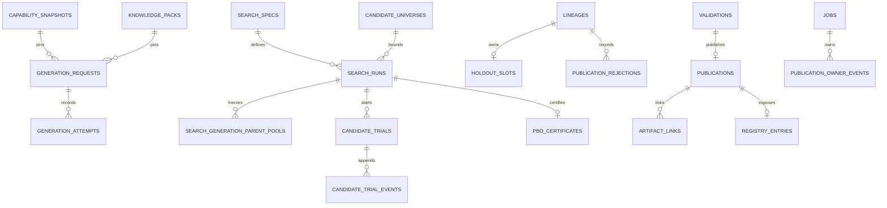

# Alpha Foundry 데이터베이스 설계

상태: Approved
MVP engine: SQLite 3.45+ WAL, single writer
Artifact store: local content-addressed filesystem

이 문서는 영속 상태와 transaction invariant의 권위 문서다. API wire는 [04_API.md](./04_API.md), canonical schema와 state machine은 [02_Architecture.md](./02_Architecture.md#3-권위-계약)을 따른다. Beta PostgreSQL 전환은 별도 승인 전까지 이 contract를 바꾸지 않는다.

## 1. 저장 원칙

1. SQLite는 metadata, immutable resource, state, event와 relation을 저장한다. 큰 JSON/HTML/engine output은 CAS에 저장하고 hash metadata만 DB가 참조한다.
2. semantic resource와 revision은 append-only다. mutable ownership/state row만 제한적으로 update하며 모든 update는 `row_version` CAS와 owner/event audit를 가진다.
3. provider call, trial engine work, sealed read, artifact publication 전에 durable intent/owner/`STARTED` record를 commit한다. final authority는 terminal event와 matching CAS가 같은 transaction에 있을 때만 생긴다.
4. timestamp는 UTC RFC3339 microsecond text, Decimal은 normalized Decimal text, JSON은 schema-validated canonical JSON이다. NaN/Infinity는 저장하지 않는다.
5. CAS file metadata는 atomic rename 뒤에만 commit한다. orphan CAS file은 authority가 아니며 protected live epoch가 없을 때만 제거한다.
6. application은 SQLite-specific SQL을 domain에 노출하지 않는다. migration 없이 runtime schema를 생성·수정하지 않는다.

## 2. 공통 형식과 AF-CANON resource storage

### 2.1 공통 형식

- table/column은 `snake_case`, ID는 `<entity>_id TEXT` UUID PK, FK는 referenced ID와 같은 이름이다.
- display hash는 `sha256:<64 lowercase hex>`이며 AF-CANON encode input에는 raw 32 digest bytes를 사용한다.
- boolean은 `INTEGER CHECK(value IN (0,1))`, mutable row는 `updated_at TEXT NOT NULL`, `row_version INTEGER NOT NULL CHECK(row_version >= 1)`을 가진다.
- immutable row는 `created_at`, `created_by`, `schema_version`, `code_version`, `content_hash`를 가진다. semantic update는 새 version/hash row이며 old row update/delete는 금지한다.

### 2.2 AF-CANON resource storage

`immutable_resources`는 reviewed immutable resource의 common envelope이다.

| column | 제약 |
| --- | --- |
| `resource_id` | PK |
| `resource_kind` | `OPERATOR_SET/VALIDATION_PROFILE/UNIVERSE/SEARCH_SPEC/SCHEMA/DATA_BUNDLE/POLICY/CAPABILITY_SNAPSHOT/KNOWLEDGE_PACK` |
| `resource_key`, `version` | logical identity; `(resource_kind, resource_key, version)` UNIQUE |
| `semantic_json` | exact schema-validated AF-CANON named fields; no unknown identity field |
| `canonical_bytes_hash` | canonical encoded bytes SHA-256; UNIQUE |
| provenance columns | immutable common columns |

`content_hash`/`canonical_bytes_hash` equals the registered identity digest where the resource has one. The exhaustive named fields and domain separators for Candidate, Universe, SearchSpec, Traversal, Parent, Parameter, ParentPool and GenerationRequest are exactly [Architecture §3.1](./02_Architecture.md#31-af-canon-identity-registry); the database does not add a default, a `max_generations`, or an un-hashed behavior field. Resource validators recompute the canonical bytes before insert.

`operator_set_hash`, `profile_hash`, `universe_hash`, `dataset_hashes`, `policy_hashes`, `schema_hashes`, and `code_hash` must have the full transitive semantic coverage defined in Architecture §3.1. Stored display labels/comments are non-semantic and cannot be read as a substitute for the reviewed canonical resource.

## 3. Entity relationships



Knowledge source/claim/pack, mandate, typed StrategySpec, DataBundle and Experiment tables remain immutable revision resources. A StrategySpec has exactly one primary `domain` and a matching typed payload schema. Each DataBundle manifest records point-in-time availability, columns/types/units, row/content hashes and version. Each execution policy resource records every cost, latency, fill, slippage, impact, borrow, funding and accounting value/version. Missing or unpinned inputs never create an Experiment/Trial.

## 4. Ownership and append-only tables

### 4.1 `generation_requests`, owner events and attempts

`generation_requests` is keyed by `generation_request_id` and has `request_hash TEXT UNIQUE`, `capability_snapshot_hash`, `knowledge_pack_hash`, exact `claim_pins_json`, `provider_chain_json`, `request_json`, `state`, `owner_token`, `owner_job_id`, `lease_epoch`, `lease_expires_at`, `next_ordinal`, `accepted_artifact_id`, `row_version` and common provenance.

| constraint | required rule |
| --- | --- |
| state | `AVAILABLE/RUNNING/ACCEPTED/FAILED` |
| initial row | unique request insert is `AVAILABLE`, owner null, epoch 0 |
| final rows | `ACCEPTED` has exactly one accepted artifact; `FAILED` has none; both clear owner/token/expiry |
| running row | owner token/job non-null, epoch >= 1 |
| transition | update predicate includes request ID, expected state, token, epoch, row_version and, where applicable, ordinal |

`generation_owner_events` is append-only: `event_id`, `generation_request_id`, `event_kind`, old/new owner job/token/epoch, `related_attempt_id`, `created_at`; kind is only `ACQUIRED`, `RELEASED_INTERRUPTED`, `TRANSFERRED`, `COMPLETED`. `TRANSFERRED` must reference the prior release event. Lease expiry alone cannot insert a transfer event.

`generation_attempts` has `attempt_id`, `generation_request_id`, `ordinal`, provider/model/config hash copied from the pinned chain, request hash, response hash nullable, `state`, error code nullable, accepted artifact nullable, `started_at`, `terminal_at`, `owner_epoch`. `UNIQUE(generation_request_id, ordinal)` is mandatory. `STARTED` is inserted before the provider call; every persisted start has one terminal `SUCCEEDED_VALID/FAILED/INVALID/INTERRUPTED`. The guarded terminal transaction advances `next_ordinal`; acceptance additionally links the already-renamed CAS artifact and CASes request `RUNNING→ACCEPTED`. An owner-job interruption terminalizes any dangling start as `INTERRUPTED`, skips its uncertain ordinal and releases the request. An accepted request/artifact is immutable and replayable without a new attempt.

### 4.2 Finite search resources and `search_runs`

`candidates` stores `candidate_hash UNIQUE`, domain, `operator_set_hash`, typed `strategy_ast_json` and immutable provenance. `candidate_universe_members` has `(universe_hash, candidate_hash)` PK and `raw_hash_order`; validators require the complete list to be duplicate-free and raw-byte ascending.

`search_specs` stores `search_spec_hash UNIQUE`, domain, every named SearchSpec field from Architecture §3.1, immutable provenance and foreign references to reviewed resources. `search_runs` has `search_run_id`, `lineage_id`, `search_spec_hash`, `universe_hash`, `profile_hash`, state, `stop_reason`, `best_candidate_hash`, `plateau_counter`, `created_at/updated_at`, `row_version`. `stop_reason` is null while running and may be normal only as `PLATEAU` or `UNIVERSE_EXHAUSTED`; cancellation/interruption/invariant failure uses failed state plus typed reason. `max_generations` is not a column or JSON field.

`search_run_proposals` has `(search_run_id, candidate_hash)` PK, `generation_index`, `slot_index`, proposal event/ledger position and timestamp. `search_run_visited` has `(search_run_id, candidate_hash)` PK and `candidate_trial_id UNIQUE`. These relations are never reset, make first-admissible selection race-free, and ensure a candidate cannot create a second started trial in the same run.

### 4.3 `search_generation_parent_pools`

| column | constraint |
| --- | --- |
| `search_run_id`, `generation_index` | composite PK; generation index >= 1 |
| `ordered_candidate_hashes_json` | exact eligible rank order, not a set |
| `parent_pool_digest` | `AF:PARENT_POOL:1` digest, UNIQUE with run/generation |
| `profile_hash`, `search_spec_hash` | must equal the SearchRun pinned hashes |
| `created_at` | generation-start transaction timestamp |

The row is inserted once before slot 0. It contains only trials terminal before that transaction, `EVALUATED`, all hard gates passed and complete finite quantized vectors. Ranking uses frozen profile lexicographic order/directions then raw candidate hash ascending; retained size is `min(parent_pool_size, eligible_count)`. No update/delete or live candidate ranking query is permitted for a generation. An empty stored ordered list is valid and forces direct fallback.

### 4.4 `candidate_trials`, events and folds

`candidate_trials` has `candidate_trial_id`, `search_run_id`, `candidate_hash`, immutable `parent_hashes_json`, `operator_id`, `parameter_indices_json`, `generation_index`, `slot_index`, `ledger_position`, `started_at`, terminal kind/time nullable, score vector nullable, hard-gate result, `row_version`. Constraints are `UNIQUE(search_run_id, ledger_position)`, `UNIQUE(search_run_id, generation_index, slot_index)`, `UNIQUE(search_run_id, candidate_hash)` and one candidate/operator relation per trial. Its creation transaction allocates the next contiguous ledger position, inserts `STARTED` and the matching event.

`candidate_trial_events` is append-only with `trial_event_id`, `candidate_trial_id`, per-trial sequence, `event_kind`, immutable evidence JSON, timestamp. Candidate-alternative events are `INVALID`, `OUTSIDE_UNIVERSE`, `DUPLICATE`, `DIRECT_FALLBACK`, `SLOT_EXHAUSTED`; trial terminal events are exactly `EVALUATED`, `REJECTED_PREFLIGHT`, `REJECTED_HARD_GATE`, `ENGINE_FAILED`, `INTERRUPTED`. A start must receive exactly one terminal; startup detects dangling starts, appends `INTERRUPTED`, and fails the SearchRun. An unconsumed iterator alternative has no row.

`candidate_trial_folds` has `(candidate_trial_id, fold_id)` PK, metric vector JSON, hard-gate outcome, complete/finite flag and immutable evidence hash. Values are quantized only by the pinned profile. The DB does not synthesize folds or scores for non-evaluable terminals.

### 4.5 `pbo_certificates`

`pbo_certificates` has `search_run_id UNIQUE`, `profile_hash`, `started_trial_ids_json`, `terminal_trial_ids_json`, `eligible_trial_ids_json`, `matrix_trial_ids_json`, expected/observed fold IDs JSON, counts, certificate artifact hash, `decision`, reason code and provenance. Before `PASS`, validator requires exact set/count equality `started=terminal`, `eligible=matrix`, every eligible trial fold set equals the profile fold set, no duplicate/missing/non-finite value, normal SearchRun stop and the profile minimum eligible count. Complete finite `EVALUATED` rows are initially eligible; a profile-listed `REJECTED_HARD_GATE` may qualify only with identical complete folds. Any violation is persisted as `FAIL/AF-PBO-INCOMPLETE`; it cannot be overwritten to pass and blocks holdout/publication.

## 5. Validation, holdout and disclosure

`validations` is immutable and has `validation_id`, strategy/candidate relation, `lineage_id`, `profile_hash`, pre-validation decision, gate/fold summary, `pbo_certificate_id`, content hash and provenance. A passing validation does not itself expose a strategy.

`lineages` has `lineage_id`, status `OPEN/CLOSED`, `closed_at`, close reason and immutable root references. `holdout_slots` has `lineage_id PRIMARY KEY`, `profile_hash`, state `UNUSED/CONSUMED`, `consumed_at`, consuming validation ID, selector hash only, `row_version`. There is one slot per lineage and no `approved_by` or user-controlled retry state.

Automatic holdout consumption is one `BEGIN IMMEDIATE` transaction: verify validation profile/certificate pass and open lineage; verify `UNUSED` slot; update it to `CONSUMED`; close the lineage; append an immutable holdout-consumed event; commit. Only then can code open sealed data. Rollback before commit permits no access; commit consumes/closes forever irrespective of result, crash or job failure. `UNIQUE(lineage_id)` and state CAS enforce one-shot use.

`holdout_disclosure_policies` is an immutable, profile-hashed resource containing only allowed named aggregate decision/metric/threshold fields. It never stores sealed selectors, rows, revealing ranges, per-observation returns, folds, detailed traces or reconstructive values. Reporting tables/services have no FK/input path back to knowledge, generation, failure memory, SearchRun, ranking, PBO or any lineage-mutating command.

## 6. Publication, registry and internal rejections

### 6.1 `publications` and owner events

`publications` has `publication_id`, `validation_id UNIQUE`, strategy/candidate and lineage IDs, state, owner token/job, owner epoch, owner expiry, attempt count, `row_version`, prepared orphan hash JSON nullable, failure kind nullable, timestamps. State is only `AVAILABLE/PREPARING/PUBLISHED/FAILED_RETRYABLE`.

- `AVAILABLE` insert is unique by validation ID. CAS from `AVAILABLE` or `FAILED_RETRYABLE` to `PREPARING` requires a fresh token/job/epoch and appends `ACQUIRED`.
- `PUBLISHED` is immutable and ownerless. `FAILED_RETRYABLE` is ownerless and only permits `ARTIFACT_IO`, `REPORT_RENDER`, `STORAGE_COMMIT`, `OWNER_INTERRUPTED`.
- `publication_owner_events` is append-only with `ACQUIRED`, `RELEASED_STALE`, `FAILED_ATTEMPT`, `PUBLISHED`; it records owner job/epoch and orphan hash where relevant. A live `PREPARING` owner is never stolen merely because expiry passed.

`publication_rejections` is append-only and idempotent by validation/input hash. It has no Publication FK because invalid work creates no Publication. Reason is only `VALIDATION_NOT_PASS`, `LINEAGE_NOT_CLOSED`, `DISCLOSURE_INVALID`, `INPUT_HASH_MISMATCH`.

### 6.2 Reports, artifacts and PUBLISHED-only reads

`artifacts` has `artifact_id`, CAS URI UNIQUE, content hash, byte size, media type, created provenance. `artifact_links` has `artifact_id`, `owner_type`, `owner_id`, role and `UNIQUE(owner_type, owner_id, role)`. Publication roles include `RESEARCH_REPORT_JSON` and `RESEARCH_REPORT_HTML`.

`registry_entries` contains only pass entries: `registry_entry_id`, `publication_id UNIQUE`, `validation_id UNIQUE`, strategy/candidate ID, lineage ID, created provenance. It has no client-settable approval state. `published_strategy_view` joins RegistryEntry, Publication, validation and allowed report metadata with the fixed predicate `publications.state='PUBLISHED'`; all public strategy/report queries use this view. A publication in any other state is invisible.

`rejection_registry` is append-only internal evidence: `rejection_id`, lineage/candidate/strategy/validation relation, terminal stage, reason code, redacted summary, artifact/evidence references, timestamp. Internal rejection queries may read it; public views do not. Neither table contains sealed selector/detail.

The successful publication transaction has one matching `PREPARING/token/epoch/row_version` predicate and atomically inserts JSON/HTML artifact metadata/link, pass RegistryEntry, `PUBLISHED` state/event and exact owner job `RUNNING→SUCCEEDED` with immutable result link. Any failure rolls all of these back. No final-batch follow-up transaction may publish a half-complete result.

## 7. Jobs, idempotency and startup recovery

`jobs` has `job_id`, kind `GENERATE/RUN_SEARCH/PUBLISH/...`, resource ID, status `QUEUED/RUNNING/SUCCEEDED/FAILED/CANCELLED`, stage, immutable input/command fingerprint, result reference nullable, error JSON nullable, lifecycle timestamps, `row_version`. `idempotency_keys` maps operation + key to canonical request hash and job/final response; a changed body is a conflict.

At every process startup, before worker acquisition, one transaction changes **every persisted** `RUNNING` job to `FAILED`, sets `AF-JOB-INTERRUPTED`, clears active execution ownership and sets `finished_at`. There is no exception for stage, lease, artifact or publication. In the same recovery flow a `PREPARING` publication owned by that failed job becomes `FAILED_RETRYABLE/OWNER_INTERRUPTED`, records old job/epoch/orphan hashes and appends `RELEASED_STALE` plus `FAILED_ATTEMPT`. A `PUBLISHED` publication remains PUBLISHED even when its legacy owner job is changed from RUNNING to FAILED; it is never auto-marked success. Completed fingerprints, accepted artifacts, consumed holdouts and PUBLISHED rows are never reopened.

## 8. Enforcement matrix

| DB-enforced | application transaction/validator-enforced |
| --- | --- |
| PK/FK, unique request/hash/version, enum CHECK, row-version predicates, unique ordinal, unique parent-pool generation, unique trial slot/ledger/candidate, one lineage slot, validation-publication uniqueness | AF-CANON bytes/transitive resource coverage, schema validation, exact owner token/epoch/version state transition, terminal event cardinality, contiguous ledger allocation, frozen rank eligibility, finite iterator order, PBO set/fold equalities, disclosure allowlist, no-feedback architecture |
| artifact URI/hash identity, report role uniqueness, PUBLISHED registry uniqueness, publication retry-kind CHECK | holdout `BEGIN IMMEDIATE` pre-access order, artifact atomic rename before metadata, publication/report/job atomic commit, unconditional startup transition |

## 9. CAS layout, retention and migration

```text
artifacts/sha256/ab/cdef.../
├── payload
└── manifest.json
```

Write sequence is temporary same-filesystem write, byte/hash validation, atomic rename to hash path, then DB metadata/owner transaction. Hash reuse validates byte size/media type. Attempt/trial/owner event, holdout consumption, parent-pool snapshot, fingerprint, lineage closure and PUBLISHED authority are permanent. Failed job detail may be redacted after 90 days while code/timestamp remain; idempotency keys may expire after 24 hours; unreferenced temporary files may be removed after 24 hours.

Migrations are ordered `NNNN_description.sql`, transactional, checksum-recorded and never edited after application. Incompatible rollback restores a verified backup; destructive change uses expand → backfill → application switch → contract. SQLite-to-PostgreSQL migration is maintenance-window export → hash verification → import → row/FK/hash verification, not dual-write.
