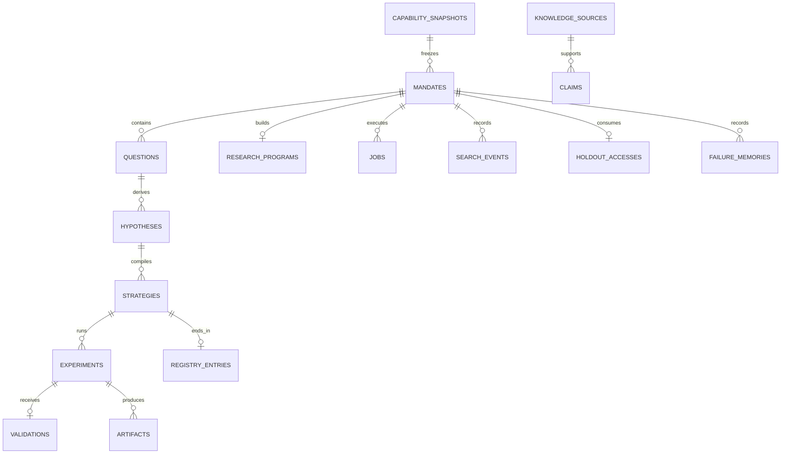

# Alpha Foundry 데이터베이스 설계

상태: Approved  
MVP engine: SQLite 3.45+ in WAL mode  
Beta target: PostgreSQL 16+

이 문서는 영속 데이터의 권위 문서다. HTTP request와 response는 [04_API.md](./04_API.md)가 정의한다.

## 1. 저장 원칙

1. MVP는 metadata와 상태를 SQLite에, 큰 결과를 content-addressed filesystem에 저장한다.
2. domain payload와 정책은 versioned JSON으로 저장하되 핵심 조회·무결성 field는 typed column으로 둔다.
3. revision resource는 update하지 않고 새 row를 추가한다.
4. 상태 resource만 제한적으로 update하며 `row_version`을 증가시킨다.
5. timestamp는 UTC ISO-8601 text, decimal은 canonical decimal text로 저장한다.
6. artifact metadata commit은 파일의 atomic rename이 성공한 뒤 수행한다.
7. repository port는 SQLite 전용 SQL을 application/domain에 노출하지 않는다.

저장소 선택 근거는 [ADR-0005](./ADR/ADR-0005-storage-topology.md)에 기록한다.

## 2. 공통 규칙

### 2.1 Naming

- table과 column: `snake_case`
- PK: `<entity>_id TEXT`
- FK: 참조 PK와 같은 이름
- boolean: SQLite `INTEGER CHECK(value IN (0,1))`
- JSON: canonical JSON `TEXT`, write 전에 schema 검증
- hash: `sha256:<64 lowercase hex>`

### 2.2 공통 컬럼

revision table은 다음을 가진다.

| 컬럼 | 타입 | Null | 규칙 |
| --- | --- | --- | --- |
| `<entity>_id` | TEXT | N | UUID PK |
| `created_at` | TEXT | N | UTC timestamp |
| `created_by` | TEXT | N | actor ID |
| `schema_version` | TEXT | N | semantic version |
| `code_version` | TEXT | N | release identifier |
| `content_hash` | TEXT | N | canonical content SHA-256 |
| `parent_id` | TEXT | Y | 이전 revision |

mutable state table은 `updated_at TEXT NOT NULL`, `row_version INTEGER NOT NULL DEFAULT 1`을 추가한다.

## 3. ERD



## 4. Table 정의

### 4.1 `schema_versions`

| 컬럼 | 타입 | Null | 제약 |
| --- | --- | --- | --- |
| `version` | INTEGER | N | PK, migration sequence |
| `name` | TEXT | N | UNIQUE |
| `checksum` | TEXT | N | migration file SHA-256 |
| `applied_at` | TEXT | N | UTC timestamp |

이 table은 application migration runner만 쓴다.

### 4.2 `capability_snapshots`

| 컬럼 | 타입 | Null | 제약 |
| --- | --- | --- | --- |
| `capability_snapshot_id` | TEXT | N | PK |
| `payload_json` | TEXT | N | dataset·engine·Lab·policy versions |
| `created_at` | TEXT | N |  |
| `created_by` | TEXT | N |  |
| `schema_version` | TEXT | N |  |
| `code_version` | TEXT | N |  |
| `content_hash` | TEXT | N | UNIQUE |

snapshot은 immutable이다.

### 4.3 `knowledge_sources`

| 컬럼 | 타입 | Null | 제약 |
| --- | --- | --- | --- |
| `source_id` | TEXT | N | PK |
| `title` | TEXT | N | 1~500자 |
| `locator` | TEXT | N | canonical locator |
| `available_at` | TEXT | N | point-in-time 가용 시점 |
| `artifact_id` | TEXT | Y | FK `artifacts` |
| `created_at` | TEXT | N |  |
| `created_by` | TEXT | N |  |
| `content_hash` | TEXT | N | UNIQUE |

Index: `idx_sources_available_at(available_at)`.

### 4.4 `claims`

| 컬럼 | 타입 | Null | 제약 |
| --- | --- | --- | --- |
| `claim_id` | TEXT | N | PK |
| `source_id` | TEXT | N | FK `knowledge_sources` |
| `domain` | TEXT | N | Domain enum |
| `statement` | TEXT | N | 비어 있지 않음 |
| `related_claim_id` | TEXT | Y | FK self |
| `relation_type` | TEXT | Y | `SUPPORTS`, `CONTRADICTS`, `LIMITS`, `REPLICATES` |
| `available_at` | TEXT | N | source 이상 |
| `created_at` | TEXT | N |  |
| `created_by` | TEXT | N |  |
| `content_hash` | TEXT | N | UNIQUE |

`related_claim_id`와 `relation_type`은 둘 다 null이거나 둘 다 non-null이다. 자기 자신을 참조하지 않는다. Index: `idx_claims_domain_available(domain, available_at)`.

### 4.5 `failure_memories`

| 컬럼 | 타입 | Null | 제약 |
| --- | --- | --- | --- |
| `failure_memory_id` | TEXT | N | PK |
| `mandate_id` | TEXT | N | FK `mandates` |
| `lineage_id` | TEXT | N |  |
| `domain` | TEXT | N | Domain enum |
| `stage` | TEXT | N | `QUESTION/STRATEGY/ENGINE/VALIDATION` |
| `resource_type`, `resource_id` | TEXT | N | 실패 resource 논리 참조 |
| `reason_code` | TEXT | N | machine-readable code |
| `summary` | TEXT | N | sealed 상세를 제거한 설명 |
| `created_at`, `created_by` | TEXT | N |  |
| `content_hash` | TEXT | N | UNIQUE |

Index: `idx_failure_domain_reason(domain, reason_code)`와 `idx_failure_lineage(lineage_id)`. append-only이며 generation context에는 `summary`와 `reason_code`만 제공한다.

### 4.6 `mandates`

| 컬럼 | 타입 | Null | 제약 |
| --- | --- | --- | --- |
| `mandate_id` | TEXT | N | PK |
| `mode` | TEXT | N | MandateMode enum |
| `domain_hint` | TEXT | Y | Domain enum |
| `objective` | TEXT | N | 1~4000자 |
| `request_json` | TEXT | N | 정규화된 전체 Mandate |
| `capability_snapshot_id` | TEXT | N | FK `capability_snapshots` |
| `lineage_id` | TEXT | N | 연구 계보 UUID |
| `status` | TEXT | N | `ACCEPTED/RUNNING/COMPLETED/REJECTED/FAILED/CANCELLED` |
| `failure_code` | TEXT | Y | terminal failure/rejection only |
| `created_at`, `updated_at` | TEXT | N |  |
| `created_by` | TEXT | N |  |
| `schema_version`, `code_version` | TEXT | N |  |
| `content_hash` | TEXT | N | immutable request hash |
| `row_version` | INTEGER | N | `>=1` |

Unique: `content_hash, capability_snapshot_id`의 조합. Index: `idx_mandates_status_created(status, created_at)`과 `idx_mandates_lineage(lineage_id)`.

### 4.7 `questions`

| 컬럼 | 타입 | Null | 제약 |
| --- | --- | --- | --- |
| `question_id` | TEXT | N | PK |
| `mandate_id` | TEXT | N | FK `mandates` |
| `domain` | TEXT | N | Domain enum |
| `payload_json` | TEXT | N | 공통 외피 + 판별형 payload |
| `audit_json` | TEXT | N | gate 결과와 reason code |
| `status` | TEXT | N | `CANDIDATE/APPROVED/REJECTED` |
| `created_at`, `created_by` | TEXT | N |  |
| `schema_version`, `code_version` | TEXT | N |  |
| `content_hash` | TEXT | N |  |
| `parent_id` | TEXT | Y | FK self |

Unique: `(mandate_id, content_hash)`. Index: `idx_questions_mandate_status(mandate_id, status)`.

### 4.8 `research_programs`

| 컬럼 | 타입 | Null | 제약 |
| --- | --- | --- | --- |
| `program_id` | TEXT | N | PK |
| `mandate_id` | TEXT | N | FK, UNIQUE |
| `nodes_json` | TEXT | N | node IDs, kind, budget |
| `edges_json` | TEXT | N | from/to; DAG 검증 완료 |
| `created_at`, `created_by` | TEXT | N |  |
| `schema_version`, `code_version` | TEXT | N |  |
| `content_hash` | TEXT | N | UNIQUE |

Application은 저장 전 cycle detection을 수행한다.

### 4.9 `hypotheses`

| 컬럼 | 타입 | Null | 제약 |
| --- | --- | --- | --- |
| `hypothesis_id` | TEXT | N | PK |
| `question_id` | TEXT | N | FK `questions` |
| `payload_json` | TEXT | N | prediction, mechanism, falsification |
| `created_at`, `created_by` | TEXT | N |  |
| `schema_version`, `code_version` | TEXT | N |  |
| `content_hash` | TEXT | N |  |
| `parent_id` | TEXT | Y | FK self |

Unique: `(question_id, content_hash)`.

### 4.10 `strategies`

| 컬럼 | 타입 | Null | 제약 |
| --- | --- | --- | --- |
| `strategy_id` | TEXT | N | PK |
| `hypothesis_id` | TEXT | N | FK `hypotheses` |
| `domain` | TEXT | N | Domain enum |
| `engine_key` | TEXT | N | capability에 존재 |
| `payload_json` | TEXT | N | domain StrategySpec |
| `created_at`, `created_by` | TEXT | N |  |
| `schema_version`, `code_version` | TEXT | N |  |
| `content_hash` | TEXT | N |  |
| `parent_id` | TEXT | Y | FK self |

Unique: `(hypothesis_id, content_hash)`. Index: `idx_strategies_domain(domain)`.

### 4.11 `experiments`

| 컬럼 | 타입 | Null | 제약 |
| --- | --- | --- | --- |
| `experiment_id` | TEXT | N | PK |
| `strategy_id` | TEXT | N | FK `strategies` |
| `mandate_id` | TEXT | N | FK `mandates` |
| `fingerprint` | TEXT | N | UNIQUE |
| `config_json` | TEXT | N | immutable normalized config |
| `status` | TEXT | N | ExperimentStatus enum |
| `result_json` | TEXT | Y | `SUCCEEDED` only |
| `result_hash` | TEXT | Y | `SUCCEEDED` only |
| `error_code` | TEXT | Y | `FAILED` only |
| `created_at`, `updated_at` | TEXT | N |  |
| `created_by` | TEXT | N |  |
| `schema_version`, `code_version` | TEXT | N |  |
| `row_version` | INTEGER | N | `>=1` |

Check는 status와 result/error nullability를 강제한다. Index: `idx_experiments_mandate_status(mandate_id, status)`.

### 4.12 `validations`

| 컬럼 | 타입 | Null | 제약 |
| --- | --- | --- | --- |
| `validation_id` | TEXT | N | PK |
| `experiment_id` | TEXT | N | FK, UNIQUE |
| `rule_set_version` | TEXT | N |  |
| `decision` | TEXT | N | `PASS/FAIL` |
| `gates_json` | TEXT | N | rule별 결과 |
| `created_at`, `created_by` | TEXT | N |  |
| `content_hash` | TEXT | N | UNIQUE |

validation은 immutable이다. 재검증은 새 experiment를 요구한다.

### 4.13 `registry_entries`

| 컬럼 | 타입 | Null | 제약 |
| --- | --- | --- | --- |
| `registry_entry_id` | TEXT | N | PK |
| `strategy_id` | TEXT | N | FK, UNIQUE |
| `validation_id` | TEXT | N | FK `validations` |
| `entry_type` | TEXT | N | `STRATEGY/REJECTION` |
| `state` | TEXT | N | RegistryState enum |
| `reason_codes_json` | TEXT | N | JSON array; PASS는 `[]` |
| `created_at`, `updated_at` | TEXT | N |  |
| `created_by` | TEXT | N |  |
| `row_version` | INTEGER | N | `>=1` |

Index: `idx_registry_type_state(entry_type, state)`.

### 4.14 `search_events`

| 컬럼 | 타입 | Null | 제약 |
| --- | --- | --- | --- |
| `search_event_id` | TEXT | N | PK |
| `mandate_id` | TEXT | N | FK `mandates` |
| `lineage_id` | TEXT | N |  |
| `event_kind` | TEXT | N | `CREATE/MODIFY/EVALUATE/REJECT` |
| `resource_type`, `resource_id` | TEXT | N | 논리 참조 |
| `change_json` | TEXT | N | 변경 field와 이유 |
| `created_at`, `created_by` | TEXT | N |  |

append-only다. Index: `idx_search_lineage_created(lineage_id, created_at)`.

### 4.15 `holdout_accesses`

| 컬럼 | 타입 | Null | 제약 |
| --- | --- | --- | --- |
| `holdout_access_id` | TEXT | N | PK |
| `lineage_id` | TEXT | N | UNIQUE |
| `mandate_id` | TEXT | N | FK `mandates` |
| `experiment_id` | TEXT | N | FK `experiments`, UNIQUE |
| `selector_hash` | TEXT | N | selector 원문 저장 금지 |
| `approved_by` | TEXT | N | Reviewer actor |
| `consumed_at` | TEXT | N | 예약 시점; 복구 시 되돌리지 않음 |

insert는 `BEGIN IMMEDIATE` transaction에서 실행한다. `lineage_id` UNIQUE 충돌은 `AF-HOLDOUT-001`이다.

### 4.16 `artifacts`

| 컬럼 | 타입 | Null | 제약 |
| --- | --- | --- | --- |
| `artifact_id` | TEXT | N | PK |
| `experiment_id` | TEXT | Y | FK `experiments` |
| `role` | TEXT | N | `RESULT/PNL/POSITIONS/DIAGNOSTICS/REPORT/SOURCE` |
| `storage_uri` | TEXT | N | UNIQUE |
| `content_hash` | TEXT | N | SHA-256 |
| `byte_size` | INTEGER | N | `>=0` |
| `media_type` | TEXT | N |  |
| `created_at`, `created_by` | TEXT | N |  |

Unique: `(content_hash, role, experiment_id)`.

### 4.17 `jobs`

| 컬럼 | 타입 | Null | 제약 |
| --- | --- | --- | --- |
| `job_id` | TEXT | N | PK |
| `kind` | TEXT | N | `RUN_MANDATE/RUN_EXPERIMENT/SEALED_EVALUATION` |
| `resource_id` | TEXT | N | command 대상 |
| `status` | TEXT | N | JobStatus enum |
| `stage` | TEXT | Y | 현재 application stage |
| `input_json` | TEXT | N | immutable command |
| `progress_json` | TEXT | N | 기본 `{}` |
| `error_json` | TEXT | Y | `FAILED` only |
| `created_at`, `updated_at` | TEXT | N |  |
| `started_at`, `finished_at` | TEXT | Y | 상태와 일치 |
| `row_version` | INTEGER | N | `>=1` |

Index: `idx_jobs_status_created(status, created_at)`. MVP 단일 Worker는 가장 오래된 `QUEUED` row를 선택해 transaction 안에서 `RUNNING`으로 바꾼다.

### 4.18 `idempotency_keys`

| 컬럼 | 타입 | Null | 제약 |
| --- | --- | --- | --- |
| `idempotency_key` | TEXT | N | PK |
| `operation` | TEXT | N | route 또는 command name |
| `request_hash` | TEXT | N |  |
| `job_id` | TEXT | Y | FK `jobs` |
| `response_json` | TEXT | Y | 동기 command 결과 |
| `created_at`, `expires_at` | TEXT | N |  |

같은 key의 request hash가 다르면 충돌이다. Index: `idx_idempotency_expires(expires_at)`.

## 5. 무결성 규칙

DB가 직접 강제한다.

- PK, FK, UNIQUE, enum CHECK, status별 nullability
- experiment fingerprint 유일성
- lineage별 holdout access 1회
- strategy별 registry entry 1개
- mandate별 program 1개

Application transaction이 강제한다.

- domain과 payload discriminator 일치
- Program DAG 비순환
- capability snapshot에 dataset·engine·policy 존재
- point-in-time 가용성
- 상태 전이 허용 여부와 row version
- JSON schema validation과 canonical hash

## 6. Artifact Layout

```text
artifacts/
└── sha256/
    └── ab/
        └── cdef.../
            ├── payload
            └── manifest.json
```

쓰기 순서:

1. 같은 filesystem의 임시 파일에 쓴다.
2. byte 수와 SHA-256을 검증한다.
3. 최종 hash 경로로 atomic rename한다.
4. DB transaction에 artifact metadata와 owner reference를 기록한다.

기존 hash가 있으면 byte와 media type을 검증한 후 재사용한다.

## 7. Index와 Partition

MVP는 예상 row 수가 작고 SQLite 단일 파일이므로 table partition을 사용하지 않는다. 위에서 명시한 조회 index만 생성한다. JSON 전체에 범용 index를 만들지 않는다.

Beta PostgreSQL에서 다음 조건을 모두 충족할 때만 월별 partition을 도입한다.

- table 1억 row 이상 또는 100GB 이상
- 시간 범위 query가 전체 조회의 80% 이상
- benchmark에서 partition pruning이 p95를 30% 이상 개선

조건을 충족하기 전에는 partition을 추가하지 않는다.

## 8. 데이터 보존 정책

| 데이터 | MVP/Beta 보존 | 삭제 규칙 |
| --- | --- | --- |
| Mandate·Question·Strategy·Validation·Registry | 영구 | project 삭제 승인에서만 제거 |
| Search event·Holdout access | 영구 | 수정·개별 삭제 금지 |
| 성공 experiment metadata | 영구 | artifact 삭제 후에도 hash·metric 보존 |
| 실패 job 상세 | 90일 | error 전문 제거, code·timestamp 보존 |
| idempotency key | 24시간 | 만료 cleanup 가능 |
| 임시 artifact | 24시간 | DB 참조가 없을 때 삭제 |
| PnL·position artifact | 1년 | legal/research hold면 보존 |

삭제 작업은 dry-run 목록과 삭제 결과 hash를 log에 기록한다.

## 9. Backup과 Recovery

- SQLite: application write 중지 후 online backup API로 매일 snapshot, 최근 7개 보존
- Artifact: manifest와 content hash 목록을 backup에 포함
- 복구: 빈 디렉터리에 DB와 artifact를 복원하고 모든 artifact hash와 FK를 검증
- 목표: MVP RPO 24시간, RTO 2시간; Production 목표는 별도 운영 승인에서 RPO 15분, RTO 1시간

## 10. Migration 전략

1. migration 파일은 `NNNN_description.sql`로 순차 증가한다.
2. 적용 전 현재 schema version과 checksum을 확인한다.
3. migration은 transaction 안에서 실행하고 성공 후 `schema_versions`에 기록한다.
4. 기존 migration 파일은 수정하지 않는다.
5. destructive change는 expand → backfill → application switch → contract의 네 release 단계로 수행한다.
6. JSON schema 변경은 row의 `schema_version`을 유지하며 read adapter가 지원 version을 명시한다.
7. CI는 빈 DB migration과 직전 release fixture upgrade를 모두 실행한다.

SQLite에서 PostgreSQL로 전환할 때 dual-write를 사용하지 않는다. maintenance window에 export → hash 검증 → import → row count/FK/hash 검증 → endpoint smoke 순서로 전환한다.
